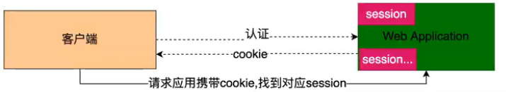

# JWT

## JWT 简介

!> `JSON Web Token` （缩写 `JWT` ）是目前最流行的**跨域认证解决方案**。

### 官方简介

`JWT` 是一种用于双方之间传递安全信息的简洁的、URL 安全的表述性声明规范。JWT 作为一个开放的标准（[RFC 7519](https://tools.ietf.org/html/rfc7519)），定义了一种简洁的，自包含的方法用于通信双方之间以 Json 对象的形式安全的传递信息。因为数字签名的存在，这些信息是可信的，JWT 可以使用 HMAC 算法或者是 RSA 的公私秘钥对进行签名。

> [!tip]
>
> JSON Web Token (JWT) is an open standard ([RFC 7519](https://tools.ietf.org/html/rfc7519)) that defines a compact and self-contained way for securely transmitting information between parties as a JSON object. This information can be verified and trusted because it is digitally signed. JWTs can be signed using a secret (with the **HMAC** algorithm) or a public/private key pair using **RSA** or **ECDSA**. ——[来着官网](https://jwt.io/introduction)

### 通俗解释

`JWT` 简称 `JSON Web Token` ，也就是通过 `JSON` 形式作为 `Web` 应用中的令牌，用于在各方之间安全地将信息作为 `JSON` 对象传输。在数据传输过程中还可以完成数据加密、签名等相关处理。

## 为什么使用 JWT

### 传统的 Session 认证

http 协议本身是一种无状态的协议，而这就意味着如果用户向我们的应用提供了用户名和密码来进行用户认证，那么下一次请求时，用户还要再一次进行用户认证才行，因为根据 http 协议，我们并不能知道是哪个用户发出的请求，所以为了让我们的应用能识别是哪个用户发出的请求，我们只能在服务器存储一份用户登录的信息，这份登录信息会在响应时传递给浏览器，告诉其保存为 cookie , 以便下次请求时发送给我们的应用，这样我们的应用就能识别请求来自哪个用户了, 这就是传统的基于 session 认证。

