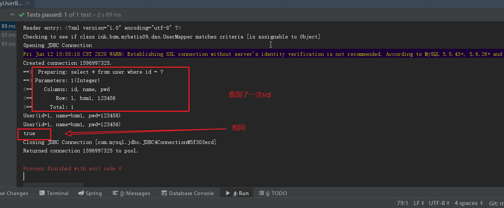
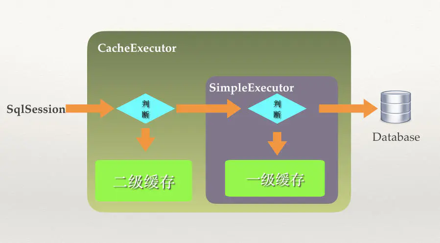

# Mybatis

[mybatis 官网](https://mybatis.org/mybatis-3/zh/getting-started.html)

[GitHub 地址](https://github.com/mybatis/mybatis-3)

## 1. Mybatis 简介

- `MyBatis `是一款优秀的持久层框架，它支持自定义 `SQL`、存储过程以及高级映射。
- `MyBatis `免除了几乎所有的 `JDBC `代码以及设置参数和获取结果集的工作。
- `MyBatis `可以通过简单的 `XML `或注解来配置和映射原始类型、接口和 `Java POJO`（`Plain Old Java Objects`，普通老式 Java 对象）为数据库中的记录。


### 1.1. 持久化

> 所谓**持久化**（`Persistence`）即把数据（如内存中的对象）保存到持久化的设备，即可永远保存到存储设备（如硬盘）

- 内存不能持久
- 内存容量有限（内存适用于存放计算数据的）
- 业务数据共享的需要（需要公共的持久设备）
- 为了使用大规模的检索（所以要将数据改为社和大规模检索的格式）
- 数据管理的需要（安全、备份）

[数据持久化](https://www.jianshu.com/p/5ec7cd9dbcfc)

### 1.2. 持久层

> 完成持久化工作的代码块 . ----> dao 层 【DAO (Data Access Object) 数据访问对象】

### 1.3. Mybatis 作用

- 它封装了 JDBC 操作的很多细节，使开发者**只需要关注 sql 语句本身**，而无需关注注册驱动、创建连接等繁杂过程

- 它使用了**ORM 思想**实现了结果集的封装

## 2. Mybatis 快速入门

### 2.1. 环境搭建

#### 2.1.1. 搭建数据库，创建一个 user 表

```sql
DROP TABLE IF EXISTS `user`;
CREATE TABLE `user` (
  `id` int(10) NOT NULL AUTO_INCREMENT,
  `name` varchar(30) COLLATE utf8mb4_unicode_ci DEFAULT NULL,
  `pwd` varchar(30) COLLATE utf8mb4_unicode_ci DEFAULT NULL,
  PRIMARY KEY (`id`)
) ENGINE=InnoDB AUTO_INCREMENT=4 DEFAULT CHARSET=utf8mb4 COLLATE=utf8mb4_unicode_ci;

-- ----------------------------
-- Records of user
-- ----------------------------
INSERT INTO `user` VALUES ('1', 'bzm1', '123');
INSERT INTO `user` VALUES ('2', 'bzm2', '123');
INSERT INTO `user` VALUES ('3', 'bzm3', '123');
```

#### 2.1.2. 创建一个项目，导入相关的依赖

```xml
 <!--导入mybatis依赖-->
        <dependency>
            <groupId>org.mybatis</groupId>
            <artifactId>mybatis</artifactId>
            <version>3.5.2</version>
        </dependency>
        <!--导入mysql驱动-->
        <dependency>
            <groupId>mysql</groupId>
            <artifactId>mysql-connector-java</artifactId>
            <version>5.1.47</version>
        </dependency>
```

#### 2.1.3. 编写 MyBatis 核心配置文件

```xml
<?xml version="1.0" encoding="UTF-8"?>
<!DOCTYPE configuration
        PUBLIC "-//mybatis.org//DTD Config 3.0//EN"
        "http://mybatis.org/dtd/mybatis-3-config.dtd">
<configuration>
    <!-- 配置properties-->
    <properties resource="jdbcConfig.properties"></properties>

    <!-- 配置环境   -->
    <environments default="mysql">
        <environment id="mysql">
            <!--配置事务的类型-->
            <transactionManager type="JDBC"></transactionManager>
            <!--配置数据源(连接池)-->
            <dataSource type="POOLED">
                <!-- 配置连接数据库的四个基本信息  -->
                <property name="driver" value="${driver}"/>
                <property name="url" value="${url}"/>
                <property name="username" value="${username}"/>
                <property name="password" value="${password}"/>
            </dataSource>
        </environment>
    </environments>

    <mappers>
        <!-- 指定映射配置文件的位置，映射配置文件指的是每个dao独立的配置文件 -->
        <mapper resource="ink/bzm/mybatis01/dao/UserDao.xml"/>
    </mappers>

</configuration>
```

jdbcConfig.properties 文件

```properties
driver=com.mysql.jdbc.Driver
url=jdbc:mysql://192.168.200.40:3306/mybatis
username=root
password=123456
```

### 2.2. 编写代码

#### 2.2.1. 编写工具类 MybatisUtils

```java
public class MybatisUtils {
    private static SqlSessionFactory sqlSessionFactory;

    static {
        try {
            String resource = "mybatis-config.xml";
            InputStream inputStream = Resources.getResourceAsStream(resource);
            //使用Mybatis第一步:获取sqlSessionFactory对象
            sqlSessionFactory = new SqlSessionFactoryBuilder().build(inputStream);
        } catch (IOException e) {
            e.printStackTrace();
        }
    }

    //获取SqlSession连接
    public static SqlSession getSession(){
        //sqlSessionFactory.openSession(true);设置为true，开启事务自动提交
        return sqlSessionFactory.openSession();
    }
}
```

#### 2.2.2. 编写实体类

```java
@AllArgsConstructor
@NoArgsConstructor
@Data
public class User {
    private int id;  //id
    private String name;   //姓名
    private String pwd;   //密码
}
```

#### 2.2.3. 编写 Dao 接口类

```java
public interface userDao {
    List<User> selectUser();
}
```

#### 2.2.4. 编写 Mapper.xml 配置文件

```xml
<?xml version="1.0" encoding="utf-8" ?>
<!DOCTYPE mapper PUBLIC "-//mybatis.org//DTD Mapper 3.0//EN" "http://mybatis.org/dtd/mybatis-3-mapper.dtd" >
<mapper namespace="ink.bzm.mybatis01.dao.userDao">
    <select id="selectUser" resultType="ink.bzm.mybatis01.pojo.User">
    select * from user
  </select>
</mapper>
```

#### 2.2.5. maven 资源导出

>   <!--在build中配置resources，来防止我们资源导出失败的问题-->

```xml
        <resources>
            <resource>
                <directory>src/main/java</directory>
                <includes>
                    <include>**/*.properties</include>
                    <include>**/*.xml</include>
                </includes>
                <filtering>false</filtering>
            </resource>
            <resource>
                <directory>src/main/resources</directory>
                <includes>
                    <include>**/*.properties</include>
                    <include>**/*.xml</include>
                </includes>
                <filtering>false</filtering>
            </resource>
        </resources>
```

### 2.3. 编写测试

```java
@Test
    void contextLoads() {
        //获取SqlSession对象
        SqlSession session = MybatisUtils.getSession();
        UserDao mapper;

        try {
            mapper = session.getMapper(UserDao.class);
            List<User> users = mapper.selectUser();

            for (User user : users) {
                System.out.println(user);
            }
        } finally {
            session.close();
        }
    }
```

## 3. Mybatis 的 CRUD 操作

### 3.1. 操作流程

1.  编写 dao 接口
2.  编写 mapper.xml 文件
3.  测试

### 3.2. 编写 CRUD 操作

```java
int addUser(User user);

int deleteUser(int id);

int updateUser(User user);

User getUserById(int id);
```

```xml
<insert id="addUser" parameterType="ink.bzm.mybatis01.pojo.User">
    insert into mybatis.user (id,name,pwd) values (#{id},#{name},#{pwd})
</insert>
<delete id="deleteUser" parameterType="int">
    delete from mybatis.user where id=#{id}
</delete>
<update id="updateUser" parameterType="ink.bzm.mybatis01.pojo.User">
    update mybatis.user set name=#{name},pwd=#{pwd} where id= #{id} ;
</update>
<select id="getUserById" parameterType="int" resultType="ink.bzm.mybatis01.pojo.User">
    select * from mybatis.user where id=#{id}
</select>
```

## 4. 配置解析

### 4.1. 核心配置文件

> `mybatis-config.xml`

```markdown
configuration（配置）

- properties（属性）
- settings（设置）
- typeAliases（类型别名）
- typeHandlers（类型处理器）
- objectFactory（对象工厂）
- plugins（插件）
- environments（环境配置）
  - environment（环境变量）
  - transactionManager（事务管理器）
  - dataSource（数据源）
- databaseIdProvider（数据库厂商标识）
- mappers（映射器）
```

### 4.2. 环境配置（environments）

MyBatis 可以配置成适应多种环境，这种机制有助于将 SQL 映射应用于多种数据库之中， 现实情况下有多种理由需要这么做。例如，开发、测试和生产环境需要有不同的配置；或者想在具有相同 Schema 的多个生产数据库中使用相同的 SQL 映射。还有许多类似的使用场景。

**不过要记住：尽管可以配置多个环境，但每个 SqlSessionFactory 实例只能选择一种环境。**

> `Mybatis`默认的事务管理器就是`JDBC`，连接池: `POOLED `

`environments `元素定义了如何配置环境。

```xml
<environments default="development">
  <environment id="development">
    <transactionManager type="JDBC">
      <property name="..." value="..."/>
    </transactionManager>
    <dataSource type="POOLED">
      <property name="driver" value="${driver}"/>
      <property name="url" value="${url}"/>
      <property name="username" value="${username}"/>
      <property name="password" value="${password}"/>
    </dataSource>
  </environment>
</environments>
```

- 默认使用的环境 ID（比如：`default="development"`）。
- 每个 `environment `元素定义的环境 ID（比如：`id="development"`）。
- 事务管理器的配置（比如：`type="JDBC"`）。
- 数据源的配置（比如：`type="POOLED"`）。

> 默认环境和环境 ID 顾名思义。 环境可以随意命名，但务必保证默认的环境 ID 要匹配其中一个环境 ID。

#### 4.2.1. 事务管理器（transactionManager）

在 `MyBatis `中有两种类型的事务管理器

- `JDBC `– 这个配置直接使用了 JDBC 的提交和回滚设施，它依赖从数据源获得的连接来管理事务作用域。
- `MANAGED `– 这个配置几乎没做什么。使用 MANAGED 的事务管理机制：这种机制 MyBatis 自身不会去实现事务管理，而是让程序的容器如（JBOSS，Weblogic）来实现对事务的管理——**基本不用了**

#### 4.2.2. 数据源（dataSource）

> 有三种内建的数据源类型（也就是` type="[UNPOOLED|POOLED|JNDI]"`）：**(常用 POOLED)**

- **UNPOOLED**– 这个数据源的实现会每次请求时打开和关闭连接。虽然有点慢，但对那些数据库连接可用性要求不高的简单应用程序来说，是一个很好的选择。
- **POOLED**– 这种数据源的实现利用“池”的概念将 JDBC 连接对象组织起来，避免了创建新的连接实例时所必需的初始化和认证时间。 这种处理方式很流行，能使并发 Web 应用快速响应请求。
- **JNDI** – 这个数据源实现是为了能在如 EJB 或应用服务器这类容器中使用，容器可以集中或在外部配置数据源，然后放置一个 JNDI 上下文的数据源引用。

### 4.3. 属性（properties）

这些属性可以在外部进行配置，并可以进行动态替换。你既可以在典型的 Java 属性文件中配置这些属性，也可以在 properties 元素的子元素中设置。

**引入外部配置文件**

```xml
<!-- 配置properties-->
<properties resource="jdbcConfig.properties"></properties>
```

_jdbcConfig.properties_

```properties
driver=com.mysql.jdbc.Driver
url=jdbc:mysql://192.168.200.40:3306/mybatis
username=root
password=123456
```

**内部配置文件**

```xml
  <!-- 配置properties-->
    <properties >
        <property name="driver" value="com.mysql.jdbc.Driver"/>
        <property name="url" value="jdbc:mysql://localhost:3306/mybatis"/>
        <property name="username" value="root"/>
        <property name="password" value="Bzm990521"/>
    </properties>
```

如果一个属性在不只一个地方进行了配置，那么，`MyBatis `将按照下面的顺序来加载：

- 首先读取在 `properties `元素体内指定的属性。
- 然后根据 `properties `元素中的 `resource `属性读取类路径下属性文件，或根据 `url `属性指定的路径读取属性文件，并覆盖之前读取过的同名属性。
- 最后读取作为方法参数传递的属性，并覆盖之前读取过的同名属性。

> 因此，通过方法参数传递的属性具有最高优先级，`resource/url `属性中指定的配置文件次之，最低优先级的则是 `properties `元素中指定的属性。

### 4.4. 类型别名（typeAliases）

类型别名可为 `Java `类型设置一个缩写名字。 它仅用于 `XML `配置，意在**降低冗余**的全限定类名书写。

```xml
    <!--给实体类取别名-->
    <typeAliases>
        <typeAlias type="ink.bzm.mybatis02.pojo.User" alias="User"/>
    </typeAliases>
```

也可以指定一个包名，`MyBatis `会在包名下面搜索需要的 `Java Bean`

```xml
 <!--给实体类取别名-->
    <typeAliases>
        <package name="ink.bzm.mybatis02.pojo"/>
    </typeAliases>
```

> 每一个在包 `ink.bzm.mybatis02.pojo` 中的 `Java Bean`，在没有注解的情况下，会使用 `Bean `的**首字母小写的非限定类名**来作为它的**别名**。 比如 `ink.bzm.mybatis02.pojo.User` 的别名为 `user；若有注解，则别名为其注解值。

```java
@Alias("author")
public class Author {
    ...
}
```

### 4.5. 设置（settings）

这是 MyBatis 中极为重要的调整设置，它们会改变 MyBatis 的运行时行为。

[官网详细描述](https://mybatis.org/mybatis-3/zh/configuration.html#settings)

```xml
<settings>
  <setting name="cacheEnabled" value="true"/>
  <setting name="lazyLoadingEnabled" value="true"/>
  <setting name="multipleResultSetsEnabled" value="true"/>
  <setting name="useColumnLabel" value="true"/>
  <setting name="useGeneratedKeys" value="false"/>
  <setting name="autoMappingBehavior" value="PARTIAL"/>
  <setting name="autoMappingUnknownColumnBehavior" value="WARNING"/>
  <setting name="defaultExecutorType" value="SIMPLE"/>
  <setting name="defaultStatementTimeout" value="25"/>
  <setting name="defaultFetchSize" value="100"/>
  <setting name="safeRowBoundsEnabled" value="false"/>
    <!--是否开启驼峰命名自动映射-->
  <setting name="mapUnderscoreToCamelCase" value="false"/>
  <setting name="localCacheScope" value="SESSION"/>
  <setting name="jdbcTypeForNull" value="OTHER"/>
  <setting name="lazyLoadTriggerMethods" value="equals,clone,hashCode,toString"/>
</settings>
```

### 4.6. 映射器（mappers）

这些配置会告诉 `MyBatis `去哪里找映射文件

**方式一：**`(推荐使用)`

```xml
<!-- 使用相对于类路径的资源引用 -->
<mappers>
    <mapper resource="ink/bzm/mybatis02/dao/UserDao.xml"/>
</mappers>
```

**方式二：**

```xml
<!-- 使用映射器接口实现类的完全限定类名 -->
<mappers>
    <mapper class="ink.bzm.mybatis02.dao.UserDao"/>
</mappers>
```

**方式三：**

```xml
<!-- 将包内的映射器接口实现全部注册为映射器 -->
<mappers>
    <package name="ink.bzm.mybatis02.dao"/>
</mappers>
```

> **方法二和方法三注意：**
>
> - 接口和他的`Mapper`配置文件必须同名!
> - 接口和他的`Mapper`配置文件必须在同一个包下

## 5. 作用域（Scope）和生命周期

不同作用域和生命周期类别是至关重要的，因为错误的使用会导致非常严重的并发问题。

### 5.1. Mybatis 工作流程


#### 5.1.1. SqlSessionFactoryBuilder

- 这个类可以被实例化、使用和丢弃，一旦创建了 `SqlSessionFactory`，就不再需要它了。

- `SqlSessionFactoryBuilder `实例的最佳作用域是方法作用域（也就是局部方法变量）。

#### 5.1.2. SqlSessionFactory

- `SqlSessionFactory `一旦被创建就应该在应用的运行期间一直存在。
- 使用 `SqlSessionFactory `的最佳实践是在应用运行期间不要重复创建多次。
- 最佳作用域是应用作用域，最简单的就是使用单例模式或者静态单例模式。

#### 5.1.3. SqlSession

- 每个线程都应该有它自己的 `SqlSession `实例。
- 它的最佳的作用域是请求或方法作用域。
- 打开一个 `SqlSession`，返回一个响应后，就关闭它。 这个关闭操作很重要。
- 这个关闭操作**最好**放到 `finally `块中。

## 6. XML 映射器

`MyBatis `的真正强大的地方——语句映射

- `MyBatis `致力于减少使用成本
- 让用户能更专注于 `SQL `代码。

### 6.1. 结果映射（resultMap）

> 它描述如何从结果集中加载对象，主要作用是定义映射规则、级联的更新、定制类型转化器。

数据库表的**列名**和**属性名**不能匹配上时候。（如`pwd`，和`password`）

**方式一：可以在 SELECT 语句中设置列别名**

```sql
select id,name,pwd as password from mybatis.user where id=#{id}
```

**方式二：结构映射**

```xml
<!--结果集映射-->
<resultMap id="UserMap" type="User">
    <!--column数据库中的字段，property实体类中的属性-->
    <result column="id" property="id"/>
    <result column="name" property="name"/>
    <result column="pwd" property="password"/>
</resultMap>

<select id="getUserById" parameterType="int"  resultMap="UserMap">
    select id,name,pwd from mybatis.user where id=#{id}
</select>
```

### 6.2. resultMap 标签详解

[映射文件 resultMap 标签详解](https://www.jianshu.com/p/0c5b3d1d0bb1)

#### 6.2.1. association—— 一个复杂类型的关联；许多结果将包装成这种类型

> 嵌套结果映射 – 关联可以是 `resultMap` 元素，或是对其它结果映射的引用

`association`标签的属性

- `property`属性，这个属性是必须的，对应的是实体类中的字段
- `resultMap`属性，`association`标签内也有`id`、`reuslt`标签，用来做关联类的字段映射关系,`reusltMap`指定可以跨命名空间。
- `column`属性，在嵌套查询方式的时候使用,数据列参数
- `javaType`属性，指定关联对象的具体类型。

#### 6.2.2. collection——一个复杂类型的集合

> 嵌套结果映射 – 集合可以是 `resultMap` 元素，或是对其它结果映射的引用

`collection`标签的属性

- `ofType`对应的类型就是`Computer`

#### 6.2.3. collection——使用结果值来决定使用哪个 `resultMap`

## 7. 日志

Mybatis 通过使用内置的日志工厂提供日志功能。内置日志工厂将会把日志工作委托给下面的实现之一：

- SLF4J
- Apache Commons Logging
- Log4j 2
- Log4j
- JDK logging

### 7.1. 日志设置

`logImpl`——SLF4J | LOG4J | LOG4J2 | JDK_LOGGING | COMMONS_LOGGING | STDOUT_LOGGING | NO_LOGGING

```xml
<!--指定 MyBatis 应该使用哪个日志记录实现。默认则会自动发现日志记录实现。-->
<settings>
    <!--默认的日志工厂实现-->
	<setting name="logImpl" value="STDOUT_LOGGING"/>
</settings>
```

### 7.2. Log4j

> `Apache`的开源项目`log4j`是一个功能强大的**日志组件（框架）**,提供方便的日志记录。

- `Log4j`是[Apache](https://baike.baidu.com/item/Apache/8512995)的一个开源项目，通过使用`Log4j`，我们可以控制日志信息输送的目的地是[控制台](https://baike.baidu.com/item/控制台/2438626)、文件、[GUI](https://baike.baidu.com/item/GUI)组件，甚至是套接口服务器、[NT](https://baike.baidu.com/item/NT/3443842)的事件记录器、[UNIX](https://baike.baidu.com/item/UNIX) [Syslog](https://baike.baidu.com/item/Syslog)[守护进程](https://baike.baidu.com/item/守护进程/966835)等

- 可以通过一个[配置文件](https://baike.baidu.com/item/配置文件/286550)来灵活地进行配置，而不需要修改应用的代码。

#### 7.2.1. 导入 Log4j 包

```xml
<!--导入Log4j-->
<dependency>
    <groupId>log4j</groupId>
    <artifactId>log4j</artifactId>
    <version>1.2.17</version>
</dependency>
```

#### 7.2.2. log4j.properties 配置文件

```properties
将等级为DEBUG的日志信息输出到console和file这两个目的地，console和file的定义在下面的代码
log4j.rootLogger=DEBUG,console,file

控制台输出的相关设置
log4j.appender.console = org.apache.log4j.ConsoleAppender
log4j.appender.console.Target = System.out
log4j.appender.console.Threshold=DEBUG
log4j.appender.console.layout = org.apache.log4j.PatternLayout
log4j.appender.console.layout.ConversionPattern=[%c]-%m%n

文件输出的相关设置
log4j.appender.file = org.apache.log4j.RollingFileAppender
log4j.appender.file.File=./log/qian.log
log4j.appender.file.MaxFileSize=10mb
log4j.appender.file.Threshold=DEBUG
log4j.appender.file.layout=org.apache.log4j.PatternLayout
log4j.appender.file.layout.ConversionPattern=[%p][%d{yy-MM-dd}][%c]%m%n

日志输出级别
log4j.logger.org.mybatis=DEBUG
log4j.logger.java.sql=DEBUG
log4j.logger.java.sql.Statement=DEBUG
log4j.logger.java.sql.ResultSet=DEBUG
log4j.logger.java.sql.PreparedStatement=DEBUG
```

```properties
 Set root category priority to INFO and its only appender to CONSOLE.
log4j.rootCategory=INFO, CONSOLE            debug   info   warn error fatal
log4j.rootCategory=debug, CONSOLE, LOGFILE

 Set the enterprise logger category to FATAL and its only appender to CONSOLE.
log4j.logger.org.apache.axis.enterprise=FATAL, CONSOLE

 CONSOLE is set to be a ConsoleAppender using a PatternLayout.
log4j.appender.CONSOLE=org.apache.log4j.ConsoleAppender
log4j.appender.CONSOLE.layout=org.apache.log4j.PatternLayout
log4j.appender.CONSOLE.layout.ConversionPattern=%d{ISO8601} %-6r [%15.15t] %-5p %30.30c %x - %m\n

 LOGFILE is set to be a File appender using a PatternLayout.
log4j.appender.LOGFILE=org.apache.log4j.FileAppender
log4j.appender.LOGFILE.File=d:\axis.log
log4j.appender.LOGFILE.Append=true
log4j.appender.LOGFILE.layout=org.apache.log4j.PatternLayout
log4j.appender.LOGFILE.layout.ConversionPattern=%d{ISO8601} %-6r [%15.15t] %-5p %30.30c %x - %m\n
```

#### 7.2.3. setting 设置日志实现

```xml
<settings>
    <setting name="logImpl" value="LOG4J"/>
</settings>
```

#### 7.2.4. Log4j 进行输出测试

```java
 static Logger logger = Logger.getLogger(Mybatis03ApplicationTests.class);

    @Test
    public void testLog4j() {
        logger.info("info：进入selectUser方法");
        logger.debug("debug：进入selectUser方法");
        logger.error("error: 进入selectUser方法");
    }
```

## 8. 分页

> 查询大量数据的时候，我们往往使用分页进行查询，也就是每次处理小部分数据，这样对数据库压力就在可控范围内。

### 8.1. limit 分页

`Sql`

```sql
select * from user limit 1,2
```

`mapper`接口

```java
List<User> getUserByLimit(Map<String,Integer> map);
```

配置`mapper.xml`文件

```xml
<select id="getUserByLimit" parameterType="map" resultMap="UserMap">
    select * from mybatis.user limit #{startIndex},#{pageSize}
</select>
```

**测试**

```java
@Test
void getUserByLimit() {
    //获取SqlSession对象
    SqlSession session = MybatisUtils.getSession();

    UserDao mapper = session.getMapper(UserDao.class);

    HashMap<String, Integer> map = new HashMap<>();
    map.put("startIndex", 0);
    map.put("pageSize", 2);

    List<User> users = mapper.getUserByLimit(map);

    for (User user : users) {
        System.out.println("user = " + user);
    }
    session.close();
}
```

### 8.2. RowBounds 分页

`mapper`接口

```java
List<User> getUserByRowBounds();
```

`mapper.xml`文件

```xml
<select id="getUserByRowBounds" resultType="user">
    select * from user
</select>
```

测试类

```java
@Test
void testUserByRowBounds() {
    SqlSession session = MybatisUtils.getSession();

    int currentPage = 2;  //第几页
    int pageSize = 2;  //每页显示几个
    RowBounds rowBounds = new RowBounds((currentPage-1)*pageSize,pageSize);

    //通过session.**方法进行传递rowBounds，[此种方式现在已经不推荐使用了]
    List<User> users = session.selectList("ink.bzm.mybatis04.dao.UserDao.getUserByRowBounds", null, rowBounds);

    for (User user: users){
        System.out.println(user);
    }
    session.close();
}
```

### 8.3. 分页插件

#### 8.3.1. PageHelper

[PageHelper](https://pagehelper.github.io/)

## 9. 注解

### 9.1. 第一个注解使用

`mapper`接口上注解

```java
@Select("select * from mybatis.user")
List<User> getUser();
```

`mapper.xml`配置文件注入接口全限定类名

```xml
<mappers>
    <mapper class="ink.bzm.mybatis05.dao.UserDao"/>
</mappers>
```

`测试`

```java
@Test
void getUserById() {
    //获取SqlSession对象
    SqlSession session = MybatisUtils.getSession();

    UserDao mapper = session.getMapper(UserDao.class);

    List<User> users = mapper.getUser();

    for (User user : users) {
        System.out.println("user = " + user);
    }
    session.close();
}
```

### 9.2. 注解 CRUD

```java
//添加一个用户
@Insert("insert into user (id,name,pwd) values (#{id},#{name},#{pwd})")
int addUser(User user);

//根据id删除用
@Delete("delete from user where id = #{id}")
int deleteUser(@Param("id")int id);

//修改一个用户
@Update("update user set name=#{name},pwd=#{pwd} where id = #{id}")
int updateUser(User user);

//根据id查询用户
@Select("select * from mybatis.user where id=#{id}")
User getUserById(@Param("id") int id);
```

### 9.3. @Param() 注解

- @Param 注解的作用是给参数命名
- 参数命名后就能根据名字得到参数值,正确的将参数传入`sql`语句中

[`MyBatis `中 @Param 注解的四种使用场景](https://juejin.im/post/5d36582051882516544469e0)

### 9.4. #{} 和${}

> `#{} `以及` $ { }`， **其最大的区别则是前者方式能够很大程度防止 sql 注入(安全)，后者方式无法防止 Sql 注入** 。

[Mybatis 中#{}与${}的区别](https://juejin.im/post/5de8dad0f265da33d451e9f9)

## 10. Lombok

`Lombok`是一款`Java`开发插件, 使得`Java`开发者可以通过其定义的一些**注解来消除业务工程中冗长和繁琐的代码**，尤其对于简单的`Java`模型对象(`POJO`)。在开发环境中使用`Lombok`插件后，`Java`开发 人员可以节省出重复构建，诸如`hashCode`和`equals`这样的方法以及各种业务对象模型的 accessor 和 ToString 等方法的大时间。对于这些方法，它能够在编译源代码期间自动帮我们生成这些方法，**并没有如反射那样降低程序的性能**。

[十分钟搞懂 Lombok 使用与原理](https://juejin.im/post/5a6eceb8f265da3e467555fe)

## 11. 多表查询

`resultMap`标签详解- [to](#6.2、resultMap标签详解)

两张表`student`,`teacher`

```sql
CREATE TABLE `teacher` (
  `id` INT(10) NOT NULL,
  `name` VARCHAR(30) DEFAULT NULL,
  PRIMARY KEY (`id`)
) ENGINE=INNODB DEFAULT CHARSET=utf8

INSERT INTO teacher(`id`, `name`) VALUES (1, '老师');

CREATE TABLE `student` (
  `id` INT(10) NOT NULL,
  `name` VARCHAR(30) DEFAULT NULL,
  `tid` INT(10) DEFAULT NULL,
  PRIMARY KEY (`id`),
  KEY `fktid` (`tid`),
  CONSTRAINT `fktid` FOREIGN KEY (`tid`) REFERENCES `teacher` (`id`)
) ENGINE=INNODB DEFAULT CHARSET=utf8


INSERT INTO `student` (`id`, `name`, `tid`) VALUES ('1', '小明', '1');
INSERT INTO `student` (`id`, `name`, `tid`) VALUES ('2', '小红', '1');
INSERT INTO `student` (`id`, `name`, `tid`) VALUES ('3', '小张', '1');
INSERT INTO `student` (`id`, `name`, `tid`) VALUES ('4', '小李', '1');
INSERT INTO `student` (`id`, `name`, `tid`) VALUES ('5', '小王', '1');
```

### 11.1. 多对一

创建实体类

```java
@Data
public class Student {
    private int id;
    private String name;
    //多个学生可以是同一个老师，即多对一
    private Teacher teacher;
}
```

```java
@Data
public class Teacher {
    private int id;
    private String name;
}
```

#### 11.1.1. 问题

> **查询学生信息，并根据 tid，查出学生对应的老师**

查询`sql`效果

```sql
select s.id ,s.name,t.name from student s ,  teacher t where s.tid=t.id
```

#### 11.1.2. 按查询嵌套处理

`StudentMapper`接口

```java
public List<Student> getStudent( );
```

编写对应的`Mapper.xml`文件

```xml
<resultMap id="StudentTeacher" type="Student">
    <association property="teacher" column="tid" javaType="Teacher" select="getTeacher"/>
</resultMap>

<select id="getStudent" resultMap="StudentTeacher">
    select * from mybatis.student
</select>

<select id="getTeacher" resultType="teacher">
    select * from teacher where id = #{id}
</select>
```

`测试`

```java
@Test
void getStudent() {
    SqlSession sqlSession = MybatisUtils.getSession();
    StudentMapper mapper = sqlSession.getMapper(StudentMapper.class);

    List<Student> studentList = mapper.getStudent();

    for (Student student : studentList) {
        System.out.println("student = " + student);
    }

    sqlSession.close();
}
```

---

#### 11.1.3. 按结果嵌套处理

`StudentMapper`接口

```java
public List<Student> getStudent2( );
```

编写对应的`Mapper.xml`文件

```xml
<!--按结果嵌套处理-->
<select id="getStudent2" resultMap="StudentTeacher2">
    select s.id sid ,s.name sname,t.name tname
    from student s ,  teacher t
    where s.tid=t.id
</select>

<resultMap id="StudentTeacher2" type="Student">
    <result property="id" column="sid"/>
    <result property="name" column="sname"/>
    <association property="teacher" javaType="Teacher">
        <result property="name" column="tname"/>
    </association>
</resultMap>
```

`测试`

```java
@Test
void getStudent2() {
    SqlSession sqlSession = MybatisUtils.getSession();
    StudentMapper mapper = sqlSession.getMapper(StudentMapper.class);

    List<Student> studentList = mapper.getStudent2();

    for (Student student : studentList) {
        System.out.println("student = " + student);
    }
    sqlSession.close();
}
```

### 11.2. 一对多

> 例子：一个老师拥有多个学生

创建实体类

```java
@Data
public class Student {
    private int id;
    private String name;
    private int tid;
}
```

```java
@Data
public class Teacher {
    private int id;
    private String name;
    //一个老师多个学生
    private List<Student> students;}
```

#### 11.2.1. 按结果嵌套处理

`TeacherMapper`接口编写方法

```xml
<select id="getTeacher" resultMap="TeacherStudent">
    select s.id sid, s.name sname , t.name tname, t.id tid
    from student s,teacher t
    where s.tid = t.id and t.id=#{id}
</select>

<resultMap id="TeacherStudent" type="Teacher">
    <result  property="name" column="tname"/>
    <collection property="students" ofType="Student">
        <result property="id" column="sid" />
        <result property="name" column="sname" />
        <result property="tid" column="tid" />
    </collection>
</resultMap>
```

`测试`

```java
@Test
void testGetTeacher() {
    SqlSession session = MybatisUtils.getSession();
    TeacherMapper mapper = session.getMapper(TeacherMapper.class);
    Teacher teacher = mapper.getTeacher(1);
    System.out.println(teacher.getName());
    System.out.println(teacher.getStudents());
}
```

---

## 12. 动态 Sql

动态 `SQL `是 `MyBatis `的强大特性之一。以前拼接的时候需要注意的空格、列表最后的逗号等，现在都可以不用手动处理了，`MyBatis`采用功能强大的基于`OGNL`的表达式来实现

- if
- choose (when, otherwise)
- trim (where, set)
- foreach

### 12.1. 第一个动态 sql

**新建一个数据库表：blog**

```sql
CREATE TABLE `blog` (
  `id` varchar(50) NOT NULL COMMENT '博客id',
  `title` varchar(100) NOT NULL COMMENT '博客标题',
  `author` varchar(30) NOT NULL COMMENT '博客作者',
  `create_time` datetime NOT NULL COMMENT '创建时间',
  `views` int(30) NOT NULL COMMENT '浏览量'
) ENGINE=InnoDB DEFAULT CHARSET=utf8
```

**IDutil 工具类**

```java
public class IDUtils {
    //生成随机id
    public static String genId(){
        return UUID.randomUUID().toString().replaceAll("-","");
    }}
```

**编写实体类**

```java
@Data
public class Blog {
    private String id;
    private String title;
    private String author;
    private Date createTime;
    private int views;
}
```

**编写`Mapper`接口及`xml`文件**

```java
public interface BlogMapper {
}
```

```xml
<?xml version="1.0" encoding="utf-8" ?>
<!DOCTYPE mapper PUBLIC "-//mybatis.org//DTD Mapper 3.0//EN" "http://mybatis.org/dtd/mybatis-3-mapper.dtd" >
<mapper namespace="ink.bzm.mybatis08.dao.BlogMapper">


</mapper>
```

**`mybatis`核心配置文件，下划线驼峰自动转换**

```xml
<settings>
    <!--是否开启驼峰命名自动映射-->
    <setting name="mapUnderscoreToCamelCase" value="true"/>
</settings>
```

**插入初始数据**

编写接口

```java
//新增一个博客
int addBlog(Blog blog);
```

`sql`配置文件

```xml
<insert id="addBlog" parameterType="Blog">
    insert into blog (id, title, author, create_time, views)
    values (#{id},#{title},#{author},#{createTime},#{views});
</insert>
```

初始化博客方法

```java
    @Test
    public void addInitBlog() {
        SqlSession session = MybatisUtils.getSession();
        BlogMapper mapper = session.getMapper(BlogMapper.class);

        Blog blog = new Blog();
        blog.setId(IDUtil.genId());
        blog.setTitle("Mybatis如此简单");
        blog.setAuthor("狂神说");
        blog.setCreateTime(new Date());
        blog.setViews(9999);

        mapper.addBlog(blog);

        blog.setId(IDUtil.genId());
        blog.setTitle("Java如此简单");
        mapper.addBlog(blog);

        blog.setId(IDUtil.genId());
        blog.setTitle("Spring如此简单");
        mapper.addBlog(blog);

        blog.setId(IDUtil.genId());
        blog.setTitle("微服务如此简单");
        mapper.addBlog(blog);

        session.close();
    }
```

### 12.2. if

编写接口类

```java
List<Blog> queryBlogIf(Map map);
```

编写`Mapper.xml`

```xml
<select id="queryBlogIf" parameterType="map" resultType="Blog">
    select * from blog where
    <if test="title != null">
        title = #{title}
    </if>
    <if test="author != null">
        and author = #{author}
    </if>
</select>
```

编写测试

```java
@Test
public void queryBlogIf() {
    SqlSession session = MybatisUtils.getSession();
    BlogMapper mapper = session.getMapper(BlogMapper.class);

    HashMap<String, String> map = new HashMap<String, String>();
    //        map.put("title","Mybatis如此简单");
    map.put("author","小千千");

    List<Blog> blogs = mapper.queryBlogIf(map);

    System.out.println(blogs);

    session.close();
}
```

### 12.3. choose (when, otherwise)

- 有时候，我们不想用到所有的查询条件，只想选择其中的一个，查询条件有一个满足即可
- `MyBatis `提供了 `choose `元素，它有点像 `Java `中的 `switch `语句。

编写接口方法

```java
List<Blog> queryBlogChoose(Map map);
```

`sql`配置文件

```xml
<select id="queryBlogChoose" parameterType="map" resultType="blog">
    select * from blog
    <where>
        <choose>
            <when test="title != null">
                title = #{title}
            </when>
            <when test="author != null">
                and author = #{author}
            </when>
            <otherwise>
                and views = #{views}
            </otherwise>
        </choose>
    </where>
</select>
```

> 策略变为：传入了 “`title`” 就按 “`title`” 查找，传入了 “`author`” 就按 “`author`” 查找

测试类

```java
@Test
public void queryBlogChoose(){
    SqlSession session = MybatisUtils.getSession();
    BlogMapper mapper = session.getMapper(BlogMapper.class);

    HashMap<String, Object> map = new HashMap<String, Object>();
    map.put("title","Java如此简单");
    map.put("author","----");
    map.put("views",9999);
    List<Blog> blogs = mapper.queryBlogChoose(map);

    System.out.println(blogs);

    session.close();
}
```

### 12.4. trim (where, set)

- _`where`_ 元素只会在子元素返回任何内容的情况下才插入 “`WHERE`” 子句。而且，若子句的开头为 “`AND`” 或 “`OR`”，`*where* `元素也会将它们去除。

```xml
<!--select * from blog where title = #{title} and author = #{author}-->
<select id="queryBlogIf" parameterType="map" resultType="Blog">
    select * from blog
    <where>
        <if test="title != null">
            title = #{title}
        </if>
        <if test="author != null">
            and author = #{author}
        </if>
    </where>
</select>
```

- _`set`_ 元素会动态地在行首插入 `SET `关键字，并会删掉额外的逗号（这些逗号是在使用条件语句给列赋值时引入的）。

```xml
<update id="updateBlog" parameterType="map">
    update blog
    <set>
        <if test="title != null">
            title = #{title},
        </if>
        <if test="author != null">
            author = #{author}
        </if>
    </set>
    where id = #{id};
</update>
```

> `注意`:逗号，不能省略。

```java
@Test
void updateBlog() {
    SqlSession session = MybatisUtils.getSession();
    BlogMapper mapper = session.getMapper(BlogMapper.class);

    HashMap<String, String> map = new HashMap<String, String>();
    map.put("title","动态SQL");
    map.put("author","千仔");
    map.put("id","753e562291e147a597f16dd320f46e9a");

    mapper.updateBlog(map);


    session.close();
}
```

### 12.5. SQL 片段

有时候可能某个 `sql `语句我们用的特别多，为了增加代码的重用性，简化代码，我们需要将这些代码抽取出来，然后使用时直接调用。

- 最好基于 单表来定义 `sql `片段，提高片段的可重用性

- 在 `sql `片段中不要包括 `where`

**提取 SQL 片段**

```xml
<sql id="if-title-author">
    <if test="title != null">
        title = #{title}
    </if>
    <if test="author != null">
        and author = #{author}
    </if>
</sql>
```

**引用 SQL 片段**

```xml
<select id="queryBlogIf" parameterType="map" resultType="blog">
    select * from blog
    <where>
        <!-- 引用 sql 片段，如果refid 指定的不在本文件中，那么需要在前面加上 namespace -->
        <include refid="if-title-author"></include>
        <!-- 在这里还可以引用其他的 sql 片段 -->
    </where>
</select>
```

---

### 12.6. foreach

_`foreach`_ 元素的功能非常强大，它允许你指定一个集合，声明可以在元素体内使用的集合项（`item`）和索引（`index`）变量。它也允许你指定开头与结尾的字符串以及集合项迭代之间的分隔符。

编写接口

```java
List<Blog> queryBlogForeach(Map map);
```

编写`Mapper.xml`

```xml-dtd
<select id="queryBlogForeach" parameterType="map" resultType="blog">
    select * from blog
    <where>
        <foreach collection="ids"  item="id" open="and (" close=")" separator="or">
            id=#{id}
        </foreach>
    </where>
</select>
```

测试

```java
@Test
public void queryBlogForeach() {
    SqlSession session = MybatisUtils.getSession();
    BlogMapper mapper = session.getMapper(BlogMapper.class);

    HashMap map = new HashMap();
    List<Integer> ids = new ArrayList<Integer>();
    ids.add(1);
    ids.add(2);
    ids.add(3);
    map.put("ids",ids);

    List<Blog> blogs = mapper.queryBlogForeach(map);

    System.out.println(blogs);

    session.close();
}
```

## 13. 缓存

- `MyBatis `内置了一个强大的事务性查询缓存机制，它可以非常方便地配置和定制。
- `MyBatis`系统中默认定义了两级缓存：**一级缓存**和**二级缓存**
- 默认情况下，只有一级缓存开启。（`SqlSession`级别的缓存，也称为本地缓存）
- 二级缓存需要手动开启和配置，他是基于`namespace`级别的缓存。
- 为了提高扩展性，MyBatis 定义了缓存接口`Cache`。我们可以通过实现`Cache`接口来自定义二级缓存

### 13.1. 一级缓存

一级缓存是`SqlSession`级别的缓存。在操作数据库时需要构造 `sqlSession`对象，在对象中有一个(内存区域)数据结构（`HashMap`）用于存储缓存数据。不同的`sqlSession`之间的缓存数据区域（`HashMap`）是互相不影响的。

> `Mybatis`默认开启一级缓存。

- 映射语句文件中的所有 `select `语句的结果将会被缓存。
- 映射语句文件中的所有 `insert`、`update` 和 `delete `语句会刷新缓存。
- 缓存会使用最近最少使用算法（`LRU`, `Least Recently Used`）算法来清除不需要的缓存。
- 缓存不会定时进行刷新
- 缓存会保存列表或对象（无论查询方法返回哪种）的 1024 个引用。
- 缓存会被视为读/写缓存，这意味着获取到的对象并不是共享的，可以安全地被调用者修改，而不干扰其他调用者或线程所做的潜在修改。

在`mybatis`中加入日志，方便测试结果

```xml
<setting name="logImpl" value="STDOUT_LOGGING"/>
```

编写接口方法

```java
//根据id查询用户
User queryUserById(@Param("id") int id);
```

接口对应的`Mapper`文件

```xml
<select id="queryUserById" resultType="User">
    select * from user where id = #{id}
</select>
```

测试

```java
@Test
public void testQueryUserById(){
    SqlSession session = MybatisUtils.getSession();
    UserMapper mapper = session.getMapper(UserMapper.class);

    User user = mapper.queryUserById(1);
    System.out.println(user);
    User user2 = mapper.queryUserById(1);
    System.out.println(user2);
    System.out.println(user==user2);

    session.close();
}
```



### 13.2. 二级缓存

基于`namespace`级别的缓存，一个名称空间，对应一个二级缓存；

> 二级缓存 二级缓存的原理和一级缓存原理一样，第一次查询，会将数据放入缓存中，然后第二次查询则会直接去缓存中取。但是一级缓存是基于 `sqlSession `的，而 二级缓存是基于 `mapper`文件的`namespace`的。



**使用步骤**

开启全局缓存 【mybatis-config.xml】

```xml
<setting name="cacheEnabled" value="true"/>
```

`mapper.xml`中配置使用二级缓存

```xml
<cache/>

<cache
  eviction="FIFO"
  flushInterval="60000"
  size="512"
  readOnly="true"/>
```

> 这个更高级的配置创建了一个 `FIFO `缓存，每隔 **60** 秒刷新，最多可以存储结果对象或列表的 **512 个引用**，而且返回的对象被认为是**只读**的，因此对它们进行修改可能会在不同线程中的调用者产生冲突。

- `LRU` – 最近最少使用：移除最长时间不被使用的对象。
- `FIFO` – 先进先出：按对象进入缓存的顺序来移除它们。
- `SOFT` – 软引用：基于垃圾回收器状态和软引用规则移除对象。
- `WEAK` – 弱引用：更积极地基于垃圾收集器状态和弱引用规则移除对象。

```markdown
- 默认的清除策略是 LRU。

- flushInterval（刷新间隔）属性可以被设置为任意的正整数，设置的值应该是一个以毫秒为单位的合理时间量。 默认情况是不设置，也就是没有刷新间隔，缓存仅仅会在调用语句时刷新。

- size（引用数目）属性可以被设置为任意正整数，要注意欲缓存对象的大小和运行环境中可用的内存资源。默认值是 1024。

- readOnly（只读）属性可以被设置为 true 或 false。只读的缓存会给所有调用者返回缓存对象的相同实例。 因此这些对象不能被修改。这就提供了可观的性能提升。而可读写的缓存会（通过序列化）返回缓存对象的拷贝。 速度上会慢一些，但是更安全，因此默认值是 false。
```

代码测试

```java
@Test
public void testQueryUserById2() {
    //创建两个session
    SqlSession session = MybatisUtils.getSession();
    SqlSession session2 = MybatisUtils.getSession();

    UserMapper mapper = session.getMapper(UserMapper.class);
    UserMapper mapper2 = session2.getMapper(UserMapper.class);

    User user = mapper.queryUserById(1);
    System.out.println(user);
    session.close();

    User user2 = mapper2.queryUserById(1);
    System.out.println(user2);
    System.out.println(user==user2);

    session2.close();
}
```

