# Spring5

## 1. Spring简介

>   1、Spring是一个开源免费的框架 , 容器  .
>
>   2、Spring是一个轻量级的框架 , 非侵入式的 .
>
>   **3、控制反转 IoC  , 面向切面 Aop**
>
>   4、对事物的支持 , 对框架的支持
>
>   ...

**Spring是一个轻量级的控制反转(IoC)和面向切面(AOP)的容器（框架）。**

### 1.1. 核心七大模块

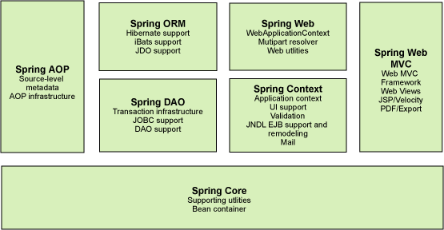

组成 `Spring `框架的每个模块（或组件）都可以单独存在，或者与其他一个或多个模块联合实现。每个模块的功能如下：

-   **核心容器**（**Spring Core**）：核心容器提供 Spring 框架的基本功能。核心容器的主要组件是 BeanFactory，它是工厂模式的实现。BeanFactory 使用*控制反转*（IOC） 模式将应用程序的配置和依赖性规范与实际的应用程序代码分开。
-   **Spring 上下文**（**Spring Context**）：Spring 上下文是一个配置文件，向 Spring 框架提供上下文信息。Spring 上下文包括企业服务，例如 JNDI、EJB、电子邮件、国际化、校验和调度功能。
-   **Spring AOP**：通过配置管理特性，Spring AOP 模块直接将面向切面的编程功能 , 集成到了 Spring 框架中。所以，可以很容易地使 Spring 框架管理任何支持 AOP的对象。Spring AOP 模块为基于 Spring 的应用程序中的对象提供了事务管理服务。通过使用 Spring AOP，不用依赖组件，就可以将声明性事务管理集成到应用程序中。
-   **Spring DAO**：JDBC DAO 抽象层提供了有意义的异常层次结构，可用该结构来管理异常处理和不同数据库供应商抛出的错误消息。异常层次结构简化了错误处理，并且极大地降低了需要编写的异常代码数量（例如打开和关闭连接）。Spring DAO 的面向 JDBC 的异常遵从通用的 DAO 异常层次结构。
-   **Spring ORM**：Spring 框架插入了若干个 ORM 框架，从而提供了 ORM 的对象关系工具，其中包括 JDO、Hibernate 和 iBatis SQL Map。所有这些都遵从 Spring 的通用事务和 DAO 异常层次结构。
-   **Spring Web 模块**：Web 上下文模块建立在应用程序上下文模块之上，为基于 Web 的应用程序提供了上下文。所以，Spring 框架支持与 Jakarta Struts 的集成。Web 模块还简化了处理多部分请求以及将请求参数绑定到域对象的工作。
-   **Spring MVC 框架**：MVC 框架是一个全功能的构建 Web 应用程序的 MVC 实现。通过策略接口，MVC 框架变成为高度可配置的，MVC 容纳了大量视图技术，其中包括 JSP、Velocity、Tiles、iText 和 POI。

## 2. IOC理论基本推导

### 2.1. 问题

1、先写一个UserDao接口

```java
public interface UserDao {
   public void getUser();
}
```

2、再去写Dao的实现类

```java
public class UserDaoImpl implements UserDao {
   @Override
   public void getUser() {
       System.out.println("获取用户数据");
  }
}
```

3、然后去写UserService的接口

```java
public interface UserService {
   public void getUser();
}
```

4、最后写Service的实现类

```java
public class UserServiceImpl implements UserService {
   private UserDao userDao = new UserDaoImpl();

   @Override
   public void getUser() {
       userDao.getUser();
  }
}
```

5、测试一下

```java
@Test
void contextLoads() {
    UserService service = new UserServiceImpl();
    service.getUser();
}
```

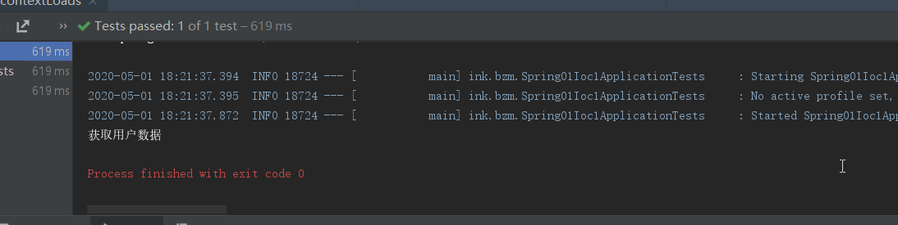

 然后这个时候需要用到Mysql，Oracle等去实现呢

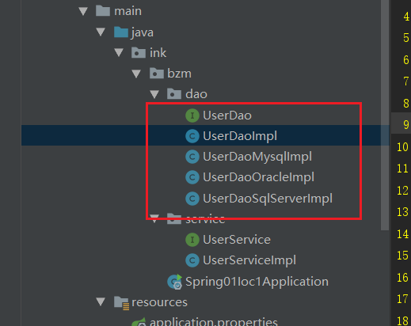

```java
public class UserServiceImpl implements UserService {
    private UserDao userDao = new UserDaoImpl();

    @Override
    public void getUser() {
        userDao.getUser();
    }
}
```

>   那么我们去用Mysql，Oracle等，就需要去service实现类里面修改对应的实现,每次变动 , 都需要修改大量代码 . 这种设计的耦合性太高了, 牵一发而动全身 。

### 2.2. 解决

不在这里去实现它，而是留一个接口

```java
public class UserServiceImpl implements UserService {
    private UserDao userDao;
    // 利用set实现
    public void setUserDao(UserDao userDao) {
        this.userDao = userDao;
    }
    @Override
    public void getUser() {
        userDao.getUser();
    }
}
```

去测试类测试

```java
   @Test
    void mysqlTest() {
        UserServiceImpl service = new UserServiceImpl();
        service.setUserDao( new UserDaoMysqlImpl() );
        service.getUser();
        //那我们现在又想用Oracle去实现呢
        service.setUserDao( new UserDaoOracleImpl() );
        service.getUser();

    }
```

>   以前所有东西都是由程序去进行控制创建 , 而现在是由我们自行控制创建对象 , 把主动权交给了调用者 . 程序不用去管怎么创建,怎么实现了 . 它只负责提供一个接口 。

## 3. IOC的本质

### 3.1. IoC：Inverse of Control（控制反转）

-   读作**“反转控制”**，更好理解，不是什么技术，而是一种**设计思想**，就是**将原本在程序中手动创建对象的控制权，交由Spring框架来管理。**
-   **正控：**若要使用某个对象，需要**自己去负责对象的创建**
-   **反控：**若要使用某个对象，只需要**从 Spring 容器中获取需要使用的对象，不关心对象的创建过程**，也就是把**创建对象的控制权反转给了Spring框架**

>   **控制反转IoC(Inversion of Control)，是一种设计思想**，没有IoC的程序中 , 我们使用面向对象编程 , 对象的创建与对象间的依赖关系完全硬编码在程序中，对象的创建由程序自己控制，控制反转后将对象的创建转移给第三方，个人认为所谓控制反转就是：获得依赖对象的方式反转了。

### 3.2. Spring IoC 容器

Spring 会提供 **IoC 容器**来管理和容纳我们所开发的各种各样的 Bean，并且我们可以从中获取各种发布在 Spring IoC 容器里的 Bean

## 4. IOC创建对象的方式

### 4.1. 通过无参构造方法来创建

1、User.java

```java
public class User {

   private String name;

   public User() {
       System.out.println("user无参构造方法");
  }

   public void setName(String name) {
       this.name = name;
  }

   public void show(){
       System.out.println("name="+ name );
  }

}
```

2、beans.xml

```xml
<?xml version="1.0" encoding="UTF-8"?>
<beans xmlns="http://www.springframework.org/schema/beans"
      xmlns:xsi="http://www.w3.org/2001/XMLSchema-instance"
      xsi:schemaLocation="http://www.springframework.org/schema/beans
       http://www.springframework.org/schema/beans/spring-beans.xsd">

   <bean id="user" class="ink.bzm.pojo.User">
       <property name="name" value="bzm"/>
   </bean>

</beans>
```

3、测试类

```java
@Test
public void test(){
   ApplicationContext context = new ClassPathXmlApplicationContext("beans.xml");
   //在执行getBean的时候, user已经创建好了 , 通过无参构造
   User user = (User) context.getBean("user");
   //调用对象的方法 .
   user.show();
}
```

4、debug可以发现

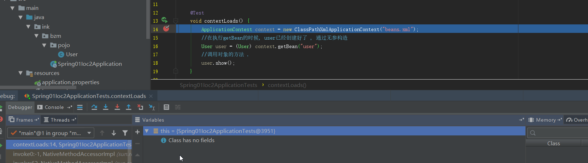


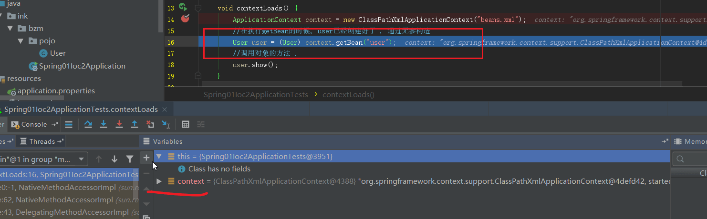

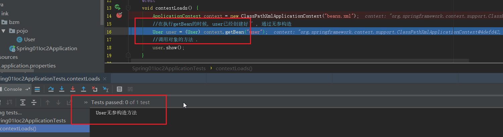

>   结果可以发现，在调用show方法之前，User对象已经通过无参构造初始化了！

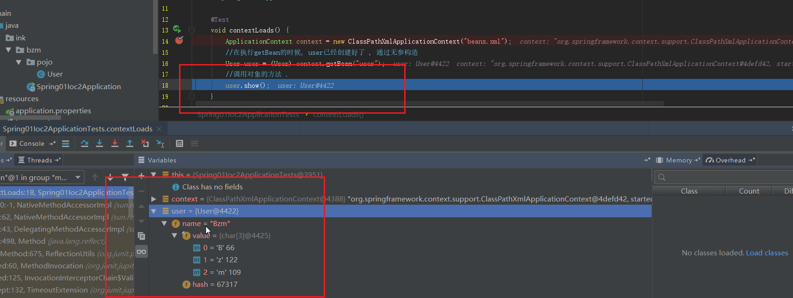

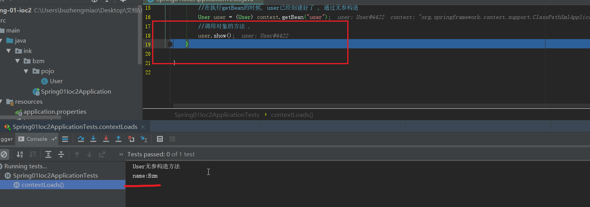

### 4.2. 通过有参构造方法来创建

1、UserT . java

```java
public class UserT {

   private String name;

   public UserT(String name) {
       this.name = name;
  }

   public void setName(String name) {
       this.name = name;
  }

   public void show(){
       System.out.println("name="+ name );
  }

}
```

2、beans.xml 有三种方式编写

```xml
<!-- 第一种根据index参数下标设置 -->
<bean id="userT" class="ink.bzm.pojo.UserT">
   <!-- index指构造方法 , 下标从0开始 -->
   <constructor-arg index="0" value="bzm2"/>
</bean>
<!-- 第二种根据参数名字设置 -->
<bean id="userT" class="ink.bzm.pojo.UserT">
   <!-- name指参数名 -->
   <constructor-arg name="name" value="bzm2"/>
</bean>
<!-- 第三种根据参数类型设置 -->
<bean id="userT" class="ink.bzm.pojo.UserT">
   <constructor-arg type="java.lang.String" value="bzm2"/>
</bean>
```

3、测试

```java
@Test
public void testT(){
   ApplicationContext context = new ClassPathXmlApplicationContext("beans.xml");
   UserT user = (UserT) context.getBean("userT");
   user.show();
}
```

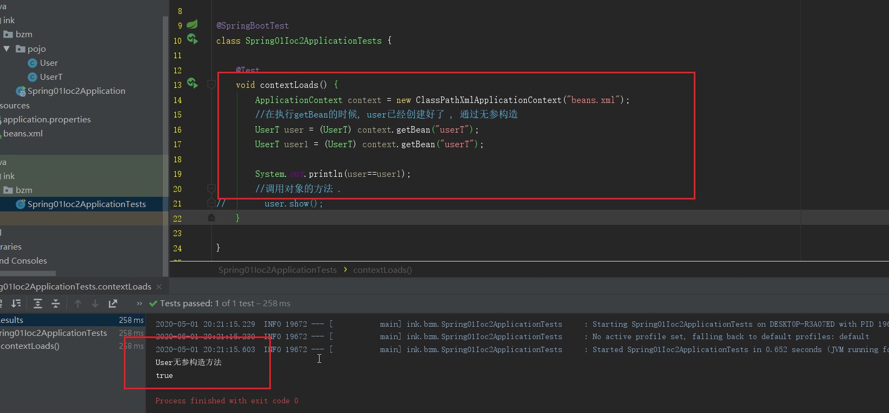

结论：在配置文件加载的时候。其中管理的对象都已经初始化了！

## 5. Spring配置

### 5.1. 别名

alias 设置别名 , 为bean设置别名 , 可以设置多个别名

```java
<!--设置别名：在获取Bean的时候可以使用别名获取-->
<alias name="userT" alias="userNew"/>
```

### 5.2. Bean的配置

```java
<!--bean就是java对象,由Spring创建和管理-->

<!--
   id 是bean的标识符,要唯一,如果没有配置id,name就是默认标识符
   如果配置id,又配置了name,那么name是别名
   name可以设置多个别名,可以用逗号,分号,空格隔开
   如果不配置id和name,可以根据applicationContext.getBean(.class)获取对象;

class是bean的全限定名=包名+类名
-->
<bean id="hello" name="hello2 h2,h3;h4" class="ink.bzm.pojo.Hello">
   <property name="name" value="Spring"/>
</bean>
```

### 5.3. import

团队的合作通过import来实现 .

```java
<import resource="{path}/beans.xml"/>
```

## 6. 依赖注入

-   依赖 : 指`Bean`对象的创建依赖于容器 . `Bean`对象的依赖资源 .
-   注入 : 指`Bean`对象所依赖的资源 , 由容器来设置和装配 .

### 6.1. 构造器注入

构造器注入保证一些必要的属性在Bean实例化时就得到设置，并且确保了`Bean`实例在实例化后就可以使用。

在配置文件中配置该类的`bean`，并配置构造器，在配置构造器中用到了`<constructor-arg>`节点，该节点有四个属性

-   `index`：指定注入属性的顺序索引，从0开始；
-   `type`：指该属性所对应的类型；
-   `ref`：引用的依赖对象；
-   `value`：当注入的不是依赖对象，而是基本数据类型时，就用`value`；

>   之前的案例已经讲过了

### 6.2. set注入

`set`注入要求`Bean`提供一个默认的构造函数，并为需要注入的属性提供对应的`Setter`方法。

**`Spring`先调用`Bean`的默认构造函数实例化`Bean`对象，然后通过反射的方式调用`Setter`方法注入属性值。**

**假设`Bean`显示定义了一个带参的构造函数，则需要同时提供一个默认无参的构造函数，否则使用属性注入时将抛出异常。** 

```java
public class Address {
    private String address;

//并且生成get，set，toString方法
```


```java
public class Student {

    private String name;
    private Address address;
    private String[] books;
    private List<String> hobbys;
    private Map<String, String> card;
    private Set<String> games;
    private String wife;
    private Properties info;

//并且生成get，set，toString方法
```

1、**常量注入**

```java
 <bean id="student" class="ink.bzm.pojo.Student">
     <property name="name" value="Bzm"/>
 </bean>
```

2、**Bean注入** 

注意点：这里的值是一个引用，ref

```java
 <bean id="addr" class="ink.bzm.pojo.Address">
     <property name="address" value="武汉"/>
 </bean>
 
 <bean id="student" class="ink.bzm.pojo.Student">
     <property name="name" value="Bzm"/>
     <property name="address" ref="addr"/>
 </bean>
```

3、**数组注入**

```java
 <bean id="student" class="ink.bzm.pojo.Student">
     <property name="name" value="Bzm"/>
     <property name="address" ref="addr"/>
     <property name="books">
         <array>
             <value>book1</value>
             <value>book2</value>
             <value>book3</value>
         </array>
     </property>
 </bean>
```

4、**List注入**

```java
 <property name="hobbys">
     <list>
         <value>听歌</value>
         <value>学习</value>
         <value>玩游戏</value>
     </list>
 </property>
```

5、**Map注入**

```java
 <property name="card">
     <map>
         <entry key="学号" value="001"/>
		 <entry key="分数" value="90"/>
     </map>
 </property>
```

6、**set注入**

```java
 <property name="games">
     <set>
         <value>LOL</value>
         <value>AA</value>
         <value>BB</value>
     </set>
 </property>
```

7、**Null注入**

```java
 <property name="wife"><null/></property>
```

8、**Properties注入**

```java
 <property name="info">
     <props>
          <prop key="学号">11</prop>
          <prop key="性别">男</prop>
		  <prop key="分数">80</prop>
     </props>
 </property>
```

测试结果：

```java
  @Test
    void contextLoads() {
        ClassPathXmlApplicationContext context = new ClassPathXmlApplicationContext("beans.xml");
        Student student = (Student) context.getBean("student");
        System.out.println(student.toString());

        /*
        Student{
        name='Bzm',
        address=Address{address='武汉'},
        books=[book1, book2, book3],
        hobbys=[听歌, 学习, 玩游戏],
        card={学号=001, 分数=90},
        games=[LOL, AA, BB],
        wife='null',
        info={学号=11, 分数=80, 性别=男}
        }
         */
    }
```


### 6.3. p命名和c命名注入

-   p：直接通过数据注入值
-   c：通过构造器注入属性值

1、P命名空间注入 : 需要在头文件中加入约束文件

```xml
 导入约束 : xmlns:p="http://www.springframework.org/schema/p"
 
 <!--P(属性: properties)命名空间 , 属性依然要设置set方法-->
 <bean id="user" class="ink.bzm.pojo.User" p:name="Bzm" p:age="18"/>
```

2、c 命名空间注入 : 需要在头文件中加入约束文件

```xml
 导入约束 : xmlns:c="http://www.springframework.org/schema/c"
 <!--C(构造: Constructor)命名空间 , 属性依然要设置set方法-->
 <bean id="user" class="ink.bzm.pojo.User" c:name="Bzm" c:age="18"/>
```

pojo类

```java
public class User {
    private String name;
    private int age;

//并且生成get，set，toString方法
```

测试类

p:

```java
 @Test
    void userTest() {
        ClassPathXmlApplicationContext context = new ClassPathXmlApplicationContext("userbeans.xml");
        Object user = context.getBean("user");
        System.out.println(user);

         /*
    User{name='Bzm', age=18}
     */
    }
```

c:

```java
 @Test
    void userTest2() {
        ClassPathXmlApplicationContext context = new ClassPathXmlApplicationContext("userbeans.xml");
        Object user = context.getBean("user2", User.class);
        System.out.println(user);
    /*
    User{name='Bzm', age=18}
     */

    }
```

### 6.4. bean作用域

在`Spring`中，那些组成应用程序的主体及由`Spring IoC`容器所管理的对象，被称之为`bean`。简单地讲，`bean`就是由`IoC`容器初始化、装配及管理的对象 .

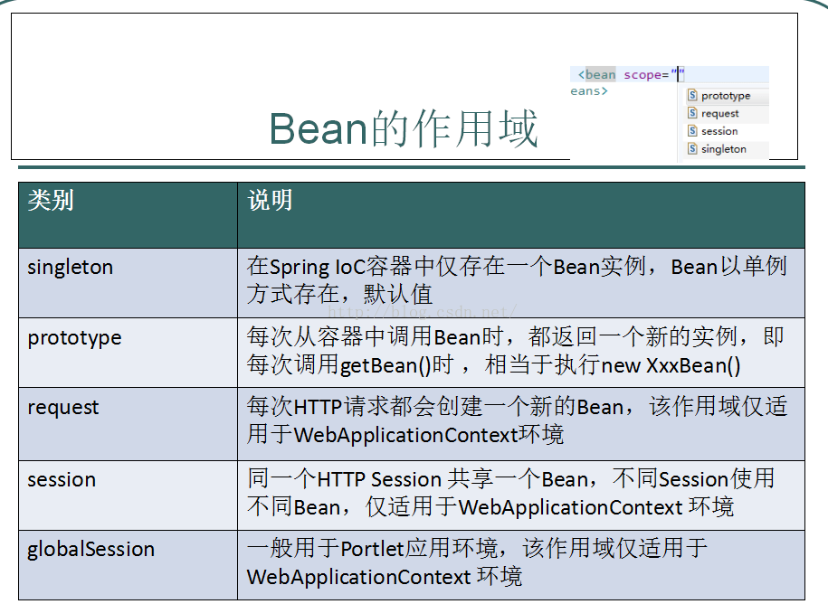

>   `Spring`中的`bean`默认都是单例的

1.  `Singleton`单例模式

    当一个`bean`的作用域为`Singleton`，那么`Spring IoC`容器中只会存在一个共享的`bean`实例，并且所有对`bean`的请求，只要`id`与该`bean`定义相匹配，则只会返回`bean`的同一实例。`Singleton`是单例类型，就是在创建起容器时就同时自动创建了一个`bean`的对象，不管你是否使用，他都存在了，每次获取到的对象都是同一个对象。注意，`Singleton`作用域是`Spring`中的缺省作用域。要在`XML`中将bean定义成`singleton`，可以这样配置：

    ```xml
        <bean id="user2" class="ink.bzm.pojo.User" c:name="Bzm" c:age="18" scope="singleton"></bean>
    ```

    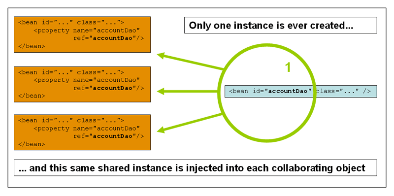

2.  `prototype`原型模式
    当一个`bean`的作用域为`Prototype`，表示一个`bean`定义对应多个对象实例。`Prototype`作用域的`bean`会导致在每次对该`bean`请求（将其注入到另一个`bean`中，或者以程序的方式调用容器的`getBean()`方法）时都会创建一个新的`bean`实例。`Prototype`是原型类型，它在我们创建容器的时候并没有实例化，而是当我们获取bean的时候才会去创建一个对象，而且我们每次获取到的对象都不是同一个对象。根据经验，对有状态的`bean`应该使用`prototype`作用域，而对无状态的`bean`则应该使用singleton作用域。在`XML`中将`bean`定义成`prototype`，可以这样配置：

    ```xml
        <bean id="user2" class="ink.bzm.pojo.User" c:name="Bzm" c:age="18" scope="prototype"></bean>
    ```

    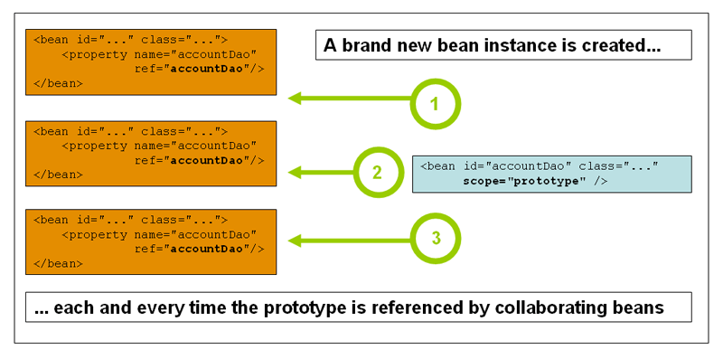

>   　五种作用域中，request、session和global session三种作用域仅在基于web的应用中使用

## 7. bean的自动装配

[Spring中bean的作用域与生命周期](https://blog.csdn.net/fuzhongmin05/article/details/73389779)

### 7.1. 手动装配

1、新建两个实体类，Cat  Dog  都有一个叫的方法

```java
public class Cat {
   public void shout() {
       System.out.println("miao~");
  }
}
public class Dog {
   public void shout() {
       System.out.println("wang~");
  }
}
```

2、新建一个用户类 User

```java
public class User {
   private Cat cat;
   private Dog dog;
   private String str;
}
```

3、编写Spring配置文件

```xml
<?xml version="1.0" encoding="UTF-8"?>
<beans xmlns="http://www.springframework.org/schema/beans"
      xmlns:xsi="http://www.w3.org/2001/XMLSchema-instance"
      xsi:schemaLocation="http://www.springframework.org/schema/beans
       http://www.springframework.org/schema/beans/spring-beans.xsd">

   <bean id="dog" class="ink.bzm.pojo.Dog"/>
   <bean id="cat" class="ink.bzm.pojo.Cat"/>

   <bean id="user" class="ink.bzm.pojo.User">
       <property name="cat" ref="cat"/>
       <property name="dog" ref="dog"/>
       <property name="str" value="Bzm"/>
   </bean>
</beans>
```

5、测试

```java
@Test
    void contextLoads() {
        ApplicationContext context = new ClassPathXmlApplicationContext("beans.xml");
        User user = (User) context.getBean("user");
        user.getCat().shout();
        user.getDog().shout();
        /*
        miao~
        wang~
        */
    }
```

结果正常输出，OK

### 7.2. ByName自动装配

**autowire byName (按名称自动装配)**


根据属性名自动装配。此选项将检查容器并根据名字查找与属性完全一致的`bean`，并将其与属性自
动装配。例如，在`bean`定义中将 `autowire`设置为`by name`，而该`bean`包含`master`属性（同时提供
`setMaster(..)`方法），`Spring`就会查找名为`master`的`bean`定义，并用它来装配给`master`属性。

1、修改`bean`配置，增加一个属性  autowire="byName"

```xml
<bean id="user" class="ink.bzm.pojo.User" autowire="byName">
        <property name="str" value="Bzm"/>
    </bean>
```

2、再次测试，结果依旧成功输出！

>   当一个`bean`节点带有 `autowire ``byName`的属性时。
>
>   1.  将查找其类中所有的`set`方法名，例如`setCat`，获得将set去掉并且首字母小写的字符串，即`cat`。
>   2.  去`spring`容器中寻找是否有此字符串名称`id`的对象。
>   3.  如果有，就取出注入；如果没有，就报空指针异常。

### 7.3. ByType自动装配

**autowire byType (按类型自动装配)**


如果容器中存在一个与指定属性类型相同的`bean`，那么将与该属性自动装配。如果存在多个该类型的`bean`，那么将会抛出异常，并指出不能使用`byType`方式进行自动装配。若没有找到相匹配的bean，则什么事都不发生，属性也不会被设置。

```xml
 <bean class="ink.bzm.pojo.Cat"/>
    <bean class="ink.bzm.pojo.Dog"/>

    <bean id="user" class="ink.bzm.pojo.User" autowire="byType">
        <property name="str" value="Bzm"/>
    </bean>
```

### 7.4. 使用注解自动装配

`jdk1.5`开始支持注解，`spring2.5`开始全面支持注解。

准备工作：利用注解的方式注入属性。

1、在spring配置文件中引入context文件头

```xml
xmlns:context="http://www.springframework.org/schema/context"

http://www.springframework.org/schema/context
http://www.springframework.org/schema/context/spring-context.xsd
```

2、开启属性注解支持！

```xml
<context:annotation-config/>
```

#### 7.4.1. @Autowired

>   @Autowired默认使用`byType`来装配属性，如果匹配到类型的多个实例，再通过`byName`来确定Bean。

@Autowired(required=false)  说明：false，对象可以为null；true，对象必须存对象，不能为null。

```java
//如果允许对象为null，设置required = false,默认为true
@Autowired(required = false)
private Cat cat;
```

----


#### 7.4.2. @Qualifier

-   @Autowired是根据类型自动装配的，加上@Qualifier则可以根据`byName`的方式自动装配
-   @Qualifier不能单独使用。

**举例**

1、配置文件修改内容，保证类型存在对象。且名字不为类的默认名字！

```
<bean id="dog1" class="ink.bzm.pojo.Dog"/>
<bean id="dog2" class="ink.bzm.pojo.Dog"/>
<bean id="cat1" class="ink.bzm.pojo.Cat"/>
<bean id="cat2" class="ink.bzm.pojo.Cat"/>
```

2、没有加Qualifier测试，直接报错

3、在属性上添加Qualifier注解

```
@Autowired
@Qualifier(value = "cat2")
private Cat cat;
@Autowired
@Qualifier(value = "dog2")
private Dog dog;
```

测试，成功输出！


#### 7.4.3. @Resource

1、@Resource后面没有任何内容，默认通过`name`属性去匹配`bean`，找不到再按`type`去匹配

2、指定了`name`或者`type`则根据指定的类型去匹配`bean`

3、指定了`name`和`type`则根据指定的`name`和type去匹配`bean`，任何一个不匹配都将报错

---


### 7.5. @Autowired与@Resource异同

-   @Autowired与@Resource都可以用来装配`bean`。都可以写在字段上，或写在`setter`方法上。
-   @Autowired默认按照`byType`方式进行`bean`匹配，@Resource默认按照`byName`方式进行`bean`匹配
-   @Autowired是`Spring`的注解，@Resource是`J2EE`的注解

## 8. Spring注解开发

### 8.1. 说明

-   在`spring4`之后，想要使用注解形式，必须得要引入`aop`的包
-   在配置文件当中还得要引入一个`context`约束

```xml
<?xml version="1.0" encoding="UTF-8"?>
<beans xmlns="http://www.springframework.org/schema/beans"
       xmlns:xsi="http://www.w3.org/2001/XMLSchema-instance"
       xmlns:context="http://www.springframework.org/schema/context"
       xsi:schemaLocation="http://www.springframework.org/schema/beans
        http://www.springframework.org/schema/beans/spring-beans.xsd
        http://www.springframework.org/schema/context
        http://www.springframework.org/schema/context/spring-context.xsd">

    <context:annotation-config/>
</beans>
```

### 8.2. Bean的实现

1、配置扫描哪些包下的注解

```xml
<!--指定注解扫描包-->
<context:component-scan base-package="ink.bzm.pojo"/>
```

2、在指定包下编写类，增加注解

```java
@Component("user")
// 相当于配置文件中 <bean id="user" class="当前注解的类"/>
public class User {
   public String name = "Bzm";
}
```

3、测试

```java
@Test
public void test(){
   ApplicationContext applicationContext =
       new ClassPathXmlApplicationContext("beans.xml");
   User user = (User) applicationContext.getBean("user");
   System.out.println(user.name);
}
```

### 8.3. 属性注入

1、可以不用提供set方法，直接在直接名上添加@value("值")

```java
@Component("user")
// 相当于配置文件中 <bean id="user" class="当前注解的类"/>
public class User {
   @Value("秦疆")
   // 相当于配置文件中 <property name="name" value="秦疆"/>
   public String name;
}
```

2、如果提供了set方法，也可以在set方法上添加@value("值");

```java
@Component("user")
public class User {

   public String name;

   @Value("秦疆")
   public void setName(String name) {
       this.name = name;
  }
}
```

### 8.4. 衍生注解

**@Component三个衍生注解**

为了更好的进行分层，`Spring`可以使用其它三个注解，功能一样，目前使用哪一个功能都一样。

-   @Controller：`web`层
-   @Service：`service`层
-   @Repository：`dao`层

### 8.5. 自动装配注解

-   @Autowired
-   @Resource

### 8.6. 作用域

-   singleton：默认的，Spring会采用单例模式创建这个对象。关闭工厂 ，所有的对象都会销毁。
-   prototype：多例模式。关闭工厂 ，所有的对象不会销毁。内部的垃圾回收机制会回收

```java
@Controller("user")
@Scope("prototype")
public class User {
   @Value("Bzm")
   public String name;
}
```

### 8.7. XML与注解比较

-   XML可以适用任何场景 ，结构清晰，维护方便
-   注解不是自己提供的类使用不了，开发简单方便

**xml与注解整合开发** ：推荐最佳实践

-   xml管理Bean
-   注解完成属性注入
-   使用过程中， 可以不用扫描，扫描是为了类上的注解

```xml 
<context:annotation-config/>  
```

## 9. 静态/动态 代理

## 10. AOP

### 10.1. aop简介

`AOP`（`Aspect Oriented Programming`）意为：面向切面编程，通过预编译方式和运行期动态代理实现程序功能的统一维护的一种技术。`AOP`是`OOP`的补充和完善，是软件开发中的一个热点，也是`Spring`框架中的一个重要内容，是函数式编程的一种衍生范型。利用`AOP`可以对业务逻辑的各个部分进行隔离，从而使得业务逻辑各部分之间的耦合度降低，提高程序的可重用性，同时提高了开发的效率。

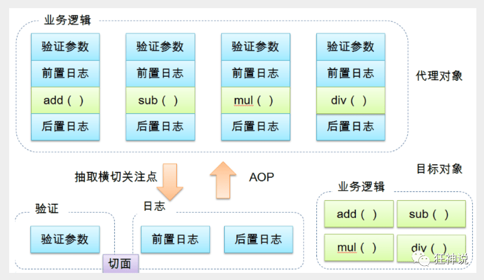

>   


### 10.2. 基本术语

-   切面（Aspect）：横切关注点 被模块化 的特殊对象。即，它是一个类。
-   通知（Advice）：切面必须要完成的工作。即，它是类中的一个方法。
-   目标（Target）：被通知对象。
-   代理（Proxy）：向目标对象应用通知之后创建的对象。
-   切入点（PointCut）：切面通知 执行的 “地点”的定义。
-   Introduction (引介): 引介是一种特殊的通知在不修改类代码的前提下, `Introduction `可以在运行期为类动态地添加一些方 法或 `Field`。 `Target`(目标对象): 代理的目标对象。
-   Weaving (织入): 是指把增强应用到目标对象来创建新的代理对象的过程。 `Spring `采用动态代理织入，而 `AspectJ `采用编译期织入和类装载期织入。
-   连接点（JointPoint）：与切入点匹配的执行点。

>   `Spring AOP `提供了5种类型的通知：
>
>   前置通知（`Before`）：在目标方法被调用之前调用通知功能。
>
>   后置通知（`After`）：在目标方法完成之后调用通知，无论该方法是否发生异常。
>
>   后置返回通知（`After-returning`）：在目标方法成功执行之后调用通知。
>
>   后置异常通知（`After-throwing`）：在目标方法抛出异常后调用通知。
>
>   环绕通知（`Around`）：通知包裹了被通知的方法，在被通知的方法调用之前和调用之后执行自定义的行为。

### 10.3. 注解方式

首先编写我们的业务接口和实现类

```java
public interface UserService {

   public void add();

   public void delete();

   public void update();

   public void search();

}
```

```java
public class UserServiceImpl implements UserService{

   @Override
   public void add() {
       System.out.println("增加用户");
  }

   @Override
   public void delete() {
       System.out.println("删除用户");
  }

   @Override
   public void update() {
       System.out.println("更新用户");
  }

   @Override
   public void search() {
       System.out.println("查询用户");
  }
}
```

第一步：编写一个注解实现的增强类

```java
package ink.bzm.config;

import org.aspectj.lang.ProceedingJoinPoint;
import org.aspectj.lang.annotation.After;
import org.aspectj.lang.annotation.Around;
import org.aspectj.lang.annotation.Aspect;
import org.aspectj.lang.annotation.Before;

@Aspect
public class AnnotationPointcut {
   @Before("execution(* ink.bzm.service.UserServiceImpl.*(..))")
   public void before(){
       System.out.println("---------方法执行前---------");
  }

   @After("execution(* ink.bzm.service.UserServiceImpl.*(..))")
   public void after(){
       System.out.println("---------方法执行后---------");
  }

   @Around("execution(* ink.bzm.service.UserServiceImpl.*(..))")
   public void around(ProceedingJoinPoint jp) throws Throwable {
       System.out.println("环绕前");
       System.out.println("签名:"+jp.getSignature());
       //执行目标方法proceed
       Object proceed = jp.proceed();
       System.out.println("环绕后");
       System.out.println(proceed);
  }
}
```

第二步：在Spring配置文件中，注册bean，并增加支持注解的配置

```java
<!--第三种方式:注解实现-->
<bean id="annotationPointcut" class="ink.bzm.config.AnnotationPointcut"/>
<aop:aspectj-autoproxy/>
```

aop:aspectj-autoproxy：说明

```markdown
- 通过aop命名空间的<aop:aspectj-autoproxy />声明自动为spring容器中那些配置@aspectJ切面的bean创建代理，织入切面。当然，spring 在内部依旧采用AnnotationAwareAspectJAutoProxyCreator进行自动代理的创建工作，但具体实现的细节已经被<aop:aspectj-autoproxy />隐藏起来了

- <aop:aspectj-autoproxy />有一个proxy-target-class属性，默认为false，表示使用jdk动态代理织入增强，当配为<aop:aspectj-autoproxy  poxy-target-class="true"/>时，表示使用CGLib动态代理技术织入增强。不过即使proxy-target-class设置为false，如果目标类没有声明接口，则spring将自动使用CGLib动态代理。
```

## 11. 声明式事务

### 11.1. 事务四个属性ACID

**原子性（atomicity）**

事务是原子性操作，由一系列动作组成，事务的原子性确保动作要么全部完成，要么完全不起作用

**一致性（consistency）**

一旦所有事务动作完成，事务就要被提交。数据和资源处于一种满足业务规则的一致性状态中

**隔离性（isolation）**

可能多个事务会同时处理相同的数据，因此每个事务都应该与其他事务隔离开来，防止数据损坏

**持久性（durability）**

事务一旦完成，无论系统发生什么错误，结果都不会受到影响。通常情况下，事务的结果被写到持久化存储器中

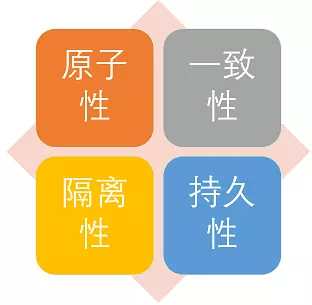

[Spring中的事务](https://juejin.im/post/5a5c631e6fb9a01cb508cd3d)

-   [传统Spring工程的Spring事务](https://www.ibm.com/developerworks/cn/java/j-master-spring-transactional-use/index.html)

