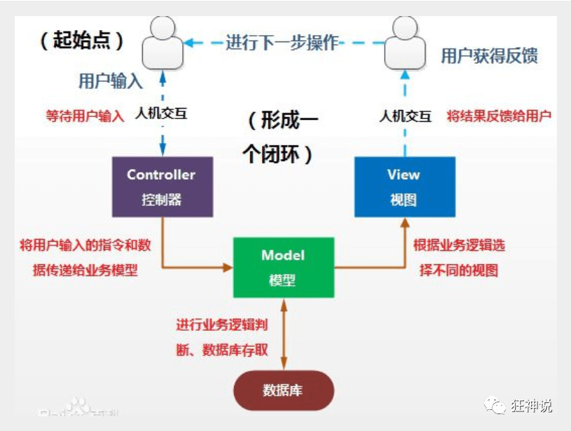

# SpringMVC

## 1. MVC理解

### 1.1. 什么事是MVC

-   `MVC`是模型(`Model`)、视图(`View`)、控制器(`Controller`)的简写，是一种软件设计规范。
-   是将业务逻辑、数据、显示分离的方法来组织代码。
-   `MVC`主要作用是**降低了视图与业务逻辑间的双向偶合**。
-   `MVC`不是一种设计模式，**MVC是一种架构模式**。当然不同的MVC存在差异。

### 1.2. Model（模型）

数据模型，提供要展示的数据，因此包含数据和行为，可以认为是领域模型或`JavaBean`组件（包含数据和行为），不过现在一般都分离开来：`Value Object`（数据Dao） 和 服务层（行为`Service`）。也就是模型提供了模型数据查询和模型数据的状态更新等功能，包括数据和业务。

### 1.3. View（视图）

负责进行模型的展示，一般就是我们见到的用户界面，客户想看到的东西。

### 1.4. Controller（控制器）

接收用户请求，委托给模型进行处理（状态改变），处理完毕后把返回的模型数据返回给视图，由视图负责展示。也就是说控制器做了个调度员的工作。



## 2. 什么是SpringMVC

`Spring MVC`是`Spring Framework`的一部分，是基于`Java`实现`MVC`的轻量级`Web`框架。


---


### 2.1. Spring MVC的特点

1.  轻量级，简单易学
2.  高效 , 基于请求响应的MVC框架
3.  与Spring兼容性好，无缝结合
4.  约定优于配置
5.  功能强大：RESTful、数据验证、格式化、本地化、主题等
6.  简洁灵活

>   `Spring`的`web`框架围绕**`DispatcherServlet` **[ 调度`Servlet `] 设计。

`DispatcherServlet`的作用是将请求分发到不同的处理器。从`Spring 2.5`开始，使用`Java 5`或者以上版本的用户可以采用基于注解形式进行开发，十分简洁；

不同的处理器--------处理方法的类

### 2.2. SpringMVC 工作原理

[SpringMVC工作原理](https://gitee.com/SnailClimb/JavaGuide/blob/master/docs/system-design/framework/spring/SpringMVC-Principle.md)

```markdown
- 客户端发送请求-> 
- 前端控制器 DispatcherServlet 接受客户端请求 -> 
- 找到处理器映射 HandlerMapping 解析请求对应的 Handler-> 
- HandlerAdapter 会根据 Handler 来调用真正的处理器开处理请求，并处理相应的业务逻辑 -> 
- 处理器返回一个模型视图 ModelAndView -> 
- 视图解析器进行解析 -> 返回一个视图对象->前端控制器 DispatcherServlet 渲染数据（Moder）-> 
- 将得到视图对象返回给用户
```


（1）客户端（浏览器）发送请求，直接请求到 `DispatcherServlet`。

（2）`DispatcherServlet` 根据请求信息调用 `HandlerMapping`，解析请求对应的 `Handler`。

（3）解析到对应的 `Handler`（也就是我们平常说的 Controller 控制器）后，开始由 `HandlerAdapter `适配器处理。

（4）`HandlerAdapter `会根据 `Handler `来调用真正的处理器开处理请求，并处理相应的业务逻辑。

（5）处理器处理完业务后，会返回一个 `ModelAndView `对象，Model 是返回的数据对象，`View `是个逻辑上的 `View`。

（6）`ViewResolver` 会根据逻辑 `View` 查找实际的 `View`。

（7）`DispaterServlet `把返回的 `Model `传给 `View`（视图渲染）。

（8）把 `View `返回给请求者（浏览器）

### 2.3. SpringMVC 重要组件说明

**1、前端控制器DispatcherServlet（不需要工程师开发）,由框架提供（重要）**

>   作用：**Spring MVC 的入口函数。接收请求，响应结果，相当于转发器，中央处理器。有了 DispatcherServlet 减少了其它组件之间的耦合度。用户请求到达前端控制器，它就相当于mvc模式中的c，DispatcherServlet是整个流程控制的中心，由它调用其它组件处理用户的请求，DispatcherServlet的存在降低了组件之间的耦合性。**

**2、处理器映射器HandlerMapping(不需要工程师开发),由框架提供**

>   作用：根据请求的url查找Handler。HandlerMapping负责根据用户请求找到Handler即处理器（Controller），SpringMVC提供了不同的映射器实现不同的映射方式，例如：配置文件方式，实现接口方式，注解方式等。

**3、处理器适配器HandlerAdapter**

>   作用：按照特定规则（HandlerAdapter要求的规则）去执行Handler 通过HandlerAdapter对处理器进行执行，这是适配器模式的应用，通过扩展适配器可以对更多类型的处理器进行执行。

**4、处理器Handler(需要工程师开发)**

>   注意：编写Handler时按照HandlerAdapter的要求去做，这样适配器才可以去正确执行Handler Handler 是继DispatcherServlet前端控制器的后端控制器，在DispatcherServlet的控制下Handler对具体的用户请求进行处理。 由于Handler涉及到具体的用户业务请求，所以一般情况需要工程师根据业务需求开发Handler。

**5、视图解析器View resolver(不需要工程师开发),由框架提供**

>   作用：进行视图解析，根据逻辑视图名解析成真正的视图（view） View Resolver负责将处理结果生成View视图，View Resolver首先根据逻辑视图名解析成物理视图名即具体的页面地址，再生成View视图对象，最后对View进行渲染将处理结果通过页面展示给用户。 springmvc框架提供了很多的View视图类型，包括：jstlView、freemarkerView、pdfView等。 一般情况下需要通过页面标签或页面模版技术将模型数据通过页面展示给用户，需要由工程师根据业务需求开发具体的页面。

**6、视图View(需要工程师开发)**

>   View是一个接口，实现类支持不同的View类型（jsp、freemarker、pdf...）
>
>   **注意：处理器Handler（也就是我们平常说的Controller控制器）以及视图层view都是需要我们自己手动开发的。其他的一些组件比如：前端控制器DispatcherServlet、处理器映射器HandlerMapping、处理器适配器HandlerAdapter等等都是框架提供给我们的，不需要自己手动开发。**

---


## 3. SpringMVC第一个程序


[SpringMVC第一个程序](https://mp.weixin.qq.com/s?__biz=Mzg2NTAzMTExNg==&mid=2247483978&idx=1&sn=6711110a3b2595d6bb987ca02ee0a728&scene=19#wechat_redirect)

### 3.1. 控制器Controller

-   控制器复杂提供访问应用程序的行为，通常通过接口定义或注解定义两种方法实现。
-   控制器负责解析用户的请求并将其转换为一个模型。
-   在Spring MVC中一个控制器类可以包含多个方法
-   在Spring MVC中，对于Controller的配置方式有很多种

>   有直接或间接实现Controller接口，或者使用的@controller注解

### 3.2. @Controller

-   @Controller注解类型用于声明Spring类的实例是一个控制器（在讲IOC时还提到了另外3个注解）；

-   Spring可以使用扫描机制来找到应用程序中所有基于注解的控制器类，为了保证Spring能找到你的控制器，需要在配置文件中声明组件扫描。

    ```java
    <!-- 自动扫描指定的包，下面所有注解类交给IOC容器管理 -->
    <context:component-scan base-package="com.kuang.controller"/>
    ```

### 3.3. @RequestMapping

@RequestMapping注解用于映射url到控制器类或一个特定的处理程序方法。可用于类或方法上。用于类上，表示类中的所有响应请求的方法都是以该地址作为父路径。

-   只注解在方法上面

    ```java
    @Controller
    public class TestController {
       @RequestMapping("/h1")
       public String test(){
           return "test";
      }
    }
    ```

    访问路径：http://localhost:8080 / 项目名 / h1

-   同时注解类与方法

    ```java
    @Controller
    @RequestMapping("/admin")
    public class TestController {
       @RequestMapping("/h1")
       public String test(){
           return "test";
      }
    }
    ```

    访问路径：http://localhost:8080 / 项目名/ admin /h1  , 需要先指定类的路径再指定方法的路径；

### 3.4. RestFul 风格

**概念**

Restful就是一个资源定位及资源操作的风格。不是标准也不是协议，只是一种风格。基于这个风格设计的软件可以更简洁，更有层次，更易于实现缓存等机制。

**功能**

资源：互联网所有的事物都可以被抽象为资源

资源操作：使用`POST`、`DELETE`、`PUT`、`GET`，使用不同方法对资源进行操作。

分别对应 添加、 删除、修改、查询。

**传统方式操作资源**  ：通过不同的参数来实现不同的效果！方法单一，post 和 get

​	http://127.0.0.1/item/queryItem.action?id=1 查询,GET

​	http://127.0.0.1/item/saveItem.action 新增,POST

​	http://127.0.0.1/item/updateItem.action 更新,POST

​	http://127.0.0.1/item/deleteItem.action?id=1 删除,GET或POST

**使用RESTful操作资源** ：可以通过不同的请求方式来实现不同的效果！如下：请求地址一样，但是功能可以不同！

​	http://127.0.0.1/item/1 查询,GET

​	http://127.0.0.1/item 新增,POST

​	http://127.0.0.1/item 更新,PUT

​	http://127.0.0.1/item/1 删除,DELETE

**测试**

1.  在新建一个类 RestFulController

    ```java
    @Controller
    public class RestFulController {
    }
    ```

2.  在Spring MVC中可以使用  @PathVariable 注解，让方法参数的值对应绑定到一个URI模板变量上。

    ```java
    @Controller
    public class RestFulController {
    
       //映射访问路径
       @RequestMapping("/commit/{p1}/{p2}")
       public String index(@PathVariable int p1, @PathVariable int p2, Model model){
           
           int result = p1+p2;
           //Spring MVC会自动实例化一个Model对象用于向视图中传值
           model.addAttribute("msg", "结果："+result);
           //返回视图位置
           return "test";
           
      }
       
    }
    ```

    

## 4. Json交互处理

### 4.1. 什么是json

-   JSON(JavaScript Object Notation, JS 对象标记) 是一种轻量级的数据交换格式，目前使用特别广泛。
-   采用完全独立于编程语言的**文本格式**来存储和表示数据。
-   简洁和清晰的层次结构使得 JSON 成为理想的数据交换语言。
-   易于人阅读和编写，同时也易于机器解析和生成，并有效地提升网络传输效率。

在 JavaScript 语言中，一切都是对象。因此，任何JavaScript 支持的类型都可以通过 JSON 来表示，例如字符串、数字、对象、数组等。看看他的要求和语法格式：

-   对象表示为键值对，数据由逗号分隔
-   花括号保存对象
-   方括号保存数组

**JSON 键值对**是用来保存 JavaScript 对象的一种方式，和 JavaScript 对象的写法也大同小异，键/值对组合中的键名写在前面并用双引号 "" 包裹，使用冒号 : 分隔，然后紧接着值：

```json
{"name": "QinJiang"}
{"age": "3"}
{"sex": "男"}
```

很多人搞不清楚 JSON 和 JavaScript 对象的关系，甚至连谁是谁都不清楚。其实，可以这么理解：

JSON 是 JavaScript 对象的字符串表示法，它使用文本表示一个 JS 对象的信息，本质是一个字符串。

```js
var obj = {a: 'Hello', b: 'World'}; //这是一个对象，注意键名也是可以使用引号包裹的
var json = '{"a": "Hello", "b": "World"}'; //这是一个 JSON 字符串，本质是一个字符串
```


### 4.2. JSON 和 JavaScript 对象互转

要实现从JSON字符串转换为JavaScript 对象，使用 JSON.parse() 方法：

```javascript
var obj = JSON.parse('{"a": "Hello", "b": "World"}');
//结果是 {a: 'Hello', b: 'World'}
```

要实现从JavaScript 对象转换为JSON字符串，使用 JSON.stringify() 方法：

```javascript
var json = JSON.stringify({a: 'Hello', b: 'World'});
//结果是 '{"a": "Hello", "b": "World"}'
```

### 4.3. Controller返回JSON数据

>   Jackson应该是目前比较好的json解析工具了
>
>   当然工具不止这一个，比如还有阿里巴巴的 fastjson 等等。
>
>   我们这里使用Jackson，使用它需要导入它的jar包；

我们这里使用Jackson，使用它需要导入它的jar包；

```xml
<!-- https://mvnrepository.com/artifact/com.fasterxml.jackson.core/jackson-core -->
<dependency>
   <groupId>com.fasterxml.jackson.core</groupId>
   <artifactId>jackson-databind</artifactId>
   <version>2.9.8</version>
</dependency>
```

配置SpringMVC需要的配置

web.xml

```xml
<?xml version="1.0" encoding="UTF-8"?>
<web-app xmlns="http://xmlns.jcp.org/xml/ns/javaee"
        xmlns:xsi="http://www.w3.org/2001/XMLSchema-instance"
        xsi:schemaLocation="http://xmlns.jcp.org/xml/ns/javaee http://xmlns.jcp.org/xml/ns/javaee/web-app_4_0.xsd"
        version="4.0">

   <!--1.注册servlet-->
   <servlet>
       <servlet-name>SpringMVC</servlet-name>
       <servlet-class>org.springframework.web.servlet.DispatcherServlet</servlet-class>
       <!--通过初始化参数指定SpringMVC配置文件的位置，进行关联-->
       <init-param>
           <param-name>contextConfigLocation</param-name>
           <param-value>classpath:springmvc-servlet.xml</param-value>
       </init-param>
       <!-- 启动顺序，数字越小，启动越早 -->
       <load-on-startup>1</load-on-startup>
   </servlet>

   <!--所有请求都会被springmvc拦截 -->
   <servlet-mapping>
       <servlet-name>SpringMVC</servlet-name>
       <url-pattern>/</url-pattern>
   </servlet-mapping>

   <filter>
       <filter-name>encoding</filter-name>
       <filter-class>org.springframework.web.filter.CharacterEncodingFilter</filter-class>
       <init-param>
           <param-name>encoding</param-name>
           <param-value>utf-8</param-value>
       </init-param>
   </filter>
   <filter-mapping>
       <filter-name>encoding</filter-name>
       <url-pattern>/</url-pattern>
   </filter-mapping>

</web-app>
```

springmvc-servlet.xml

```java
<?xml version="1.0" encoding="UTF-8"?>
<beans xmlns="http://www.springframework.org/schema/beans"
      xmlns:xsi="http://www.w3.org/2001/XMLSchema-instance"
      xmlns:context="http://www.springframework.org/schema/context"
      xmlns:mvc="http://www.springframework.org/schema/mvc"
      xsi:schemaLocation="http://www.springframework.org/schema/beans
       http://www.springframework.org/schema/beans/spring-beans.xsd
       http://www.springframework.org/schema/context
       https://www.springframework.org/schema/context/spring-context.xsd
       http://www.springframework.org/schema/mvc
       https://www.springframework.org/schema/mvc/spring-mvc.xsd">

   <!-- 自动扫描指定的包，下面所有注解类交给IOC容器管理 -->
   <context:component-scan base-package="com.kuang.controller"/>

   <!-- 视图解析器 -->
   <beanclass="org.springframework.web.servlet.view.InternalResourceViewResolver"
         id="internalResourceViewResolver">
       <!-- 前缀 -->
       <property name="prefix" value="/WEB-INF/jsp/" />
       <!-- 后缀 -->
       <property name="suffix" value=".jsp" />
   </bean>

</beans>
```

我们随便编写一个User的实体类，然后我们去编写我们的测试Controller；

```java
package com.kuang.pojo;

import lombok.AllArgsConstructor;
import lombok.Data;
import lombok.NoArgsConstructor;

//需要导入lombok
@Data
@AllArgsConstructor
@NoArgsConstructor
public class User {

   private String name;
   private int age;
   private String sex;
   
}
```


### 4.4. @Controller和@RestController的区别

[@Controller和@RestController的区别](https://www.jianshu.com/p/b534b394dc7a)

### 4.5. 乱码统一解决

上一种方法比较麻烦，如果项目中有许多请求则每一个都要添加，可以通过Spring配置统一指定，这样就不用每次都去处理了！

我们可以在springmvc的配置文件上添加一段消息StringHttpMessageConverter转换配置！

```xml
<mvc:annotation-driven>
   <mvc:message-converters register-defaults="true">
       <beanclass="org.springframework.http.converter.StringHttpMessageConverter">
           <constructor-arg value="UTF-8"/>
       </bean>
       <beanclass="org.springframework.http.converter.json.MappingJackson2HttpMessageConverter">
           <property name="objectMapper">
               <beanclass="org.springframework.http.converter.json.Jackson2ObjectMapperFactoryBean">
                   <property name="failOnEmptyBeans" value="false"/>
               </bean>
           </property>
       </bean>
   </mvc:message-converters>
</mvc:annotation-driven>
```


**返回json字符串统一解决**

在类上直接使用 **@RestController** ，这样子，里面所有的方法都只会返回 json 字符串了，不用再每一个都添加@ResponseBody ！我们在前后端分离开发中，一般都使用 @RestController ，十分便捷！

```java
@RestController
public class UserController {

   //produces:指定响应体返回类型和编码
   @RequestMapping(value = "/json1")
   public String json1() throws JsonProcessingException {
       //创建一个jackson的对象映射器，用来解析数据
       ObjectMapper mapper = new ObjectMapper();
       //创建一个对象
       User user = new User("秦疆1号", 3, "男");
       //将我们的对象解析成为json格式
       String str = mapper.writeValueAsString(user);
       //由于@ResponseBody注解，这里会将str转成json格式返回；十分方便
       return str;
  }

}
```

启动tomcat测试，结果都正常输出！

