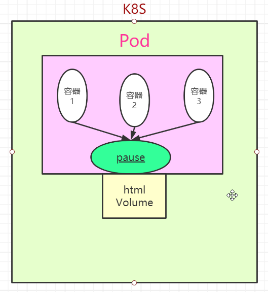
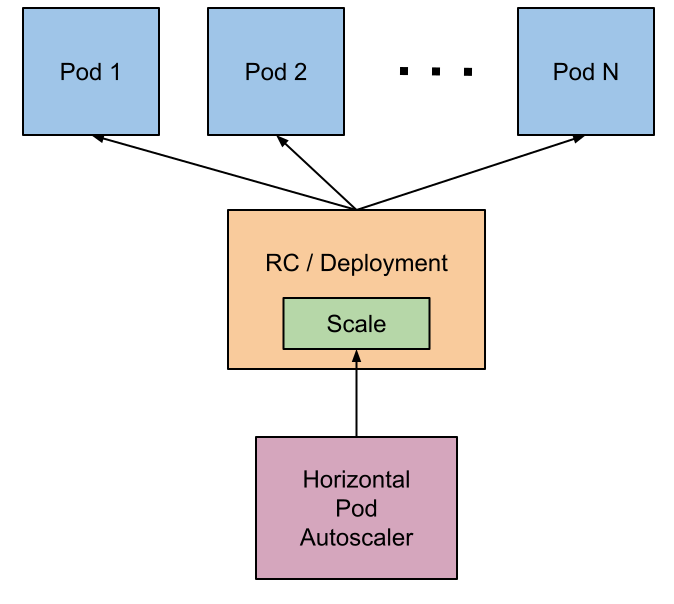
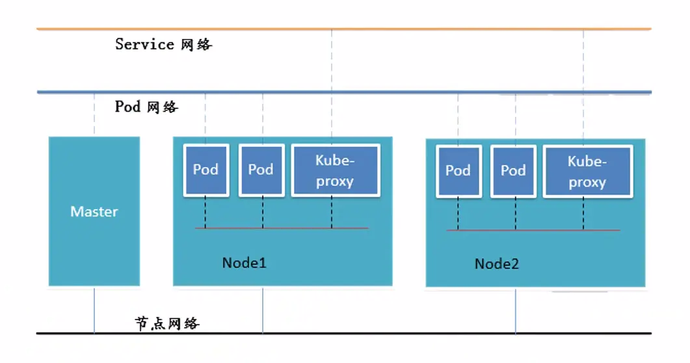
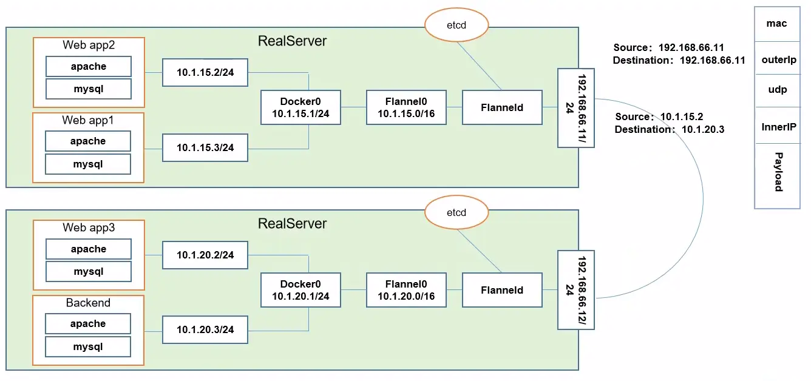

# Kubernetes 基本概念

## 1. Pod

### 1.1. Pod 概念

`Pod`是一组紧密关联的容器集合，它们共享 PID、IPC、Network 和 UTS namespace， 是 `Kubernetes `调度的基本单位。`Pod `内的多个容器共享网络和文件系统，可以通过进程间通信和文件共享这种简单高效的方式组合完成服务。

> - 每个 `Pod `都有一个特殊的被称为"**根容器**"的 **Pause 容器**
>
> - 每个 `Pod `中有一个 Pause 容器保存所有的容器状态，通过管理 Pause 容器，达到管理 Pod 中所有容器的效果
> - 在同一个 `Pod `里面，即**共享网络**，又**共享存储**

### 1.2. Pod 类型

- 自主式的 Pod（不被控制器管理）
- 控制器管理的 Pod

### 1.3. Pod 控制器类型

#### 1.3.1. ReplicationContro1ler & ReplicaSet & Deployment

- `ReplicationController`用来确保容器应用的副本数始终保持在用户定义的副本数，即如果有容器异常退出，会自动创建新的`Pod`来替代;而如果异常多出来的容器也会自动回收。

- `ReplicaSet`跟`ReplicationController`没有本质的不同，只是名字不一样，并且`ReplicaSet`支持集合式的 selector

  > 建议使用`ReplicaSet`来取代`ReplicationContro11e`

- `Deployment `为 `Pod `和 `ReplicaSet `提供了一个声明式定义 (`declarative`) 方法，用来替代以前的`ReplicationController `来方便的管理应用。这样就无需担心跟其他机制的不兼容问题（比如`rolling update`但 `Deployment`支持）

  ① 定义 Deployment 来创建 Pod 和 ReplicaSet

  ② 滚动升级和回滚应用【Deployment 自身具备的特点】

  ③ 扩容和缩容【RS 就已经实现，Deployment 通过 RS 管理 Pod 因此也支持】

  ④ 暂停和继续 Deployment【Deployment 自身具备的特点】

  > [Deployment 更新](#Deployment更新策略)

#### 1.3.2. HPA （HorizontalPodAutoScale)

`Horizontal Pod Autoscaling `仅适用于`Deployment`和`ReplicaSet `，在 v1 版本中仅支持根据 Pod 的 CPU 利用率扩所容，在 vlalpha 版本中，支持根据内存和用户自定义的 metric 扩缩容

> 可以自定义扩缩规则：Cpu > 80，Max 10，Min 2

`Pod `水平自动扩缩特性由 `Kubernetes API` 资源和控制器实现。资源决定了控制器的行为。 控制器会周期性的调整副本控制器或 `Deployment `中的副本数量，以使得 `Pod `的平均 `CPU `利用率与用户所设定的目标值匹配。

#### 1.3.3. DaemonSet

_DaemonSet_ 确保全部（或者某些）节点上运行一个 Pod 的副本。 当有节点加入集群时， 也会为他们新增一个 Pod 。 当有节点从集群移除时，这些 Pod 也会被回收。删除 DaemonSet 将会删除它创建的所有 Pod。

DaemonSet 的一些典型用法：

- 在每个节点上运行集群存守护进程
- 在每个节点上运行日志收集守护进程
- 在每个节点上运行监控守护进程

#### 1.3.4. Job，Cronjob

`Job `负责批处理任务，即仅执行一次的任务，它保证批处理任务的一个或多个 Pod 成功结束

`Cron Job`创建基于时间调度的 Jobs。

> 典型的用法如下所示：
>
> - 在给定的时间点调度 Job 运行
> - 创建周期性运行的 Job，例如：数据库备份、发送邮件

#### 1.3.5. StatefullSet

`StatefulSet `作为 `Controller `为 `Pod `提供唯一的标识。它可以保证部署和 `scale `的顺序
`StatefulSet`是为了解决有状态服务的问题（对应`Deployments`和`ReplicaSets`是为无状态服务而设计）

- 稳定的、唯一的网络标识符。
- 稳定的、持久的存储。
- 有序的、优雅的部署和缩放。
- 有序的、自动的滚动更新。

> 但是对于 mysql 这些有状态服务，还是不建议放入 k8s 中

---

## 2. 服务发现

## 3. 网络通讯模式

`Kubernetes `的网络模型假定了所有 Pod 都在一个可以直接连通的扁平的网络空间中。

- 同一个 Pod 内的多个容器之间：lo
- 各 Pod 之间的通讯：Overlay Network
- Pod 与 Service 之间的通讯：各节点的 Iptables 规则

### 3.1. 不同情况下网络通信方式

<u>同一个 Pod 内部通讯：</u>

- 同一个*Pod* 共享同一个网络命名空间，共享同一个*Linux* 协议栈

<u>Pod1 至 Pod2：</u>

- _Pod1_ 与*Pod2* 不在同一台主机，*Pod*的地址是与*docker0*在同一个网段的，但*docker0*网段与宿主机网卡是两个完全不同的 IP 网段，并且不同 Node 之间的通信只能通过宿主机的物理网卡进行。将 Pod 的 IP 和所在 Node 的 IP 关联起来，通过这个关联让 Pod 可以互相访问
- _Pod1_ 与*Pod2* 在同一台机器，由*Docker0* 网桥直接转发请求至*Pod2*，不需要经过*Flannel*

<u>Pod 至 Service 的网络：</u>

- 目前基于性能考虑，全部为 iptables 维护和转发（目前已经为 lvs）

<u>Pod 到外网：</u>

- Pod 向外网发送请求，查找路由表, 转发数据包到宿主机的网卡，宿主网卡完成路由选择后，iptables 执行 Masquerade，把源 IP 更改为宿主网卡的 IP，然后向外网服务器发送请求

<u>外网访问 Pod：</u>

- Service

### 3.2. 网络解决方案

#### 3.2.1. Kubernetes + Flannel

- Flannel 首先创建了一个名为 flannel0 的网桥，然后这个网桥的一端连接 docker0 的网桥，另一端连接一个名为 flanneld 的服务进程。
- Flanneld 进程并不简单，它首先上连 etcd，利用 etcd 来管理可分配的 IP 地址段资源，同时监控 etcd 中每个 Pod 的实际地址，并在内存中建立了一个 Pod 节点路由表；然后下连 docker0 和物理网络，使用内存中的 Pod 节点路由表，将 docker0 发给它的数据包包装起来，利用物理网络的连接将数据包投递到目标 flanneld 上，从而完成 pod 到 pod 之间的直接的地址通信。

> 这里消耗的资源还是比较高得~首先要进行二次封装，然后到目标主机后再进行解封装

**ETCD 之 Flannel 提供说明：**

- 存储管理 Flannel 可分配的 IP 地址段资源
- 监控 ETCD 中每个 Pod 的实际地址，并在内存中建立维护 Pod 节点路由表
