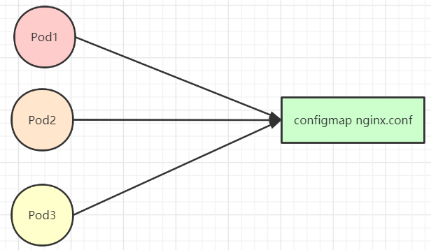
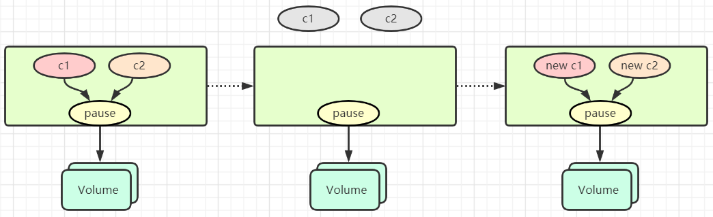
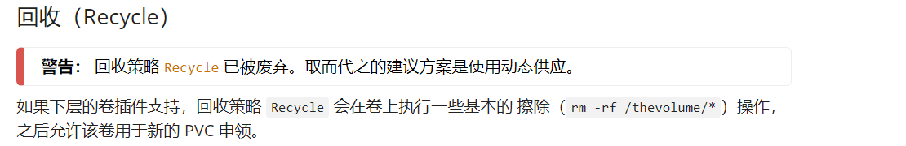
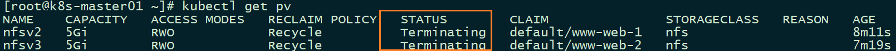

# Kubernetes 存储

## 1. configMap

### 1.1. configMap 简介

- `ConfigMap `是一种 API 对象，用来将非机密性的数据保存到健值对中。使用时可以用作环境变量、命令行参数或者存储卷中的配置文件。

- `ConfigMap `将环境配置信息和容器镜像解耦，便于应用配置的修改。当你需要储存机密信息时可以使用 Secret 对象。

> **ConfigMap**是明文保存的，如果你想存储的数据是机密的，请使用 **Secret**；或者使用其他第三方工具来保证数据的私密性，而不是用 **ConfigMap**。

### 1.2. configMap 作用

在生产环境中，比如有很多台机器，他们的配置文件就需要统一管理，方便以后进行修改维护。这种东西叫 **配置中心** （比如 spring cloud config ）。

> `ConfigMap`的作用与他类似

 

### 1.3. ConfigMap 创建

#### 1.3.1. 1、使用目录创建

`game.properties`

```properties
enemies=alienslives=3
enemies.cheat=true
enemies.cheat.level=noGoodRotten
secret.code.passphrase=UUDDLRLRBABAS
secret.code.allowed=true
secret.code.lives=30
```

`ui.properties`

```properties
color.good=purple
color.bad=yellow
allow.textmode=true
how.nice.to.look=fairlyNice
```

```shell
[root@k8s-master01 configmap]# pwd
/data/configmap
[root@k8s-master01 configmap]# ls
game.properties  ui.properties

[root@k8s-master01 configmap]# kubectl create configmap game-config --from-file=/data/configmap/
configmap/game-config created
[root@k8s-master01 configmap]# kubectl get cm
NAME          DATA   AGE
game-config   2      8s

 查看一些信息
[root@k8s-master01 configmap]# kubectl get cm -o yaml
[root@k8s-master01 configmap]# kubectl describe cm game-config 
```

#### 1.3.2. 2、使用文件创建

```shell
 可以指定目录，也可以单独指定文件
[root@k8s-master01 configmap]#  kubectl create configmap game-config-2 --from-file=/data/configmap/game.properties
```

#### 1.3.3. 3、使用宁面值创建

```shell
$ kubectl create configmap special-config --from-literal=special.how=very --from-literal=special.type=charm
```

> —from-literal参数传递配置信息，该参数可以使用多次

### 1.4. Pod 中使用 ConfigMap

#### 1.4.1. 1、使用 ConfigMap 来替代环境变量

`cm.yaml `

```yaml
apiVersion: v1
kind: ConfigMap
metadata:
  name: special-config
  namespace: default
data:
  special.how: very
  special.type: charm
---
apiVersion: v1
kind: ConfigMap
metadata:
  name: env-config
  namespace: default
data:
  log_level: INFO
```

```shell
[root@k8s-master01 configmap]# kubectl apply -f cm.yaml 
configmap/special-config created
configmap/env-config created
[root@k8s-master01 configmap]# kubectl get cm
NAME             DATA   AGE
env-config       1      6s
special-config   2      6s
```

`dapi-test-pod`

```yaml
apiVersion: v1
kind: Pod
metadata:
  name: dapi-test-pod
spec:
  containers:
    - name: test-container
      image: qianzai/k8s-myapp:v1
      command: [ "/bin/sh", "-c", "env" ]
      env:
        - name: SPECIAL_LEVEL_KEY
          valueFrom:
            configMapKeyRef:
              name: special-config
              key: special.how
        - name: SPECIAL_TYPE_KEY
          valueFrom:
            configMapKeyRef:
              name: special-config
              key: special.type
      envFrom:
        - configMapRef:
            name: env-config
  restartPolicy: Never
```

```shell
[root@k8s-master01 configmap]# kubectl apply -f dapi-test-pod 
pod/dapi-test-pod created
[root@k8s-master01 configmap]# kubectl get pod
NAME            READY   STATUS      RESTARTS   AGE
dapi-test-pod   0/1     Completed   0          3s
[root@k8s-master01 configmap]# kubectl log dapi-test-pod 
log is DEPRECATED and will be removed in a future version. Use logs instead.
MYAPP_SVC_PORT_80_TCP_ADDR=10.98.57.156
KUBERNETES_PORT=tcp://10.96.0.1:443
KUBERNETES_SERVICE_PORT=443
MYAPP_SVC_PORT_80_TCP_PORT=80
HOSTNAME=dapi-test-pod
SHLVL=1
MYAPP_SVC_PORT_80_TCP_PROTO=tcp
HOME=/root
SPECIAL_TYPE_KEY=charm		# special.type: charm
MYAPP_SVC_PORT_80_TCP=tcp://10.98.57.156:80
NGINX_VERSION=1.12.2
KUBERNETES_PORT_443_TCP_ADDR=10.96.0.1
PATH=/usr/local/sbin:/usr/local/bin:/usr/sbin:/usr/bin:/sbin:/bin
KUBERNETES_PORT_443_TCP_PORT=443
KUBERNETES_PORT_443_TCP_PROTO=tcp
MYAPP_SVC_SERVICE_HOST=10.98.57.156
SPECIAL_LEVEL_KEY=very		# special.how: very
log_level=INFO		# log_level: INFO
KUBERNETES_PORT_443_TCP=tcp://10.96.0.1:443
KUBERNETES_SERVICE_PORT_HTTPS=443
PWD=/
KUBERNETES_SERVICE_HOST=10.96.0.1
MYAPP_SVC_SERVICE_PORT=80
MYAPP_SVC_PORT=tcp://10.98.57.156:80
[root@k8s-master01 configmap]# 
```

> 通过 ConfigMap 将环境变量 注入到 Pod内部

#### 1.4.2. 2、用ConfigMap设置命令行参数

`cm.yaml`

```yaml
apiVersion: v1
kind: ConfigMap
metadata:
  name: special-config
  namespace: default
data:
  special.how: very
  special.type: charm
```

```yaml
apiVersion: v1
kind: Pod
metadata:
  name: dapi-test-pod
spec:
  containers:
    - name: test-container
      image: qianzai/k8s-myapp:v1
      command: [ "/bin/sh", "-c", "echo $(SPECIAL_LEVEL_KEY) $(SPECIAL_TYPE_KEY)" ]
      env:
        - name: SPECIAL_LEVEL_KEY
          valueFrom:
            configMapKeyRef:
              name: special-config
              key: special.how
        - name: SPECIAL_TYPE_KEY
          valueFrom:
            configMapKeyRef:
              name: special-config
              key: special.type
  restartPolicy: Never
```

> 也就是通过环境变量的方式注入值

#### 1.4.3. 3、通过数据卷插件使用ConfigMap

```yaml
apiVersion: v1
kind: Pod
metadata:
  name: dapi-test-pod
spec:
  containers:
    - name: test-container
      image: qianzai/k8s-myapp:v1
      command: [ "/bin/sh", "-c", "cat /etc/config/special.how /etc/config/special.type" ]
      volumeMounts:
        - name: config-volume
          mountPath: /etc/config	# 容器内的
  volumes:
    - name: config-volume
      configMap:
        name: special-config
  restartPolicy: Never
```

```shell
[root@k8s-master01 configmap]# kubectl apply -f dapi-test-pod 
pod/dapi-test-pod created
[root@k8s-master01 configmap]# kubectl get pod
NAME            READY   STATUS      RESTARTS   AGE
dapi-test-pod   0/1     Completed   0          4s
[root@k8s-master01 configmap]# kubectl log dapi-test-pod 
log is DEPRECATED and will be removed in a future version. Use logs instead.
very 
charm
```

### 1.5. ConfigMap 热更新

`hot-update.yaml`

```yaml
apiVersion: v1
kind: ConfigMap
metadata:
  name: log-config
  namespace: default
data:  
  log_level: INFO
---
apiVersion: extensions/v1beta1
kind: Deployment
metadata:
  name: my-nginx
spec:
  replicas: 1
  template:
    metadata:
      labels:
        run: my-nginx
    spec:
      containers:
        - name: my-nginx
          image: qianzai/k8s-myapp:v1
          ports:
            - containerPort: 80
          volumeMounts:
            - name: config-volume
              mountPath: /etc/config
      volumes:
        - name: config-volume
          configMap:
            name: log-config
```

```shell
[root@k8s-master01 configmap]# kubectl apply -f hot-update.yaml 
configmap/log-config created
deployment.extensions/my-nginx created
[root@k8s-master01 configmap]# kubectl get cm 
NAME         DATA   AGE
log-config   1      7s
[root@k8s-master01 configmap]# kubectl get pod
NAME                       READY   STATUS    RESTARTS   AGE
my-nginx-6d748db98-fs8kv   1/1     Running   0          10s
[root@k8s-master01 configmap]# kubectl exec my-nginx-6d748db98-fs8kv -it -- cat /etc/config/log_level
INFO
```

> 可以发现`log_level`对应的数据`INFO`

```shell
[root@k8s-master01 configmap]# kubectl edit configmaps log-config
 进去修改对应的值
...
data:
  log_level: DEBUG
... 
		{"apiVersion":"v1","data":{"log_level":"DEBUG"},"kind":"ConfigMap","metadata":{"annotations":{},"name":"log-config","namespace":"default"}}
...
configmap/log-config edited
```

> 修改`INFO`为`DEBUG`

```shell
[root@k8s-master01 configmap]# kubectl exec my-nginx-6d748db98-fs8kv -it -- cat /etc/config/log_level
DEBUG
```

>  可以发现Pod里面的内容已经随之改变

更新 ConfigMap 目前并不会触发相关 Pod 的滚动更新，可以通过修改 pod annotations 的方式强制触发滚动更新。

```shell
$ kubectl patch deployment my-nginx --patch '{"spec": {"template": {"metadata": {"annotations": {"version/config": "20180411" }}}}}'
```

### 1.6. 总结

更新 **ConfigMap** 后：

- 使用该 ConfigMap 挂载的 Env **不会**同步更新
- 使用该 ConfigMap 挂载的 Volume 中的数据需要一段时间（实测大概10秒）才能同步更新

`ENV `是在容器启动的时候注入的，启动之后 `kubernetes `就不会再改变环境变量的值，且同一个 `namespace `中的 `pod `的环境变量是不断累加的。为了更新容器中使用 `ConfigMap `挂载的配置，需要通过滚动更新 `pod `的方式来强制重新挂载 `ConfigMap`。

## 2. Secret

### 2.1. Secret 简介

`Secret `解决了**密码**、**token**、**密钥**等敏感数据的配置问题，而不需要把这些敏感数据暴露到镜像或者 Pod Spec中。Secret 可以以 Volume 或者环境变量的方式使用

### 2.2. Secret 三种类型

Secret有三种类型：

- **Service Account** ：用来访问Kubernetes API，由Kubernetes自动创建，并且会自动挂载到Pod的`/run/secrets/kubernetes.io/serviceaccount`目录中；
- **Opaque** ：base64编码格式的Secret，用来存储密码、密钥等；**（加密弱）**
- **kubernetes.io/dockerconfigjson** ：用来存储私有docker registry的认证信息。

#### 2.2.1. Service Account

```shell
[root@k8s-master01 ~]# kubectl run nginx --image nginx
deployment.apps/nginx created
[root@k8s-master01 ~]# kubectl get pod
NAME                     READY   STATUS    RESTARTS   AGE
nginx-7bb7cd8db5-pp9w8   1/1     Running   0          49s
[root@k8s-master01 ~]# kubectl exec nginx-7bb7cd8db5-pp9w8 ls /run/secrets/kubernetes.io/serviceaccount/
ca.crt
namespace
token
```

#### 2.2.2. Opaque

```sh
$ echo -n "admin" | base64
YWRtaW4=
$ echo -n "1f2d1e2e67df" | base64
MWYyZDFlMmU2N2Rm
```

`Opaque-secrets.yml`

```yaml
apiVersion: v1
kind: Secret
metadata:
  name: mysecret
type: Opaque
data:
  password: MWYyZDFlMmU2N2Rm
  username: YWRtaW4=
```

```shell
[root@k8s-master01 ~]# kubectl create -f Opaque-secrets.yml 
secret/mysecret created
[root@k8s-master01 ~]# kubectl get secrets 
NAME                  TYPE                                  DATA   AGE
basic-auth            Opaque                                1      5d2h
default-token-5vbgx   kubernetes.io/service-account-token   3      6d21h
mysecret              Opaque                                2      24s
tls-secret            kubernetes.io/tls                     2      5d4h
```

创建好secret之后，有两种方式来使用它：

- 以Volume方式
- 以环境变量方式

**将Secret挂载到Volume中**

`db.yaml`

```yaml
apiVersion: v1
kind: Pod
metadata:
  labels:
    name: db
  name: db
spec:
  volumes:
    - name: secrets
      secret:
        secretName: mysecret
  containers:
    - image: qianzai/k8s-myapp:v1
      name: db
      volumeMounts:
        - name: secrets
          mountPath: "/etc/secrets"
          readOnly: true
      ports:
        - name: cp
          containerPort: 5432
          hostPort: 5432
```

```shell
[root@k8s-master01 ~]# kubectl create -f db.yaml 
pod/db created
[root@k8s-master01 ~]# kubectl get pod
NAME   READY   STATUS    RESTARTS   AGE
db     1/1     Running   0          13s
[root@k8s-master01 ~]# kubectl exec db -it -- cat /etc/secrets/username /etc/secrets/password
admin
1f2d1e2e67df
```

> 可以发现在挂载使用的时候，会自己解密。（感觉没什么用~）

**将Secret导出到环境变量中**

`pod-deployment.yaml`

```yaml
apiVersion: extensions/v1beta1
kind: Deployment
metadata:
  name: pod-deployment
spec:
  replicas: 2
  template:
    metadata:
      labels:
        app: pod-deployment
    spec:
      containers:
        - name: "pod"
          image: qianzai/k8s-myapp:v1
          ports:
            - containerPort: 80
          env:
            - name: TEST_USER
              valueFrom:
                secretKeyRef:
                  name: mysecret
                  key: username
            - name: TEST_PASSWORD
              valueFrom:
                secretKeyRef:
                  name: mysecret
                  key: password
```

```shell
[root@k8s-master01 ~]# kubectl apply -f pod-deployment.yaml 
deployment.extensions/pod-deployment created
[root@k8s-master01 ~]# kubectl get pod
NAME                              READY   STATUS    RESTARTS   AGE
pod-deployment-6fdf4b46d7-54zvl   1/1     Running   0          5s
pod-deployment-6fdf4b46d7-vbkh9   1/1     Running   0          5s
[root@k8s-master01 ~]# kubectl exec pod-deployment-6fdf4b46d7-54zvl -it -- /bin/sh
/ # echo $TEST_USER
admin
/ # echo $TEST_PASSWORD
1f2d1e2e67df
```

#### 2.2.3. kubernetes.io/dockerconfigjson

可以直接用`kubectl`命令来创建用于docker registry认证的secret：

```sh
$ kubectl create secret docker-registry myregistrykey --docker-server=DOCKER_REGISTRY_SERVER --docker-username=DOCKER_USER --docker-password=DOCKER_PASSWORD --docker-email=DOCKER_EMAIL
secret "myregistrykey" created.
```

也可以直接读取`~/.docker/config.json`的内容来创建：

```sh
$ cat ~/.docker/config.json | base64
$ cat > myregistrykey.yaml <<EOF
apiVersion: v1
kind: Secret
metadata:
  name: myregistrykey
data:
  .dockerconfigjson: UmVhbGx5IHJlYWxseSByZWVlZWVlZWVlZWFhYWFhYWFhYWFhYWFhYWFhYWFhYWFhYWFhYWxsbGxsbGxsbGxsbGxsbGxsbGxsbGxsbGxsbGxsbGx5eXl5eXl5eXl5eXl5eXl5eXl5eSBsbGxsbGxsbGxsbGxsbG9vb29vb29vb29vb29vb29vb29vb29vb29vb25ubm5ubm5ubm5ubm5ubm5ubm5ubm5ubmdnZ2dnZ2dnZ2dnZ2dnZ2dnZ2cgYXV0aCBrZXlzCg==
type: kubernetes.io/dockerconfigjson
EOF
$ kubectl create -f myregistrykey.yaml
```

在创建Pod的时候，通过`imagePullSecrets`来引用刚创建的`myregistrykey`:

```yaml
apiVersion: v1
kind: Pod
metadata:
  name: foo
spec:
  containers:
    - name: foo
      image: janedoe/awesomeapp:v1
  imagePullSecrets:
    - name: myregistrykey
```

## 3. Volume

### 3.1. Volume 简介

容器磁盘上的文件的生命周期是短暂的，这就使得在容器中运行重要应用时会出现一些问题。

- 首先，当容器崩溃时，kubelet 会重启它，但是容器中的文件将丢失——容器以干净的状态（镜像最初的状态）重新启动。
- 其次，在 `Pod` 中同时运行多个容器时，这些容器之间通常需要共享文件。**Kubernetes** 中的 `Volume`抽象就很好的解决了这些问题。

`Kubernetes `中的卷有明确的寿命——与封装它的 `Pod `相同。所以，卷的生命比 `Pod `中的所有容器都长，当这个容器重启时数据仍然得以保存。当然，当 `Pod` 不再存在时，卷也将不复存在。也许更重要的是，`Kubernetes `支持多种类型的卷，`Pod `可以同时使用任意数量的卷。



> 在前面**pod概念**中已经说到，在同一个Pod里面，即共享网络，又共享存储。

- 在重启容器的过程中，这个`Volume`并没有产生变化

### 3.2. Volume 类型

Kubernetes 支持以下类型的卷：

- `awsElasticBlockStore`
- `azureDisk`
- `azureFile`
- `cephfs`
- `csi`
- `downwardAPI`
- `emptyDir`
- `fc` (fibre channel)
- `flocker`
- `gcePersistentDisk`
- `gitRepo`
- `glusterfs`
- `hostPath`
- `iscsi`
- `local`
- `nfs`
- `persistentVolumeClaim`
- `projected`
- `portworxVolume`
- `quobyte`
- `rbd`
- `scaleIO`
- `secret`
- `storageos`
- `vsphereVolume`

### 3.3. Volume 详解

#### 3.3.1. emptyDir

当 Pod 被分配给节点时，首先创建 `emptyDir` 卷，并且只要该 Pod 在该节点上运行，该卷就会存在。正如卷的名字所述，它最初是空的。Pod 中的容器可以读取和写入 `emptyDir` 卷中的相同文件，尽管该卷可以挂载到每个容器中的相同或不同路径上。当出于任何原因从节点中删除 Pod 时，`emptyDir` 中的数据将被永久删除。

> **注意**：容器崩溃不会从节点中移除 pod，因此 `emptyDir` 卷中的数据在容器崩溃时是安全的。

`emptyDir` 的用法有：

- 暂存空间，例如用于基于磁盘的合并排序
- 用作长时间计算崩溃恢复时的检查点
- Web服务器容器提供数据时，保存内容管理器容器提取的文件

`emptyDir.yaml`

```yaml
apiVersion: v1
kind: Pod
metadata:
  name: emptydir
spec:
  containers:
    - image: qianzai/k8s-myapp:v1
      name: test-container-1
      volumeMounts:
        - mountPath: /cache1
          name: cache-volume

    - image: busybox
      name: test
      volumeMounts:
        - mountPath: /test
          name: cache-volume
  volumes:
    - name: cache-volume
      emptyDir: {}

```

> 创建了两个容器，一个挂载在/cache1目录，一个挂载在/cache2目录

```shell
[root@k8s-master01 ~]# kubectl apply -f emptyDir.yaml 
pod/emptydir created
[root@k8s-master01 ~]# kubectl get pod
NAME       READY   STATUS    RESTARTS   AGE
emptydir   2/2     Running   1          7s
```

先在**test-container-1**容器的`cache1/`目录 创建一个文件test

```shell
[root@k8s-master01 ~]# kubectl exec emptydir -c test-container-1 -it -- /bin/sh
/ # cd cache1/
/cache1 # date >>test
/cache1 # cat test 
Tue Nov 10 09:04:07 UTC 2020

[root@k8s-master01 ~]# kubectl exec emptydir -c test-container-2 -it -- /bin/sh
/ # cd /cache2/
/cache2 # cat test 
Tue Nov 10 09:04:07 UTC 2020
```

#### 3.3.2. hostPath

`hostPath` 卷将主机节点的文件系统中的文件或目录挂载到集群中。该功能大多数 Pod 都用不到，但它为某些应用程序提供了一个强大的解决方法。

例如，`hostPath` 的用途如下：

- 运行需要访问 Docker 内部的容器；使用 `/var/lib/docker` 的 `hostPath`
- 在容器中运行 cAdvisor；使用 `/dev/cgroups` 的 `hostPath`
- 允许 pod 指定给定的 hostPath 是否应该在 pod 运行之前存在，是否应该创建，以及它应该以什么形式存在

除了所需的 `path` 属性之外，用户还可以为 `hostPath` 卷指定 `type`。

`type` 字段支持以下值：

| 值                  | 行为                                                         |
| :------------------ | :----------------------------------------------------------- |
|                     | 空字符串（默认）用于向后兼容，这意味着在挂载 hostPath 卷之前不会执行任何检查。 |
| `DirectoryOrCreate` | 如果在给定的路径上没有任何东西存在，那么将根据需要在那里创建一个空目录，权限设置为 0755，与 Kubelet 具有相同的组和所有权。 |
| `Directory`         | 给定的路径下必须存在目录                                     |
| `FileOrCreate`      | 如果在给定的路径上没有任何东西存在，那么会根据需要创建一个空文件，权限设置为 0644，与 Kubelet 具有相同的组和所有权。 |
| `File`              | 给定的路径下必须存在文件                                     |
| `Socket`            | 给定的路径下必须存在 UNIX 套接字                             |
| `CharDevice`        | 给定的路径下必须存在字符设备                                 |
| `BlockDevice`       | 给定的路径下必须存在块设备                                   |

使用这种卷类型是请注意，因为：

- 由于每个节点上的文件都不同，具有相同配置（例如从 podTemplate 创建的）的 pod 在不同节点上的行为可能会有所不同
- 当 Kubernetes 按照计划添加资源感知调度时，将无法考虑 `hostPath` 使用的资源
- 在底层主机上创建的文件或目录只能由 root 写入。您需要在特权容器中以 root 身份运行进程，或修改主机上的文件权限以便写入 `hostPath` 卷

`hostPath.yaml`

```yaml
apiVersion: v1
kind: Pod
metadata:
  name:  hostpath
spec:
  containers:
    - image: qianzai/k8s-myapp:v1
      name: test-container
      volumeMounts:
        - mountPath: /hostPath
          name: test-volume
  volumes:
    - name: test-volume
      hostPath:
        # directory location on host
        path: /data
        # this field is optional
        type: Directory
```

```shell
[root@k8s-master01 ~]# kubectl apply -f hostPath.yaml 
pod/hostpath created
[root@k8s-master01 ~]# kubectl get pod -o wide
NAME       READY   STATUS    RESTARTS   AGE     IP            NODE         NOMINATED NODE   READINESS GATES
hostpath   1/1     Running   0          4s   10.244.1.47   k8s-node01   <none>           <none>
[root@k8s-master01 ~]# kubectl exec -it hostpath -- /bin/sh
/ # cd hostPath/
/hostPath # date >>test
```

> 然后可以发现运行在 `node01 `节点

```shell
[root@k8s-node01 ~]# cd /data/
[root@k8s-node01 data]# cat test 
Tue Nov 10 09:28:06 UTC 2020
```

## 4. Persistent Volume（持久化卷）

### 4.1. 概念

`PersistentVolume`（PV）是由管理员设置的存储，它是群集的一部分。就像节点是集群中的资源一样，PV 也是集群中的资源。 PV 是 Volume 之类的卷插件，但具有独立于使用 PV 的 Pod 的生命周期。此 API 对象包含存储实现的细节，即 NFS、iSCSI 或特定于云供应商的存储系统。

> 独立于使用 PV 的 Pod 的生命周期，就是说Pod被删除了，PV依然会被保留 

`PersistentVolumeClaim`（PVC）是用户存储的请求。它与 Pod 相似。Pod 消耗节点资源，PVC 消耗 PV 资源。Pod 可以请求特定级别的资源（CPU 和内存）。声明可以请求特定的大小和访问模式（例如，可以以读/写一次或 只读多次模式挂载）。

#### 4.1.1. 配置（Provision）

**静态**

集群管理员创建一些 PV。它们带有可供群集用户使用的实际存储的细节。它们存在于 Kubernetes API 中，可用于消费。

**动态**

当管理员创建的静态PV都无法与PVC匹配时，群集可能会尝试为PVC动态配置卷。此配置基于StorageClasses：PVC必须请求 存储类，并且管理员必须已创建并配置该类，以便进行动态配置。请求该类的声明""有效地禁用了它们自己的动态配置。

要启用基于存储级别的动态存储配置，集群管理员需要启用API Server上的DefaultStorageClass[准入控制器]。例如，通过确保DefaultStorageClass位于API Server组件的`--admission-control`标志，使用逗号分隔的有序值列表中，可以完成此操作。

#### 4.1.2. 绑定

在动态配置的情况下，用户创建或已经创建了具有特定存储量的 `PersistentVolumeClaim` 以及某些访问模式。master 中的控制环路监视新的 PVC，寻找匹配的 PV（如果可能），并将它们绑定在一起。如果为新的 PVC 动态调配 PV，则该环路将始终将该 PV 绑定到 PVC。否则，用户总会得到他们所请求的存储，但是容量可能超出要求的数量。一旦 PV 和 PVC 绑定后，`PersistentVolumeClaim` 绑定是排他性的，不管它们是如何绑定的。 PVC 跟 PV 绑定是一对一的映射。

如果没有匹配的卷，声明将无限期地保持未绑定状态。随着匹配卷的可用，声明将被绑定。例如，配置了许多 50Gi PV的集群将不会匹配请求 100Gi 的PVC。将100Gi PV 添加到群集时，可以绑定 PVC。

#### 4.1.3. 持久化卷声明的保护

PVC 保护的目的是确保由 pod 正在使用的 PVC 不会从系统中移除，因为如果被移除的话可能会导致数据丢失。

注意：当 pod 状态为 `Pending` 并且 pod 已经分配给节点或 pod 为 `Running` 状态时，PVC 处于活动状态。

当启用PVC 保护 alpha 功能时，如果用户删除了一个 pod 正在使用的 PVC，则该 PVC 不会被立即删除。PVC 的删除将被推迟，直到 PVC 不再被任何 pod 使用。

### 4.2. 持久化卷 类型

**PersistentVolume** 类型以插件形式实现。Kubernetes 目前支持以下插件类型：

- `GCEPersistentDisk` `AWSElasticBlockStore` `AzureFile` `AzureDisk` `FC(Fibre Channel)`
- `FlexVolume` `Flocker` `NFS` `iSCSI` `RBD(Ceph Block Device)` `CephFS`
- `Cinder(OpenStack block storage)` `Glusterfs` `VsphereVolume` `Quobyte` `Volumes`
- `HostPath` `VMware` `Photon` `Portworx Volumes` `Scalelo Volumes` `StorageOS`

> 原始块支持仅适用于以上这些插件。(排名不分先后)

**简单演示**

```yaml
apiVersion: v1 
kind: PersistentVolume 
metadata:
  name：pve003 
spec:
  capacity:
    # 卷的大小为5G
    storage: 5Gi 
  # 存储卷的类型为：文件系统
  volumeMode: Filesystem 
  # 访问策略：该卷可以被单个节点以读/写模式挂载
  accessModes:
    - ReadNriteOnce 
  # 回收策略：回收
  persistentVolumeReclaimPolicy: Recycle
  # 对应的具体底层存储的分级
  # 比如有些固态或者其他存储类型比较快，就可以定义为strong
  storageClassName: slow
  # (可选的)挂载选项
  mountOptions:
    - hard 
    - nfsvers=4.1
  # 具体对应的真实底层存储类型为nfs
  # 挂载到172服务器下的/tmp目录
  nfs:
    path: /tmp 
    server: 172.17.0.2
```

### 4.3. 持久化卷 详解

#### 4.3.1. 访问模式

`PersistentVolume` 可以以资源提供者支持的任何方式挂载到主机上。如下表所示，供应商具有不同的功能，每个 PV 的访问模式都将被设置为该卷支持的特定模式。例如，NFS 可以支持多个读/写客户端，但特定的 NFS PV 可能以只读方式导出到服务器上。每个 PV 都有一套自己的用来描述特定功能的访问模式。

存储模式包括：

- ReadWriteOnce——该卷可以被单个节点以读/写模式挂载
- ReadOnlyMany——该卷可以被多个节点以只读模式挂载
- ReadWriteMany——该卷可以被多个节点以读/写模式挂载

在命令行中，访问模式缩写为：

- RWO - ReadWriteOnce
- ROX - ReadOnlyMany
- RWX - ReadWriteMany

> **重要**！一个卷一次只能使用一种访问模式挂载，即使它支持很多访问模式。例如，GCEPersistentDisk 可以由单个节点作为 ReadWriteOnce 模式挂载，或由多个节点以 ReadOnlyMany 模式挂载，但不能同时挂载。

| Volume 插件          | ReadWriteOnce | ReadOnlyMany |      ReadWriteMany      |
| :------------------- | :-----------: | :----------: | :---------------------: |
| AWSElasticBlockStore |       ✓       |      -       |            -            |
| AzureFile            |       ✓       |      ✓       |            ✓            |
| AzureDisk            |       ✓       |      -       |            -            |
| CephFS               |       ✓       |      ✓       |            ✓            |
| Cinder               |       ✓       |      -       |            -            |
| FC                   |       ✓       |      ✓       |            -            |
| FlexVolume           |       ✓       |      ✓       |            -            |
| Flocker              |       ✓       |      -       |            -            |
| GCEPersistentDisk    |       ✓       |      ✓       |            -            |
| Glusterfs            |       ✓       |      ✓       |            ✓            |
| HostPath             |       ✓       |      -       |            -            |
| iSCSI                |       ✓       |      ✓       |            -            |
| PhotonPersistentDisk |       ✓       |      -       |            -            |
| Quobyte              |       ✓       |      ✓       |            ✓            |
| NFS                  |       ✓       |      ✓       |            ✓            |
| RBD                  |       ✓       |      ✓       |            -            |
| VsphereVolume        |       ✓       |      -       | - （当 pod 并列时有效） |
| PortworxVolume       |       ✓       |      -       |            ✓            |
| ScaleIO              |       ✓       |      ✓       |            -            |
| StorageOS            |       ✓       |      -       |            -            |

#### 4.3.2. 回收策略

当前的回收策略包括：

- Retain（保留）——手动回收
- Recycle（回收）——基本擦除（`rm -rf /thevolume/*`）
- Delete（删除）——关联的存储资产（例如 AWS EBS、GCE PD、Azure Disk 和 OpenStack Cinder 卷）将被删除

当前，只有 `NFS `和 `HostPath `支持回收策略。AWS EBS、GCE PD、Azure Disk 和 Cinder 卷支持删除策略。

> **注：**
>
> 最新版本中的`Recycle`已被废弃，点击 [官网查看](https://kubernetes.io/zh/docs/concepts/storage/persistent-volumes/)
>
> 

#### 4.3.3. 状态

卷可以处于以下的某种状态：

- **Available**（可用）——一块空闲资源还没有被任何声明绑定
- **Bound**（已绑定）——卷已经被声明绑定
- **Released**（已释放）——声明被删除，但是资源还未被集群重新声明
- **Failed**（失败）——该卷的自动回收失败

命令行会显示绑定到 PV 的 PVC 的名称。

### 4.4. 持久化卷 演示

#### 4.4.1. 1、安装 NFS 服务器

```shell
[root@hub ~]# yum install -y nfs-common nfs-utils  rpcbind
[root@hub ~]# mkdir /nfs
[root@hub ~]# chmod 777 /nfs/
[root@hub ~]# chown nfsnobody /nfs/
[root@hub ~]# echo "/nfs *(rw,no_root_squash,no_all_squash,sync)" >>/etc/exports
[root@hub ~]# systemctl start rpcbind
[root@hub ~]# systemctl start nfs

 所有的节点都安装nfs客户端，rpc
$ yum install -y nfs-utils  rpcbind
```

```shell
[root@k8s-master01 ~]# mkdir /test

 在master 节点查看是否能检查到nfs节点
[root@k8s-master01 ~]# showmount -e 192.168.200.80
Export list for 192.168.200.80:
/nfs *

[root@k8s-master01 ~]# mount -t nfs 192.168.200.80:/nfs /test/
[root@k8s-master01 ~]# df -h
Filesystem               Size  Used Avail Use% Mounted on
...
192.168.200.80:/nfs      100G  4.8G   96G   5% /test
```

> NFS服务器 部署完成

#### 4.4.2. 2、部署 PV

`pv.yaml`

```yaml
apiVersion: v1
kind: PersistentVolume
metadata:
  name: nfsv1
spec:
  capacity:
    storage: 5Gi
  accessModes:
    - ReadWriteOnce
  persistentVolumeReclaimPolicy: Recycle
  storageClassName: nfs
  nfs:
    path: /nfs
    server: 192.168.200.80
```

```shell
[root@k8s-master01 ~]# kubectl apply -f  pv.yaml 
persistentvolume/nfsv1 created
[root@k8s-master01 ~]# kubectl get persistentvolume
NAME    CAPACITY   ACCESS MODES   RECLAIM POLICY   STATUS      CLAIM   STORAGECLASS   REASON   AGE
nfsv1   5Gi        RWO            Recycle          Available           nfs                     23s
```

#### 4.4.3. 3、创建服务并使用PVC

```yaml
apiVersion: v1
kind: Service
metadata:
  name: nginx
  labels:
    app: nginx
spec:
  ports:
    - port: 80
      name: web
  clusterIP: None
  selector:
    app: nginx
---
apiVersion: apps/v1
kind: StatefulSet
metadata:
  name: web
spec:
  selector:
    matchLabels:
      app: nginx
  serviceName: "nginx"
  replicas: 3
  template:
    metadata:
      labels:
        app: nginx
    spec:
      containers:
        - name: nginx
          image: qianzai/k8s-myapp:v2
          ports:
            - containerPort: 80
              name: web
          volumeMounts:
            - name: www
              mountPath: /usr/share/nginx/html
  volumeClaimTemplates:
    - metadata:
        name: www
      spec:
        accessModes: [ "ReadWriteOnce" ]
        storageClassName: "nfs"
        resources:
          requests:
            storage: 1Gi
```

```shell
[root@k8s-master01 ~]# kubectl apply -f pvcpod.yaml 
service/nginx created
statefulset.apps/web created

[root@k8s-master01 ~]# kubectl get pod
NAME    READY   STATUS    RESTARTS   AGE
web-0   1/1     Running   0          6s
web-1   0/1     Pending   0          5s
```

> 发现第二个运行不成功！第三个都没有被创建，是因为是按序创建的，前面的没有成功，后面是不会被创建的

```shell
[root@k8s-master01 ~]# kubectl describe pod web-1 
Name:           web-1
Namespace:      default
...
...
Events:
  Type     Reason            Age                From               Message
  ----     ------            ----               ----               -------
  Warning  FailedScheduling  25s (x3 over 96s)  default-scheduler  pod has unbound immediate PersistentVolumeClaims (repeated 2 times)
```

> `describe`查看发现,PersistentVolumeClaims不能绑定。

```shell
 因为 只有一个 nfsv1 ，已经被绑定了
[root@k8s-master01 ~]# kubectl get persistentvolume
NAME    CAPACITY   ACCESS MODES   RECLAIM POLICY   STATUS   CLAIM               STORAGECLASS   REASON   AGE
nfsv1   5Gi        RWO            Recycle          Bound    default/www-web-0   nfs                     36m
```

> 所以要创建成功再创建两个 PV就好。

### 4.5. 关于 Statefulset

- 匹配 Pod name ( 网络标识 ) 的模式为：`$(statefulset名称)-$`(序号)，比如上面的示例：web-0，web-1，web-2

- `StatefulSet`为每个Pod副本创建了一个`DNS域`名，这个域名的格式为:`S(podname).(headless servername)`

  ```shell
  # 进入web-2，pingweb-1
  [root@k8s-master01 ~]# kubectl exec -it web-2 -- bin/sh
  / # ping -c 3 web-0.nginx
  PING web-0.nginx (10.244.1.59): 56 data bytes
  64 bytes from 10.244.1.59: seq=0 ttl=64 time=0.077 ms
  64 bytes from 10.244.1.59: seq=1 ttl=64 time=0.090 ms
  64 bytes from 10.244.1.59: seq=2 ttl=64 time=0.068 ms
  
  --- web-0.nginx ping statistics ---
  3 packets transmitted, 3 packets received, 0% packet loss
  round-trip min/avg/max = 0.068/0.078/0.090 ms
  ```

  > 也就意味着服务间是通过Pod域名来通信而非PodIP，因为当Pod所在Node发生故障时，Pod会被飘移到其它 Node上,PodIP会发生变化，但是Pod域名不会有变化

- `StatefulSet`使用`Headless服务`来控制Pod的域名，这个域名的FQDN为:`S(servicename).$(namespace).svc.cluster.local`

  > 其中，“cluster.local”指的是集群的域名

- 根据`volumeClaimTemplates`，为每个Pod 创建一个pvo,pvc的命名规则匹配模式:
  `(volumeClaimTemplates.name)-(pod_name)`

  > 比如上面的 `volumeMounts.name=www,Podname-web-[0-2]`，因此创建出来的PVC是 `www-web-0、www-web-1、 www-web-2`

- 删除 Pod 不会删除其pvc，手动删除 pvc将自动释放pv

**Statefulset的启停顺序:**

1. 有序部署:部罢Statefulset时，如果有多个Pod副本，它们会被顺序地创建（从0到N-1)并且，在下一个Pod运行之前所有之前的Pod必须都是Running和Ready状态。
2. 有序删除:当Pod被删除时，它们被终止的顺序是从N-1到0。
3. 有序扩展:当对Pod执行扩展操作时，与部署一样，它前面的Pod必须都处于Running和Ready状态。

**Statefulset使用场景:**

1. 稳定的持久化存储，即Pod重新调度后还是能访问到相同的持久化数据，基于PVC 来实现。
2. 稳定的网络标识符，即Pod 重新调度后其iPodName 和 HostName不变。
3. 有序部署，有序扩展，基于init containers 来实现。
4. 有序收缩。

### 4.6. 持久化卷 问题

#### 4.6.1. 1、pv无法删除



```shell
$ kubectl patch pv nfsv3 -p '{"metadata":{"finalizers":null}}'
```