# Kubernetes 服务发现

## 1. Service 简介

`Kubernetes Service` 定义了这样一种抽象：逻辑上的一组 `Pod`，一种可以访问它们的策略 —— 通常称为**微服务**。 这一组 `Pod `能够被 `Service `访问到，通常是通过 [选择算符](https://kubernetes.io/zh/docs/concepts/overview/working-with-objects/labels/) （`Label Selector`）

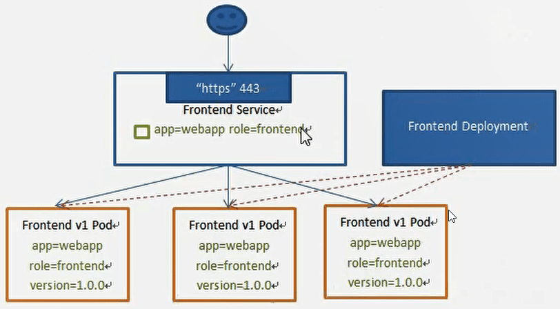

> 访问`svc`的时候，就是通过`Round Robin`（轮询算法）访问下面一个`Pod`，有且只有这一个算法。

**Service能够提供负载均衡的能力,但是在使用上有以下限制**

- 只提供4层负载胸衡能力，而没有7层功能，但有时我们可能需要更多的匹配规则来转发请求,这点上4层负载均衡是不支持的
- 后续可以添加ingress，达到七层的功能

## 2. Service 类型

`Service`在 `K8s`中有以下四种类型：

- **ClusterIp**：默认类型，自动分配一个仅 Cluster 内部可以访问的虚拟 IP

- **NodePort**：在 ClusterIP 基础上为 Service 在每台机器上绑定一个端口，这样就可以通过`<NodeIP>: NodePort `来访问该服务
- **LoadBalancer**：在 NodePort 的基础上，借助 cloud provider 创建一个外部负载均衡器，并将请求转发到`<NodeIP>: NodePort`
- **ExternalName**：把集群外部的服务引入到集群内部来，在集群内部直接使用。没有任何类型代理被创建，这只有 kubernetes 1.7 或更高版本的 kube-dns 才支持

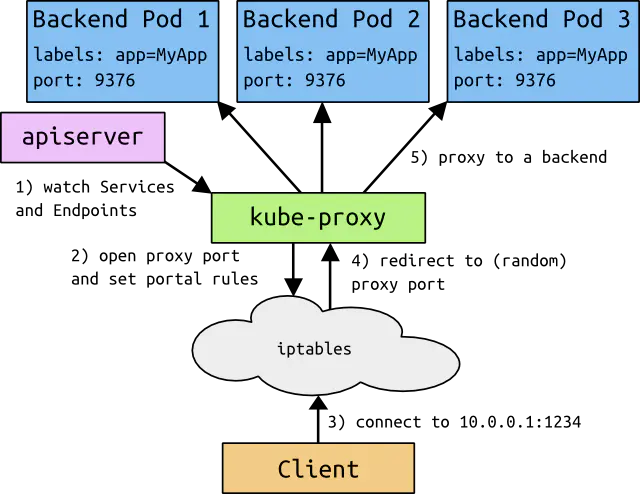

### 2.1. ClusterIP

**clusterIP** 主要在每个 `node `节点使用 `iptables`，将发向 **clusterIP** 对应端口的数据，转发到 `kube-proxy` 中。然后 `kube-proxy` 自己内部实现有负载均衡的方法，并可以查询到这个 `service `下对应 `pod `的地址和端口，进而把数据转发给对应的 `pod` 的地址和端口

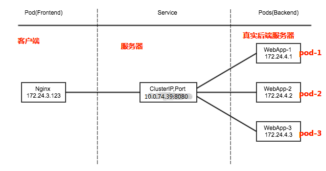

为了实现图上的功能，主要需要以下几个组件的协同工作：

- apiserver 用户通过kubectl命令向apiserver发送创建service的命令，apiserver接收到请求后将数据存储到etcd中
- kube-proxy kubernetes的每个节点中都有一个叫做kube-porxy的进程，这个进程负责感知service，pod的变化，并将变化的信息写入本地的iptables规则中
- iptables 使用NAT等技术将virtualIP的流量转至endpoint中

**myapp-deploy.yaml** 

```yaml
apiVersion: apps/v1
kind: Deployment
metadata:
  name: myapp-deploy
  namespace: default
spec:
  replicas: 3
  selector:
    matchLabels:
      app: myapp
      release: stabel
  template:
    metadata:
      labels:
        app: myapp
        release: stabel
        env: test
    spec:
      containers:
        - name: myapp
          image: qianzai/k8s-myapp:v2
          imagePullPolicy: IfNotPresent
          ports:
            - name: http
              containerPort: 80
```

```shell
[root@k8s-master01 ~]# kubectl apply -f myapp-deploy.yaml 
deployment.apps/myapp-deploy created
[root@k8s-master01 ~]# kubectl get pod
NAME                            READY   STATUS    RESTARTS   AGE
myapp-deploy-58f45c56fc-5zvqz   1/1     Running   0          8s
myapp-deploy-58f45c56fc-jxpht   1/1     Running   0          8s
myapp-deploy-58f45c56fc-rz7th   1/1     Running   0          8s
```

**myapp-service.yaml**

```yaml
apiVersion: v1
kind: Service
metadata:  
  name: myapp  
  namespace: default
spec:  
    type: ClusterIP
    selector:    
        app: myapp    
        release: stabel  
    ports:  
      - name: http    
        port: 80    
        targetPort: 80
```

```shell
[root@k8s-master01 ~]# kubectl apply -f myapp-service.yaml 
service/myapp created
[root@k8s-master01 ~]# kubectl get svc
NAME         TYPE        CLUSTER-IP     EXTERNAL-IP   PORT(S)   AGE
kubernetes   ClusterIP   10.96.0.1      <none>        443/TCP   18d
myapp        ClusterIP   10.111.41.16   <none>        80/TCP    9s
[root@k8s-master01 ~]# ipvsadm -Ln
IP Virtual Server version 1.2.1 (size=4096)
Prot LocalAddress:Port Scheduler Flags
  -> RemoteAddress:Port           Forward Weight ActiveConn InActConn
TCP  10.96.0.1:443 rr
  -> 192.168.200.61:6443          Masq    1      1          0         
TCP  10.96.0.10:53 rr
TCP  10.96.0.10:9153 rr
TCP  10.111.41.16:80 rr
  -> 10.244.1.53:80               Masq    1      0          0         
  -> 10.244.2.152:80              Masq    1      0          0         
  -> 10.244.2.153:80              Masq    1      0          0         
UDP  10.96.0.10:53 rr
```

### 2.2. Headless Service

有时不需要或不想要负载均衡，以及单独的 `Service IP` 。遇到这种情况，可以通过指定 **ClusterIP**(`spec.clusterIP`) 的值为 “None” 来创建 Headless Service 。这类 Service 并不会分配 Cluster IP， kube-proxy 不会处理它们，而且平台也不会为它们进行负载均衡

**myapp-svc-headless.yaml**

```yaml
apiVersion: v1
kind: Service
metadata:
  name: myapp-headless
  namespace: default
spec:
  selector:
    app: myapp
  clusterIP: "None"
  ports:
    - port: 80
      targetPort: 80
```

```shell
[root@k8s-master01 ~]# kubectl apply -f myapp-svc-headless.yaml 
service/myapp-headless created
[root@k8s-master01 ~]# kubectl get svc
NAME             TYPE        CLUSTER-IP     EXTERNAL-IP   PORT(S)   AGE
kubernetes       ClusterIP   10.96.0.1      <none>        443/TCP   18d
myapp-headless   ClusterIP   None           <none>        80/TCP    57s
```

### 2.3. NodePort

`nodePort `的原理在于在 `node `上开了一个端口，将向该端口的流量导入到 `kube-proxy`，然后由 `kube-proxy `进一步到给对应的 `pod`

**nodePort.yaml**

```yaml
apiVersion: v1
kind: Service
metadata:
  name: myapp
  namespace: default
spec:
  type: NodePort
  selector:
    app: myapp
    release: stabel
  ports:
    - name: http
      port: 80
      targetPort: 80
```

```shell
[root@k8s-master01 ~]# kubectl create -f nodePort.yaml 
service/myapp created
[root@k8s-master01 ~]# kubectl get svc
NAME             TYPE        CLUSTER-IP      EXTERNAL-IP   PORT(S)        AGE
kubernetes       ClusterIP   10.96.0.1       <none>        443/TCP        18d
myapp            NodePort    10.99.126.245   <none>        80:31559/TCP   5s
myapp-headless   ClusterIP   None            <none>        80/TCP         15m
```

> 这里可以发现一个pod是可以对应多个service的

可以通过`nodeip:31559`访问

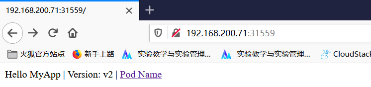

### 2.4. LoadBalancer

**loadBalancer** 和 `nodePort `其实是同一种方式。区别在于 **loadBalancer** 比 `nodePort `多了一步，就是可以调用`cloud provider` 去创建 `LB `来向节点导流

> LB：由供应商提供的，LAAS（负载均衡即服务）

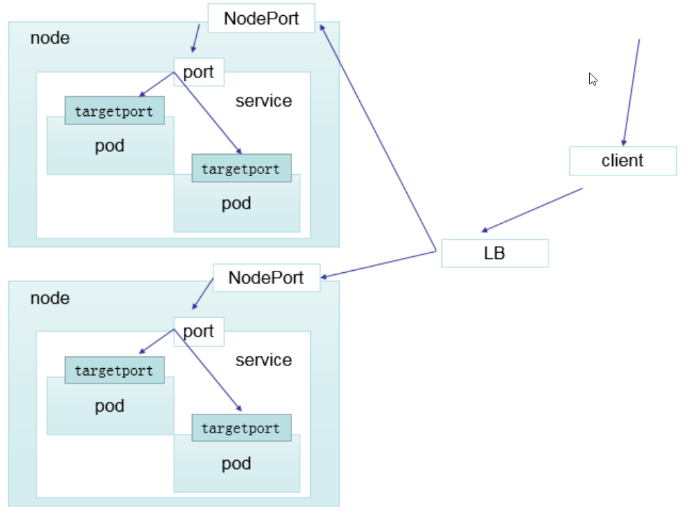

### 2.5. ExternalName

这种类型的 `Service `通过返回 CNAME 和它的值，可以将服务映射到 **externalName** 字段的内容( 例如：ink.bzm.com)。**ExternalName Service** 是 `Service `的特例，它没有 `selector`，也没有定义任何的端口和`Endpoint`。相反的，对于运行在集群外部的服务，它通过返回该外部服务的别名这种方式来提供服务

**ex.yaml**

```yaml
kind: Service
apiVersion: v1
metadata:  
  name: my-service-1  
  namespace: default
spec:  
  type: ExternalName   
  externalName: ink.bzm.com
```

> 当查询主机 my-service.defalut.svc.cluster.local ( SVC_NAME.NAMESPACE.svc.cluster.local )时，集群的DNS 服务将返回一个值ink.bzm.com 的 CNAME 记录。访问这个服务的工作方式和其他的相同，唯一不同的是重定向发生在 DNS 层，而且不会进行代理或转发

```shell
[root@k8s-master01 ~]# kubectl create -f ex.yaml 
service/my-service-1 created
[root@k8s-master01 ~]# kubectl get svc
NAME             TYPE           CLUSTER-IP      EXTERNAL-IP   PORT(S)        AGE
kubernetes       ClusterIP      10.96.0.1       <none>        443/TCP        18d
my-service-1     ExternalName   <none>          ink.bzm.com   <none>         7s
```


## 3. VIP和 Service代理

在 `Kubernetes `集群中，每个 `Node` 运行一个`kube-proxy`进程。`kube-proxy`负责为`Service`实现了一种`VIP`（**虚拟 IP**）的形式，而不是`ExternalName`的形式。

> **各版本kube-proxy支持的代理模式**
>
> - Kubernetes v1.0支持userspace代理模式。
>
> - Kubernetes v1.1添加了 iptables 模式代理，在Kubernetes v1.2，默认配置为iptables。
>
> - Kubernetes v1.8添加了 ipvs 代理模式。

## 4. 代理模式的分类

### 4.1. 1、userspace 代理模式

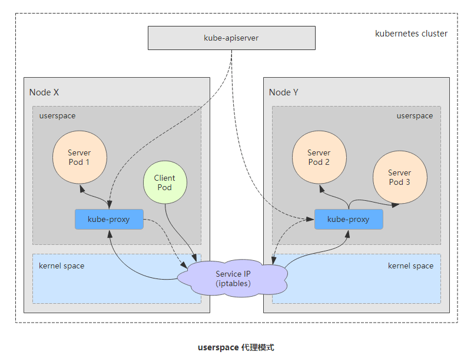

### 4.2. 2、iptables 代理模式

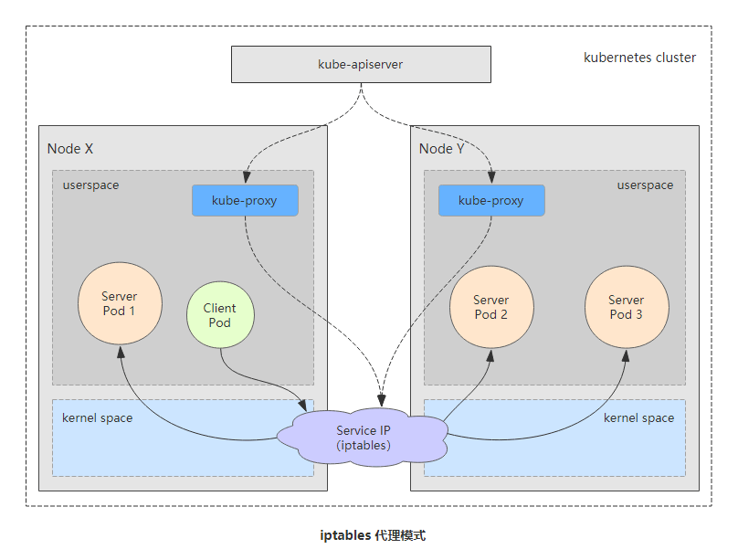

### 4.3. 3、ipvs代理模式

这种模式，`kube-proxy` 会监视 **Kubernetes** `Service`对象和`Endpoints`，调用`netlink`接口以相应地创建ipvs 规则并定期与 Kubernetes Service对象和Endpoints对象同步 ipvs 规则，以确保 ipvs 状态与期望一致。访问服务时，流量将被重定向到其中一个后端 Pod

与 iptables 类似，ipvs 于 netfilter 的 hook 功能，但使用哈希表作为底层数据结构并在内核空间中工作。这意味着 ipvs 可以更快地重定向流量，并且在同步代理规则时具有更好的性能。此外，ipvs 为负载均衡算法提供了更多选项，例如：

- rr：轮询调度
- lc：最小连接数
- dh：目标哈希
- sh：源哈希
- sed：最短期望延迟
- nq：不排队调度

>  <!--注意: ipvs模式假定在运行kube-proxy 之前在节点上都已经安装了IPVS 内核模块。当kube-proxy 以 ipvs 代理模式启动时，kube-proxy 将验证节点上是否安装了工PVs模块，如果未安装，则kube-proxy将回退到 iptables 代理模式-->

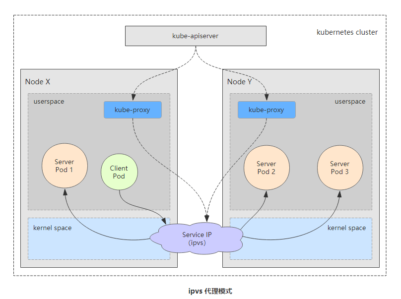

```shell
[root@k8s-master01 ~]# ipvsadm -Ln
IP Virtual Server version 1.2.1 (size=4096)
Prot LocalAddress:Port Scheduler Flags
  -> RemoteAddress:Port           Forward Weight ActiveConn InActConn
TCP  10.96.0.1:443 rr
  -> 192.168.200.61:6443          Masq    1      1          0         
TCP  10.96.0.10:53 rr
TCP  10.96.0.10:9153 rr
UDP  10.96.0.10:53 rr
[root@k8s-master01 ~]# kubectl get svc
NAME         TYPE        CLUSTER-IP   EXTERNAL-IP   PORT(S)   AGE
kubernetes   ClusterIP   10.96.0.1    <none>        443/TCP   17d
```

> 可以看出，如果有人访问：10.96.0.1:443接口，就会被访问到当前机器的192.168.200.61:6443接口 

## 5. Ingress

***Ingress-Nginx*** github 地址：https://github.com/kubernetes/ingress-nginx

***Ingress-Nginx*** 官方网站：https://kubernetes.github.io/ingress-nginx/

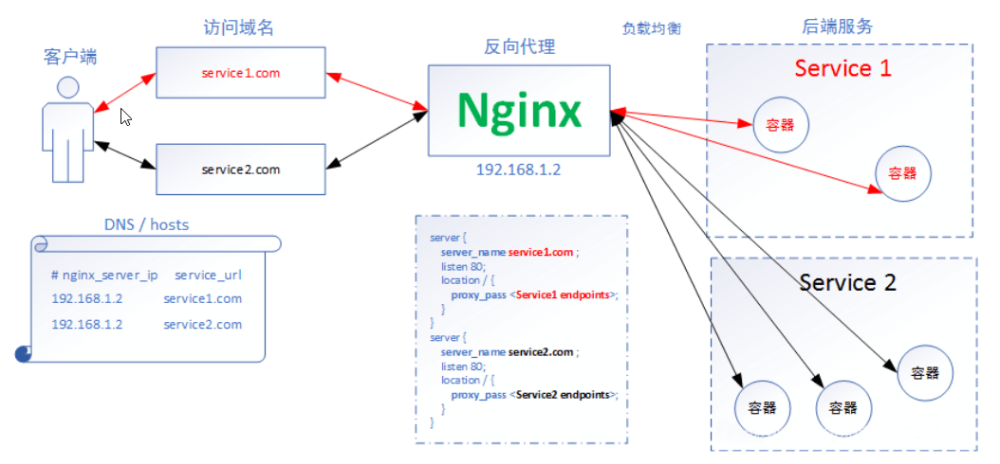

> **Nginx**：nodePort

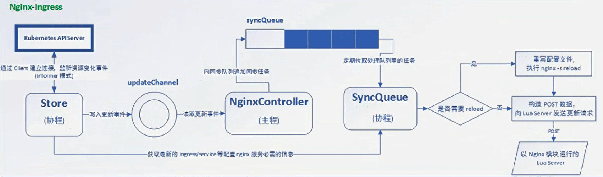


### 5.1. 部署ingress

 **可以在官网的Deployment中，查看怎么安装**

> 国外的镜像可能比较慢，还可以通过下面方式安装

三个节点导入ingress镜像

```shell
[root@k8s-master01 ~]# docker load -i nginx-ingress-0.30.0.tar 
[root@k8s-master01 ~]# docker tag f351ba0d5604 quay.io/kubernetes-ingress-controller/nginx-ingress-controller:0.30.0
 https://github.com/kubernetes/ingress-nginx/blob/nginx-0.30.0/deploy/static/mandatory.yaml
[root@k8s-master01 ~]# kubectl apply -f mandatory.yaml 
```

> `nginx-ingress-0.30.0.tar `：公众号：<u>云计算小千</u>  回复：*k8s安装*

查看 Pod，注意这个 Pod 运行在`ingress-nginx`名称空间下：

```shell
[root@k8s-master01 ~]# kubectl get pod -n ingress-nginx 
NAME                                        READY   STATUS    RESTARTS   AGE
nginx-ingress-controller-7fcf8df75d-4ljbt   1/1     Running   0          10m
```

然后还需要选择服务暴露模式，官网中有介绍针对 **AWS**、**GCE**、**Azure** 等的暴露方式，也有 **Bare-metal** 的。

> 因为我们的集群是一个本地裸机结构，这里使用 `Bare-metal` 模式，使用 `NodePort `直接暴露服务

```shell
[root@k8s-master01 ~]# wget https://raw.githubusercontent.com/kubernetes/ingress-nginx/nginx-0.30.0/deploy/static/provider/baremetal/service-nodeport.yaml

[root@k8s-master01 ~]# kubectl apply -f service-nodeport.yaml 
service/ingress-nginx created
[root@k8s-master01 ~]# kubectl get svc -n ingress-nginx 
NAME            TYPE       CLUSTER-IP       EXTERNAL-IP   PORT(S)                      AGE
ingress-nginx   NodePort   10.104.236.185   <none>        80:32185/TCP,443:31294/TCP   18s
```

> 一个 NodePort 服务暴露了

### 5.2. Ingress HTTP 代理访问

`ingress-demo.yaml`

```yaml
apiVersion: apps/v1
kind: Deployment
metadata:
  name: nginx-deploy
spec:
  replicas: 2
  selector:
    matchLabels:
      name: nginx
  template:
    metadata:
      labels:
        name: nginx
    spec:
      containers:
      - name: nginx
        image: qianzai/k8s-myapp:v1
        imagePullPolicy: IfNotPresent
        ports:
        - containerPort: 80
---
apiVersion: v1
kind: Service
metadata:
  name: nginx-svc
spec:
  selector:
    name: nginx
  ports:
  - port: 80
    targetPort: 80
    protocol: TCP
---
apiVersion: extensions/v1beta1
kind: Ingress
metadata:
  name: nginx-ingress
spec:
  rules:
  - host: www.bzmingress.com
    http:
      paths:
      - path: /
        backend:
          serviceName: nginx-svc
          servicePort: 80 
```

```shell
[root@k8s-master01 ~]# kubectl apply -f ingress-demo.yaml 
deployment.apps/nginx-deploy created
service/nginx-svc created
ingress.extensions/nginx-ingress created
```

> 1. 定义了一个 **Deployment** ，包含两个 Pod 副本，Pod 开启了 80 端口；
> 2. 定义了一个 **Service** ，Type 是 ClusterIP ，暴露 80 端口对应 Pod 的 80 端口；
> 3. 定义了一个 **Ingress** ，访问 `www.bzmingress.com` 的根路径将链接到 `nginx-svc`

```shell
[root@k8s-master01 ~]# kubectl get pod
NAME                          READY   STATUS    RESTARTS   AGE
nginx-deploy-5fff9bfc-cjgd2   1/1     Running   0          37s
nginx-deploy-5fff9bfc-lpdww   1/1     Running   0          37s
[root@k8s-master01 ~]# kubectl get svc
NAME         TYPE        CLUSTER-IP       EXTERNAL-IP   PORT(S)   AGE
kubernetes   ClusterIP   10.96.0.1        <none>        443/TCP   23h
nginx-svc    ClusterIP   10.108.154.152   <none>        80/TCP    49s
[root@k8s-master01 ~]# kubectl get svc -n ingress-nginx
NAME            TYPE       CLUSTER-IP       EXTERNAL-IP   PORT(S)                      AGE
ingress-nginx   NodePort   10.104.236.185   <none>        80:32185/TCP,443:31294/TCP   30m
```

在本机host 文件 `/etc/hosts` 添加

```shell
192.168.200.61 www.bzmingress.com
```

在浏览器访问： www.bzmingress.com:32185

```shell
Hello MyApp | Version: v1 | Pod Name
```

> 不断刷新，应该可以发现已经实现了负载均衡。

### 5.3. Ingress 创建虚拟主机

通过两个域名（`www1.bzmingress.com `和 `www2.bzmingress.com`）分别访问不同的内容。

```shell
 清除之前的实验
[root@k8s-master01 ~]# kubectl delete -f ingress-demo.yaml 
deployment.apps "nginx-deploy" deleted
service "nginx-svc" deleted
ingress.extensions "nginx-ingress" deleted
```

**ingress-deployment1.yaml**

```yaml
apiVersion: apps/v1
kind: Deployment
metadata:
  name: deploy-1
spec:
  replicas: 2
  selector:
    matchLabels:
      name: nginx
  template:
    metadata:
      labels:
        name: nginx
    spec:
      containers:
      - name: nginx
        image: qianzai/k8s-myapp:v1
        imagePullPolicy: IfNotPresent
        ports:
        - containerPort: 80
---
apiVersion: v1
kind: Service
metadata:
  name: svc-1
spec:
  selector:
    name: nginx
  ports:
  - port: 80
    targetPort: 80
    protocol: TCP
```

ingress-deployment2.yaml

```yaml
apiVersion: apps/v1
kind: Deployment
metadata:
  name: deploy-2
spec:
  replicas: 2
  selector:
    matchLabels:
      name: nginx
  template:
    metadata:
      labels:
        name: nginx
    spec:
      containers:
      - name: nginx
        image: qianzai/k8s-myapp:v2
        imagePullPolicy: IfNotPresent
        ports:
        - containerPort: 80
---
apiVersion: v1
kind: Service
metadata:
  name: svc-2
spec:
  selector:
    name: nginx
  ports:
  - port: 80
    targetPort: 80
    protocol: TCP
```

> - Name 不同
> - Pod 的镜像版本不同，deploy-1 是 v1 版本，deploy-2 是 v2 版本。

部署

```shell
[root@k8s-master01 ~]# kubectl apply -f ingress-deployment1.yaml 
deployment.apps/deploy-1 created
service/svc-1 created
[root@k8s-master01 ~]# kubectl apply -f ingress-deployment2.yaml 
deployment.apps/deploy-2 created
service/svc-2 created

[root@k8s-master01 ~]# kubectl get pod -o wide
NAME                        READY   STATUS    RESTARTS   AGE     IP           NODE         NOMINATED NODE   READINESS GATES
deploy-1-5fff9bfc-9vxxn     1/1     Running   0          4m27s   10.244.1.5   k8s-node01   <none>           <none>
deploy-1-5fff9bfc-lmmvt     1/1     Running   0          4m27s   10.244.2.2   k8s-node02   <none>           <none>
deploy-2-6bd699df44-qds9v   1/1     Running   0          4m23s   10.244.2.3   k8s-node02   <none>           <none>
deploy-2-6bd699df44-xpjqn   1/1     Running   0          4m23s   10.244.1.6   k8s-node01   <none>           <none>

[root@k8s-master01 ~]# curl 10.244.1.5
Hello MyApp | Version: v1 | <a href="hostname.html">Pod Name</a>
[root@k8s-master01 ~]# curl 10.244.1.6
Hello MyApp | Version: v2 | <a href="hostname.html">Pod Name</a>
```

> 访问 deploy-1 的 Pod 输出 v1 版本信息，访问 deploy-2 的 Pod 输出 v2 版本的信息，

编写 ingress 规则

`ingressrule.yaml`

```yaml
apiVersion: extensions/v1beta1
kind: Ingress
metadata:
  name: ingress-1
spec:
  rules:
  - host: www1.bzmingress.com
    http:
      paths:
      - path: /
        backend:
          serviceName: svc-1
          servicePort: 80 
---
apiVersion: extensions/v1beta1
kind: Ingress
metadata:
  name: ingress-2
spec:
  rules:
  - host: www2.bzmingress.com
    http:
      paths:
      - path: /
        backend:
          serviceName: svc-2
          servicePort: 80 
```


```shell
[root@k8s-master01 ~]# kubectl apply -f ingress.yaml 
ingress.extensions/ingress-1 created
ingress.extensions/ingress-2 created
```

进入 Ingress 容器查看 Nginx 配置信息

```shell
[root@k8s-master01 ~]# kubectl get pod -n ingress-nginx 
NAME                                        READY   STATUS    RESTARTS   AGE
nginx-ingress-controller-7fcf8df75d-vvl78   1/1     Running   0          27m

[root@k8s-master01 ~]# kubectl exec -it nginx-ingress-controller-7fcf8df75d-vvl78 -n ingress-nginx bash
bash-5.0$ cat nginx.conf

 Configuration checksum: 13317249304218280187
...
...
	
	## start server www1.bzmingress.com
	server {
		server_name www1.bzmingress.com ;
		
		listen 80  ;
		listen 443  ssl http2 ;
		
		set $proxy_upstream_name "-";
		
		ssl_certificate_by_lua_block {
			certificate.call()
		}
		
		location / {
			
			set $namespace      "default";
			set $ingress_name   "ingress-1";
			set $service_name   "svc-1";
			set $service_port   "80";
			set $location_path  "/";
			
			...
			...
		}
		
	}
	## end server www1.bzmingress.com
	
	## start server www2.bzmingress.com
	server {
		server_name www2.bzmingress.com ;
		
		listen 80  ;
		listen 443  ssl http2 ;
		
		set $proxy_upstream_name "-";
		
		ssl_certificate_by_lua_block {
			certificate.call()
		}
		
		location / {
			
			set $namespace      "default";
			set $ingress_name   "ingress-2";
			set $service_name   "svc-2";
			set $service_port   "80";
			set $location_path  "/";
			
			...
			...
		}
		
	}
	## end server www2.bzmingress.com
	...
	...
```

> `yaml`文件编写的那些 `Ingress `规则，最终会被转化成 `Nginx `的配置文件，以达到访问控制的目的。

```shell
[root@k8s-master01 ~]# kubectl get ingress
NAME        HOSTS                 ADDRESS         PORTS   AGE
ingress-1   www1.bzmingress.com   10.100.104.99   80      11m
ingress-2   www2.bzmingress.com   10.100.104.99   80      11m

```

> 通过命令也可以看到有两个 Ingress 信息

在本机的host添加映射

```shell
192.168.200.61 www1.bzmingress.com
192.168.200.61 www2.bzmingress.com
```

浏览器访问测：

http://www1.bzmingress.com:31672/


http://www2.bzmingress.com:31672/


> `Ingress `虚拟主机功能演示完成。

### 5.4. Ingress HTTPS 代理访问

创建自定义证书，实现 [www3.bzmingress.com](https://www3.bzmingress.com/) 的访问。

**创建证书和私钥**

```shell
openssl req -x509 -sha256 -nodes -days 365 -newkey rsa:2048 -keyout tls.key -out tls.crt -subj "/CN=ingresssvc/O=ingresssvc"
```

**将证书和私钥存储到 Secret**

```shell
kubectl create secret tls tls-secret --key tls.key --cert tls.crt
```

**创建部署 Deployment & Service**

`deployment3.yaml`

```yaml
apiVersion: apps/v1
kind: Deployment
metadata:
  name: deploy-3
spec:
  replicas: 2
  selector:
    matchLabels:
      name: nginx-3
  template:
    metadata:
      labels:
        name: nginx-3
    spec:
      containers:
      - name: nginx
        image: qianzai/k8s-myapp:v3
        imagePullPolicy: IfNotPresent
        ports:
        - containerPort: 80
---
apiVersion: v1
kind: Service
metadata:
  name: svc-3
spec:
  selector:
    name: nginx-3
  ports:
  - port: 80
    targetPort: 80
    protocol: TCP
```

```shell
[root@k8s-master01 https]# kubectl apply -f deployment3.yaml 
deployment.apps/deploy-3 created
service/svc-3 created
[root@k8s-master01 https]# kubectl get svc
NAME         TYPE        CLUSTER-IP      EXTERNAL-IP   PORT(S)   AGE
kubernetes   ClusterIP   10.96.0.1       <none>        443/TCP   41h
svc-1        ClusterIP   10.100.120.31   <none>        80/TCP    16h
svc-2        ClusterIP   10.97.196.135   <none>        80/TCP    16h
svc-3        ClusterIP   10.99.19.169    <none>        80/TCP    6s
```

**创建部署 Ingress**

`ingress-tls.yaml`

```yaml
apiVersion: extensions/v1beta1
kind: Ingress
metadata:
  name: ingress-https
spec:
  tls:
  - hosts:
    - www3.bzmingress.com
    secretName: tls-secret
  rules:
  - host: www3.bzmingress.com
    http:
      paths:
      - path: /
        backend:
          serviceName: svc-3
          servicePort: 80 
```

```shell
[root@k8s-master01 https]# kubectl apply -f ingress-tls.yaml 
ingress.extensions/ingress-https created
[root@k8s-master01 https]# kubectl get svc -n ingress-nginx
NAME            TYPE       CLUSTER-IP      EXTERNAL-IP   PORT(S)                      AGE
ingress-nginx   NodePort   10.100.104.99   <none>        80:31672/TCP,443:31851/TCP   17h
```

> Https 的端口是 31851，下面来验证下。

在host添加

```shell
192.168.200.61 www3.bzmingress.com
```

访问：`www3.bzmingress.com:31851`测试

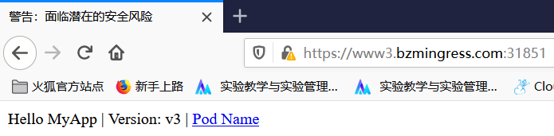

### 5.5. Ingress 实现 BasicAuth

通过 Ingress 实现 Basic Auth 的认证，对于 Nginx 的认证方式来说，它采用的是 Apache 的认证模块，所以需要先安装 Apache 模块。

```shell
[root@k8s-master01 basic]# yum install -y httpd

 创建用户名 bzm
[root@k8s-master01 basic]# htpasswd -c auth bzm
New password: 
Re-type new password: 
Adding password for user bzm

 创建 Secret
[root@k8s-master01 basic]# kubectl create secret generic basic-auth --from-file=auth
secret/basic-auth created
```

ingress-basic-auth.yaml

```yaml
apiVersion: extensions/v1beta1
kind: Ingress
metadata:
  name: ingress-basic-auth
  annotations:
    nginx.ingress.kubernetes.io/auth-type: basic
    nginx.ingress.kubernetes.io/auth-secret: basic-auth
    nginx.ingress.kubernetes.io/auth-realm: 'Authentication Required - bzm'
spec:
  rules:
  - host: auth.bzmingress.com
    http:
      paths:
      - path: /
        backend:
          serviceName: svc-1
          servicePort: 80 
```

```shell
[root@k8s-master01 basic]# kubectl apply -f ingress-basic-auth.yaml 
ingress.extensions/ingress-basic-auth created
[root@k8s-master01 basic]# kubectl get ingress
NAME                 HOSTS                 ADDRESS         PORTS     AGE
ingress-1            www1.bzmingress.com   10.100.104.99   80        17h
ingress-2            www2.bzmingress.com   10.100.104.99   80        17h
ingress-basic-auth   auth.bzmingress.com                   80        8s
ingress-https        www3.bzmingress.com   10.100.104.99   80, 443   46m
[root@k8s-master01 basic]# kubectl get svc -n ingress-nginx
NAME            TYPE       CLUSTER-IP      EXTERNAL-IP   PORT(S)                      AGE
ingress-nginx   NodePort   10.100.104.99   <none>        80:31672/TCP,443:31851/TCP   18h
```

在 `/etc/hosts` 里面添加 

```shell
192.168.200.61 auth.bzmingress.com
```

再访问：`auth.bzmingress.com:31672` 测试

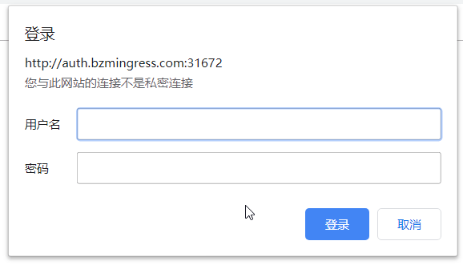

> 输入设置的用户名 ，密码


### 5.6. Ingress 实现 Rewrite

在 Nginx 中还有比较常用的还有重写功能。

下面演示当访问 `http://www4.bzmingress.com` 的时候重定向到 `https://www3.bzmingress.com`

`ingress-rewrite.yaml`

```yaml
apiVersion: extensions/v1beta1
kind: Ingress
metadata:
  name: ingress-rewrite
  annotations:
    nginx.ingress.kubernetes.io/rewrite-target: https://www3.bzmingress.com:31851
spec:
  rules:
  - host: www4.bzmingress.com
    http:
      paths:
      - path: /
        backend:
          serviceName: svc-1
          servicePort: 80
```

```shell
[root@k8s-master01 ~]# kubectl apply -f ingress-rewrite.yaml
ingress.extensions/ingress-rewrite created
[root@k8s-master01 ~]# kubectl get svc -n ingress-nginx
NAME            TYPE       CLUSTER-IP      EXTERNAL-IP   PORT(S)                      AGE
ingress-nginx   NodePort   10.100.104.99   <none>        80:31672/TCP,443:31851/TCP   40h
```

访问：`www4.bzmingress.com:31672/ `将会跳转到 `www3.bzmingress.com:31851/`

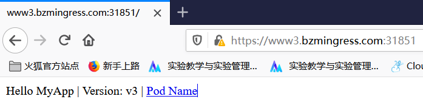

> 除此之外还有一些常用的配置，具体可以参考 Ingress 官网：[kubernetes.github.io/ingress-ngi…](https://kubernetes.github.io/ingress-nginx/)