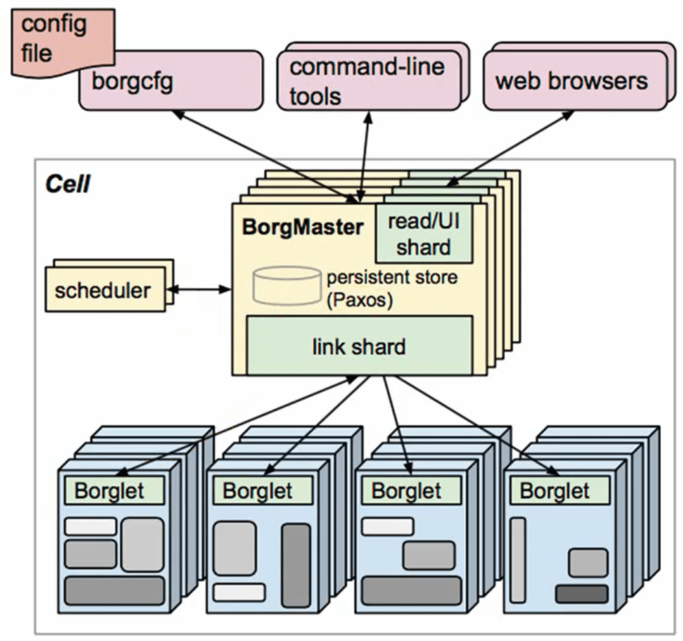
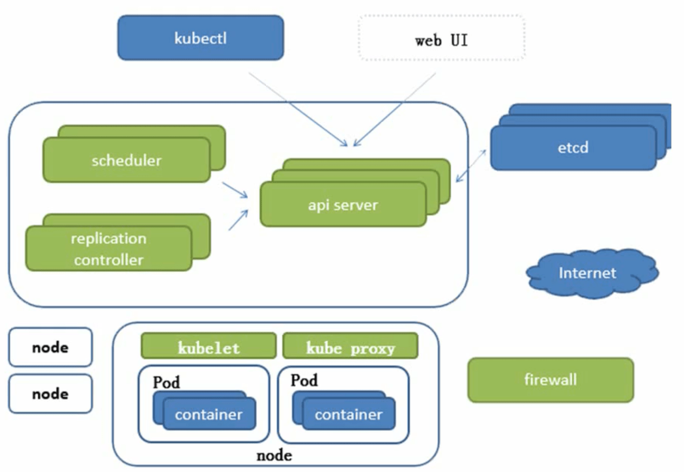

# Kubernetes架构

>   Kubernetes是基于Borg翻写的，先来简单看下Borg架构。

**Borg架构图**

**Kubernetes 架构图**

高可用的集群的副本至少是大于3 的奇数

>   C/S结构：Server服务器，node节点。

-   `apiserver`：	提供了资源操作的唯一入口，并提供认证、授权、访问控制、API	注册和 发现等机制； 
-   `controller	manager`：	负责维护集群的状态，比如故障检测、自动扩展、滚动更新 等； 
-   `scheduler`：	负责资源的调度，按照预定的调度策略将	Pod	调度到相应的机器上； 

-   `etcd`： 一个可信赖的分布式键值存储服务，保存了整个集群的状态（持久化）； 
-   `kubelet`：	直接跟容器引擎交互，负责维护容器的生命周期，同时也负责	Volume（CVI）和网络（CNI）的管 理；
-   `kube-proxy`：	负责为Service提供cluster内部的服务发现，通信和负载均衡 ；

