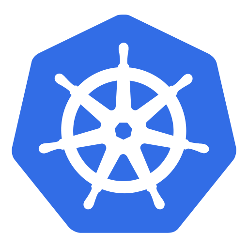
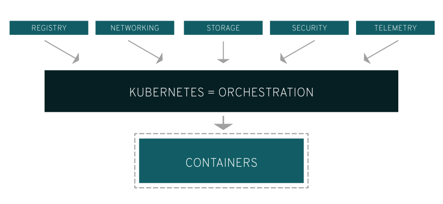

# Kubernetes 简介

## 1. Kubernetes 是什么？

`Kubernetes `是谷歌开源的容器集群管理系统，Kubernetes 是一个可移植的、可扩展的开源平台，用于管理容器化的工作负载和服务，可促进声明式配置和自动化。Kubernetes 拥有一个庞大且快速增长的生态系统。Kubernetes 的服务、支持和工具广泛可用。

> 是 Google 多年大规模容器管理技术 Borg 的开源版本，由 Go 语言翻写。

## 2. Kubernetes 能做什么？

1.  基于容器的应用部署、维护和滚动升级
2.  负载均衡和服务发现
3.  跨机器和跨地区的集群调度
4.  自动伸缩
5.  无状态服务和有状态服务
6.  广泛的*Volume*支持
7.  插件机制保证扩展性

真实的生产环境应用会包含多个容器，而这些容器还很可能会跨越多个服务器主机部署。

- Kubernetes 提供了为那些工作负载大规模部署容器的编排与管理能力。
- Kubernetes 编排让你能够构建多容器的应用服务，在集群上调度或伸缩这些容器，以及管理它们随时间变化的健康状态。

> Kubernetes 也需要与网络、存储、安全、监控等其它服务集成才能提供综合性的容器基础设施。

