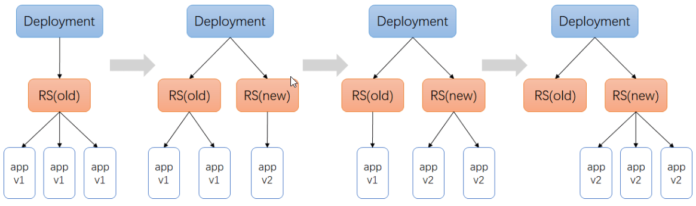

# Kubernetes 资源控制器

**自主式 pod**

- 只要 pod 退出了，此类型的 pod 不会被重建，该 pod 没有管理者，死亡后不会被拉起。

**控制器管理的 pod**

- 在控制器的生命周期里始终要维持 pod 的副本数目

  > 生产环境中大多数都是选择控制器去管理 pod

## 1. 什么是控制器

Kubernetes 中内建了很多 controller（控制器），这些相当于一个状态机，用来控制 Pod 的具体状态和行为 。

> 这是一个控制环的例子：房间里的温度自动调节器。
>
> 当你设置了温度，告诉了温度自动调节器你的*期望状态（Desired State）*。 房间的实际温度是*当前状态（Current State）*。 通过对设备的开关控制，温度自动调节器让其当前状态接近期望状态。

控制器通过 `apiserver `监控集群的公共状态，并致力于将当前状态转变为期望的状态。

## 2. 控制器类型

[Pod 控制器类型](/document/云原生/Kubernetes/Kubernetes基本概念?id=_13-pod-控制器类型)

> 上面介绍 Pod 的时候，已经介绍了

## 3. 控制器案例

### 3.1. ReplicaSet

`rs.yaml`

```yaml
apiVersion: extensions/v1beta1
kind: ReplicaSet
metadata:
  name: frontend
spec:
  replicas: 3
  selector:
    matchLabels:
      tier: frontend
  template:
    metadata:
      labels:
        tier: frontend
    spec:
      containers:
        - name: myapp
          image: qianzai/k8s-myapp:v1
          env:
            - name: GET_HOSTS_FROM
              value: dns
          ports:
            - containerPort: 80
```

```shell
[root@k8s-master01 ~]# kubectl create -f rs.yaml
replicaset.extensions/frontend created
[root@k8s-master01 ~]# kubectl get rs
NAME       DESIRED   CURRENT   READY   AGE
frontend   3         3         3       7s
[root@k8s-master01 ~]# kubectl get pod
NAME             READY   STATUS    RESTARTS   AGE
frontend-2khcd   1/1     Running   0          16s
frontend-4s2w7   1/1     Running   0          16s
frontend-lk49t   1/1     Running   0          16s
```

> 可以发现已经创建 了

```shell
[root@k8s-master01 ~]# kubectl delete pod --all
pod "frontend-2khcd" deleted
pod "frontend-4s2w7" deleted
pod "frontend-lk49t" deleted
[root@k8s-master01 ~]# kubectl get pod
NAME             READY   STATUS    RESTARTS   AGE
frontend-54qpf   1/1     Running   0          13s
frontend-6sdzl   1/1     Running   0          13s
frontend-cx2px   1/1     Running   0          13s
```

> 然后删除所有 pod 后，可以发现 RS 为了维持期望的副本数，又新建了 3 个 pod

```shell
 查看标签
[root@k8s-master01 ~]# kubectl get pod --show-labels
NAME             READY   STATUS    RESTARTS   AGE     LABELS
frontend-54qpf   1/1     Running   0          2m44s   tier=frontend
frontend-6sdzl   1/1     Running   0          2m44s   tier=frontend
frontend-cx2px   1/1     Running   0          2m44s   tier=frontend

 修改frontend-54qpf标签
[root@k8s-master01 ~]# kubectl label pod frontend-54qpf tier=frontend1 --overwrite=true
pod/frontend-54qpf labeled
[root@k8s-master01 ~]# kubectl get pod --show-labels
NAME             READY   STATUS    RESTARTS   AGE   LABELS
frontend-54qpf   1/1     Running   0          14m   tier=frontend1	# 不属于RS了
frontend-6sdzl   1/1     Running   0          14m   tier=frontend
frontend-cx2px   1/1     Running   0          14m   tier=frontend
frontend-kfsmh   1/1     Running   0          2s    tier=frontend
```

> selector.matchLabels[].tier: frontend 匹配了标签选项，带有`tier=frontend`的才是属于 RS 的。

### 3.2. Deployment

`deployment.yaml`

```yaml
apiVersion: extensions/v1beta1
kind: Deployment
metadata:
  name: nginx-deployment
spec:
  replicas: 3
  template:
    metadata:
      labels:
        app: nginx
    spec:
      containers:
        - name: nginx
          image: qianzai/k8s-myapp:v1
          ports:
            - containerPort: 80
```

```shell
[root@k8s-master01 ~]# kubectl apply -f deployment.yaml --record
deployment.extensions/nginx-deployment created
[root@k8s-master01 ~]# kubectl get deployments
NAME               READY   UP-TO-DATE   AVAILABLE   AGE
nginx-deployment   3/3     3            3           19s
[root@k8s-master01 ~]# kubectl get rs
NAME                          DESIRED   CURRENT   READY   AGE
nginx-deployment-866f7f6558   3         3         3       20s
[root@k8s-master01 ~]# kubectl get pod
NAME                                READY   STATUS    RESTARTS   AGE
nginx-deployment-866f7f6558-kzwl9   1/1     Running   0          24s
nginx-deployment-866f7f6558-txzp8   1/1     Running   0          24s
nginx-deployment-866f7f6558-wtf4s   1/1     Running   0          24s
```

> `--record`参数可以记录命令，我们可以很方便的查看每次 revision 的变化 更新的时候可以记录状态，每一步是使用什么命令进行更新的

#### 3.2.1. 扩容

```shell
[root@k8s-master01 ~]# kubectl scale deployment nginx-deployment --replicas=10
deployment.extensions/nginx-deployment scaled
[root@k8s-master01 ~]# kubectl get pod
NAME                                READY   STATUS    RESTARTS   AGE
nginx-deployment-866f7f6558-6k9tt   1/1     Running   0          40s
nginx-deployment-866f7f6558-7k2vt   1/1     Running   0          40s
nginx-deployment-866f7f6558-dx9zf   1/1     Running   0          40s
nginx-deployment-866f7f6558-j75bq   1/1     Running   0          40s
nginx-deployment-866f7f6558-kzwl9   1/1     Running   0          3h44m
nginx-deployment-866f7f6558-ltcqg   1/1     Running   0          40s
nginx-deployment-866f7f6558-tkgxx   1/1     Running   0          40s
nginx-deployment-866f7f6558-txzp8   1/1     Running   0          3h44m
nginx-deployment-866f7f6558-wtf4s   1/1     Running   0          3h44m
nginx-deployment-866f7f6558-z7qwf   1/1     Running   0          40s
```

#### 3.2.2. 更新

```shell
kubectl set image deployment/nginx-deployment nginx=qianzai/k8s-myapp:v2 --record
```

```shell
[root@k8s-master01 ~]# kubectl get rs
NAME                          DESIRED   CURRENT   READY   AGE
nginx-deployment-5c478875d8   4         4         2       11s
nginx-deployment-866f7f6558   7         7         7       58s
[root@k8s-master01 ~]# kubectl get rs
NAME                          DESIRED   CURRENT   READY   AGE
nginx-deployment-5c478875d8   9         9         7       28s
nginx-deployment-866f7f6558   2         2         2       75s
[root@k8s-master01 ~]# kubectl get rs
NAME                          DESIRED   CURRENT   READY   AGE
nginx-deployment-5c478875d8   10        10        9       30s
nginx-deployment-866f7f6558   0         0         0       77s

[root@k8s-master01 ~]# kubectl get deployments
NAME               READY   UP-TO-DATE   AVAILABLE   AGE
nginx-deployment   10/10   10           10          3m28s

[root@k8s-master01 ~]# curl 10.244.2.110
Hello MyApp | Version: v2 | <a href="hostname.html">Pod Name</a>
```

> 可以看到滚动更新完成

#### 3.2.3. 回滚

```shell
 rollout回滚
[root@k8s-master01 ~]# kubectl rollout undo deployment/nginx-deployment
deployment.extensions/nginx-deployment rolled back
[root@k8s-master01 ~]# kubectl get rs
NAME                          DESIRED   CURRENT   READY   AGE
nginx-deployment-5c478875d8   3         3         3       13m
nginx-deployment-866f7f6558   8         8         6       14m
[root@k8s-master01 ~]# kubectl get rs
NAME                          DESIRED   CURRENT   READY   AGE
nginx-deployment-5c478875d8   0         0         0       13m
nginx-deployment-866f7f6558   10        10        10      14m

[root@k8s-master01 ~]# kubectl get deployments
NAME               READY   UP-TO-DATE   AVAILABLE   AGE
nginx-deployment   10/10   10           10          15m

 查看rollout的状态
[root@k8s-master01 ~]# kubectl rollout status deployment/nginx-deployment
deployment "nginx-deployment" successfully rolled out

 rollout历史
[root@k8s-master01 ~]#  kubectl rollout history deployment/nginx-deployment
deployment.extensions/nginx-deployment
REVISION  CHANGE-CAUSE
1         kubectl apply --filename=deployment.yaml --record=true
2         kubectl set image deployment/nginx-deployment nginx=qianzai/k8s-myapp:v2 --record=true
```

```shell
 回滚到指定版本
kubectl rollout undo deployment/nginx-deployment --to-revision=1

暂停 deployment的更新
kubectl rollout pause deployment/nginx-deployment
```

#### 3.2.4. Deployment 更新策略

在 Deployment 中，可以通过 spec.strategy 指定 Pod 更新的策略，目前支持：`Recreate（重建）`和`RollingUpdate（滚动更新）`，默认是 RollingUpdate。

    	 **Recreate**：设置`spec.strategy.type=Recreate`，更新方式为：Deployment在更新Pod时，会先杀掉所有正在运行的Pod，然后创建新的Pod。

**RollingUpdate**：设置`spec.strategy.type=RollingUpdate`，更新方式为：Deployment 会以滚动的方式来渐变性的更新 Pod，即 Pod 新版本的递增，旧版本的递减的一个过程。

> 更新时将会创建出两个 RS，其中旧的 RS 一次减少 25%的 pod 而新的 RS 一次创建 25%的 pod



1.  初始创建 Deployment，系统创建了一个 ReplicaSet，并按照用户的需求创建了 3 个 Pod 副本；
2.  当更新 Deployment 时，系统创建一个新的 ReplicaSet，并将其副本数量扩展到 1，然后将旧的 ReplicaSet 缩减为 2；
3.  系统继续按照相同的更新策略对新旧两个 ReplicaSet 进行逐个调整。
4.  最后，新的 ReplicaSet 运行了 3 个新版本的 Pod 副本，旧的 ReplicaSet 副本数量则缩减为 0。

#### 3.2.5. Rollover（多个 rollout 并行）

假如您创建了一个有 5 个`myapp:v1`的 Deployment，但是当还只有 3 个`myapp:v1`的 replica 创建出来的时候您就开始更新含有 5 个`myapp:v2 `replica 的 Deployment。在这种情况下，Deployment 会立即杀掉已创建的 3 个`myapp:v1`的 Pod，并开始创建`myapp:v2`的 Pod。它不会等到所有的 5 个`myapp:v1`的 Pod 都创建完成后才开始改变航道

#### 3.2.6. 清理 Policy

您可以通过设置`.spec.revisonHistoryLimit`项来指定 deployment 最多保留多少 revision 历史记录。默认的会保留所有的 revision；如果将该项设置为 0，Deployment 就不允许回退

### 3.3. DaemonSet

`DaemonSet.yaml`

```yaml
apiVersion: apps/v1
kind: DaemonSet
metadata:
  name: deamonset-example
  labels:
    app: daemonset
spec:
  selector:
    matchLabels:
      name: deamonset-example
  template:
    metadata:
      labels:
        name: deamonset-example
    spec:
      containers:
        - name: daemonset-example
          image: qianzai/k8s-myapp:v1
```

```shell
[root@k8s-master01 ~]# kubectl create -f daemonSet.yaml
daemonset.apps/deamonset-example created
[root@k8s-master01 ~]# kubectl get daemonsets
NAME                DESIRED   CURRENT   READY   UP-TO-DATE   AVAILABLE   NODE SELECTOR   AGE
deamonset-example   2         2         2       2            2           <none>          7s
[root@k8s-master01 ~]# kubectl get pod -o wide
NAME                      READY   STATUS    RESTARTS   AGE   IP             NODE        NOMINATED NODE   READINESS GATES
deamonset-example-6frqm   1/1     Running   0          21s   10.244.2.134   k8s-node1   <none>           <none>
deamonset-example-c8gfz   1/1     Running   0          21s   10.244.1.35    k8s-node2   <none>           <none>
```

> 可以发现 node1 和 node2 都已经运行了，主节点现在默认是不进行调度的

```shell
[root@k8s-master01 ~]# kubectl delete pod deamonset-example-6frqm
pod "deamonset-example-6frqm" deleted
[root@k8s-master01 ~]# kubectl get pod
NAME                      READY   STATUS    RESTARTS   AGE
deamonset-example-c8gfz   1/1     Running   0          3m39s
deamonset-example-kb6t5   1/1     Running   0          4s
```

> 删除后可以发现又重新创建了一个新的

### 3.4. Job

`job.yaml`

```yaml
apiVersion: batch/v1
kind: Job
metadata:
  name: pi
spec:
  template:
    metadata:
      name: pi
    spec:
      containers:
        - name: pi
          image: perl
          command: ["per1", "-Mbignum=bpi", "-wle", "print bpi(2000)"]
      restartPolicy: Never
```

> `perl`：公众号：<u>云计算小千</u> 回复：_k8s 资料_

```shell
[root@k8s-master01 ~]# kubectl get jobs.batch
NAME   COMPLETIONS   DURATION   AGE
pi     1/1           2s         36s
[root@k8s-master01 ~]# kubectl get pod
NAME       READY   STATUS      RESTARTS   AGE
pi-z4g44   0/1     Completed   0          40s
```

### 3.5. CronJob

`cronJob.yaml`

```yaml
apiVersion: batch/v1beta1
kind: CronJob
metadata:
  name: he11o
spec:
  schedule: "*/1 * * * *"
  jobTemplate:
    spec:
      template:
        spec:
          containers:
            - name: hello
              image: busybox
              args:
                - /bin/sh
                - -c
                - date;echo Hello from the Kubernetes cluster
          restartPolicy: OnFailure
```

```shell
[root@k8s-master01 ~]# kubectl create -f cronJob.yaml
cronjob.batch/he11o created
[root@k8s-master01 ~]# kubectl get cronjobs.batch
NAME    SCHEDULE      SUSPEND   ACTIVE   LAST SCHEDULE   AGE
he11o   */1 * * * *   False     0        <none>          7s
[root@k8s-master01 ~]# kubectl get pod
NAME                     READY   STATUS      RESTARTS   AGE
he11o-1602754380-vm6sc   0/1     Completed   0          41s
[root@k8s-master01 ~]# kubectl get jobs.batch
NAME               COMPLETIONS   DURATION   AGE
he11o-1602754380   1/1           19s        60s
he11o-1602754440   0/1           0s         0s
[root@k8s-master01 ~]# kubectl logs he11o-1602754380-vm6sc
Thu Oct 15 09:33:23 UTC 2020
Hello from the Kubernetes cluster
```

**Cronjob 本身的一些限制**
创建 Job 操作应该是幂等的
CronJob 并不太好去判断任务是否成功，CronJob 通过创建 Job 去完成任务，Job 成功与否可以判断，但 CronJob 无法链接到 Job 去获取成功与否，Cron 只会定期的去创建 Job，仅此而已。
