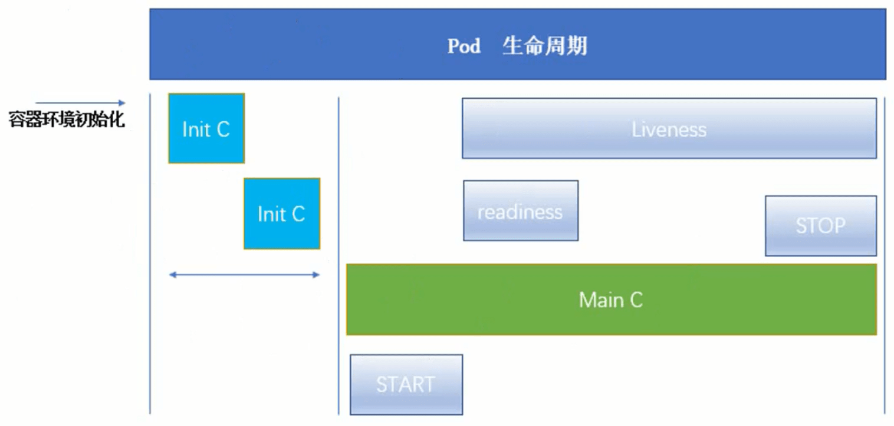

# Kubernetes 资源清单

## 1. Kubernetes 中的资源

**K8s 中的资源可以分为三类：**

- 名称空间级别
- 集群级别
- 元数据型

### 1.1. 名称空间级别

- **工作负载型资源（ workload）**

Pod、ReplicaSet、Deployment、StatefulSet、DaemonSet、Job、CronJob

- **服务发现及负载均衡型资源（ServiceDiscovery LoadBalance）**

Service、Ingress、...

- **配置与存储型资源**

Volume（存储卷）、CSI（容器存储接口，可以扩展各种各样的第三方存储卷）

- **特殊类型的存储卷**

ConfigMap（当配置中心来使用的资源类型）、Secret（保存敏感数据）、DownwardAPI（所外部环境中的信息输出给容器）

### 1.2. 集群级别

Namespace、Node、Role、ClusterRole、RoleBinding、ClusterRoleBinding

### 1.3. 元数据

HPA、PodTemplate、LimitRange

## 2. 资源清单

k8s 一般都是通过定义资源清单的方式去创建资源，资源清单等价于剧本，写好了每一步应该如何去做。一般使用 yaml 格式的文件来创建符合我们预期期望的资源，这样的 yaml 文件我们一般称为资源清单。

> yaml 格式 就不一一介绍了，大家或多或少都了解点。**详情见百度**

## 3. 常用字段的解释

### 3.1. 必填字段：

| 参数名                  | 字段类型 | 说明                                                                        |
| ----------------------- | -------- | :-------------------------------------------------------------------------- |
| version                 | String   | 指 K8s API 的版本，目前基本上是 v1 ，可以用 `kubectl api-versions` 命令查询 |
| kind                    | String   | 指 yaml 文件定义的资源类型和角色，比如：Pod                                 |
| metadata                | Object   | 元数据对象                                                                  |
| metadata.name           | String   | 元数据对象的名字，比如命名 Pod 的名字                                       |
| metadata.namespace      | String   | 元数据对象的命名空间（默认 default）                                        |
| spec                    | Object   | 详细定义对象                                                                |
| spec.containers[]       | List     | 容器列表的定义                                                              |
| spec.containers[].name  | String   | 容器的名字                                                                  |
| spec.containers[].image | String   | 容器镜像的名称                                                              |

### 3.2. 主要字段：

| 参数名                                      | 字段类型 | 说明                                                                                                                                                                                                                                                   |
| ------------------------------------------- | -------- | :----------------------------------------------------------------------------------------------------------------------------------------------------------------------------------------------------------------------------------------------------- |
| spec.containers[].imagePullPolicy           | String   | 定义镜像的拉取策略，有 Always、Never、IfNotPresent 三个值可选，（1）Always：意思是每次都尝试重新拉取镜像，（2）Never：表示仅使用本地镜像，（3）IfNotPresent：如果本地有镜像就使用本地镜像，没有就拉取在线镜像。上面三个值都没设置的话，默认是 Always。 |
| spec.containers[].command[]                 | List     | 指定容器启动命令，因为是数组可以指定多个，不指定则使用镜像打包时使用的启动命令。                                                                                                                                                                       |
| spec.containers[].args[]                    | List     | 批定容器启动命令参数，因为是数组可以指定多个。                                                                                                                                                                                                         |
| spec.containers[].workingDir                | String   | 指定容器的工作目录                                                                                                                                                                                                                                     |
| spec.containers[].volumeMounts[]            | List     | 指定容器内部的存储卷位置                                                                                                                                                                                                                               |
| spec.containers[].volumeMounts[].name       | String   | 指定可以被容器挂载的存储卷的名称                                                                                                                                                                                                                       |
| spec.containers[].volumeMounts[].mountPath  | String   | 指定可以被挂载的存储卷的路径                                                                                                                                                                                                                           |
| spec.containers[].volumeMounts[].readOnly   | String   | 设置存储卷路径的读写模式，true 或者 false，默认为读写模式                                                                                                                                                                                              |
| spec.containers[].ports[]                   | List     | 指定容器需要用到的端口列表                                                                                                                                                                                                                             |
| spec.containers[].ports[].name              | String   | 指定端口名称                                                                                                                                                                                                                                           |
| spec.containers[].ports[].containerPort     | String   | 指定容器需要监听的端口号                                                                                                                                                                                                                               |
| spec.containers[].ports[].hostPort          | String   | 指定容器所在主机需要监听的端口号，默认跟上面 containerPort 相同，注意设置了 hostPort 同一台主机无法启动该容器的相同副本（会端口冲突）                                                                                                                  |
| spec.containers[].ports[].protocol          | String   | 指定端口协议，支持 TCP 和 UDP，默认为 TCP                                                                                                                                                                                                              |
| spec.containers[].env[]                     | List     | 指定容器运行前需要设置的环境变量列表                                                                                                                                                                                                                   |
| spec.containers[].env[].name                | String   | 指定环境变量名称                                                                                                                                                                                                                                       |
| spec.containers[].env[].value               | String   | 指定环境变量值                                                                                                                                                                                                                                         |
| spec.containers[].resources                 | Object   | 指定资源限制和资源请求的值（这里开始就是设置容器的资源上限）                                                                                                                                                                                           |
| spec.containers[].resources.limits          | Object   | 指定设置容器运行时资源的运行上限                                                                                                                                                                                                                       |
| spec.containers[].resources.limits.cpu      | String   | 指定 CPU 限制，单位为 core 数，将用于 docker run --cpu-shares 参数                                                                                                                                                                                     |
| spec.containers[].resources.limits.memory   | String   | 指定 MEM 内存的限制，单位为 MIB、GiB                                                                                                                                                                                                                   |
| spec.containers[].resources.requests        | Object   | 指定容器启动和调度时的限制设置                                                                                                                                                                                                                         |
| spec.containers[].resources.requests.cpu    | String   | CPU 请求，单位为 core 数，容器启动时初始化可用数量                                                                                                                                                                                                     |
| spec.containers[].resources.requests.memory | String   | 内存请求，单位为 MIB、GiB，容器启动时初始化可用数量                                                                                                                                                                                                    |

### 3.3. 额外字段：

| 参数名                | 字段类型 | 说明                                                                                                                                                                                                                                                                                                                                      |
| --------------------- | -------- | ----------------------------------------------------------------------------------------------------------------------------------------------------------------------------------------------------------------------------------------------------------------------------------------------------------------------------------------- |
| spec.restartPolicy    | String   | 定义 Pod 的重启策略，可选值为 Always、OnFailure、默认为 Always。 1. Always：Pod 一旦终止运行，则无论容器是如何终止的，kubelet 服务都将重启它 2.OnFailure：只有 Pod 以非零退出码终止时，kubelet 才会重启该容器。如果容器正常结束（退出码为 0），则 kubelet 不会重启它。 3.Never：Pod 终止后，kubelet 将退出码报告给 master，不会重启该 Pod |
| spec.nodeSelector     | Object   | 定义 Node 的 Label 过滤标签，以 key:value 格式指定                                                                                                                                                                                                                                                                                        |
| spec.imagePullSecrets | Object   | 定义 pull 镜像时使用 secret 名称，以 name:secretkey 格式指定                                                                                                                                                                                                                                                                              |
| spec.hostNetwork      | Boolean  | 定义是否使用主机网络模式，默认值是 false，设置 true 表示使用主机网络，不使用 docker 网桥，同时设置了 true 将无法在同一台宿主机上启动第二个副本                                                                                                                                                                                            |

> 以上命令也是来自网络整理，大概有个印象即可

也可以通过 `kubectl explain [name]` 命令查看每个字段的解释和用法，比如：

```shell
$ kubectl explain pod
$ kubectl explain pod.spec
$ kubectl explain pod.spec.containers
```

简单的资源清单文件创建 `pod.yaml`

```yaml
apiVersion: v1
kind: Pod
metadata:
  name: myapp-pod
  labels:
    app: myapp
    version: v1

spec:
  containers:
    - name: app
      image: qianzai/k8s-myapp:v1
```

```shell
[root@k8s-master01 ~]# kubectl create -f pod.yaml
pod/myapp-app created
[root@k8s-master01 ~]# kubectl get pod
NAME                                READY   STATUS    RESTARTS   AGE
myapp-pod                          1/1     Running   0          12s
```

## 4. 容器生命周期



### 4.1. Init 初始容器

#### 4.1.1. Init 初始容器简介

初始化容器即 `Pod `内主容器启动之前要运行的容器，主要是做一些前置工作，下面直接称为 `Init `容器。

Init 容器与普通的容器非常像，除了以下两点：

- **Init 容器总是运行到成功完成为止**
- **每个 Init 容器都必须在下一个 Init 容器启动之前成功完成**

> 如果 Pod 的 Init 容器启动失败，Kubernetes 会不断地重启该 Pod ，直到 Init 容器成功为止。如果 Pod 对应的 restartPolicy 为 Never ，它失败后不会再重新启动。

#### 4.1.2. Init 容器的作用

因为 Init 容器具有与应用程序容器分离的单独镜像，所以它们的启动相关代码具有如下优势：

- 它们可以包含并运行实用工具。（比如在主容器启动之前，需要有一些文件被创建）
- 应用程序镜像可以分离出创建和部署的角色，而没有必要联合它们构建一个单独的镜像。
- Init 容器使用 Linux Namespace ，所以相对应用程序容器来说具有不同的文件系统视图。因此，它们能够具有访问 Secret 的权限，而应用程序容器则不能。
- 它们必须在应用程序容器启动之前运行完成，而应用程序容器是并行运行的，所以 Init 容器能够提供了一种简单的阻塞或延时应用容器启动的方法，直到满足了一组先决条件。（比如一个 Pod 里面有两个容器，分别运行 mysql 和 apache+php，可以在 apache+php 容器的 Init 检测 mysql 的就绪状态，只有 mysql 就绪了才能创建 apache+php 容器）

#### 4.1.3. Init 容器案例

`init-pod.yaml`

```shell
apiVersion: v1
kind: Pod
metadata:
  name: myapp-pod
  labels:
    app: myapp
spec:
  containers:
  - name: myapp-container
    image: busybox
    command: ['sh', '-c', 'echo The app is running! && sleep 360']
  initContainers:
  - name: init-myservice
    image: busybox
    command: ['sh', '-c', 'until nslookup myservice; do echo waiting for myservice; sleep 2; done;']
  - name: init-mydb
    image: busybox
    command: ['sh', '-c', 'until nslookup mydb; do echo waiting for mydb; sleep 2; done;']
```

`containers`容器：

- myapp-container：启动后打印一段话，然后休眠 6 分钟

两个`initContainers`容器：

- init-myservice
- init-mydb

这两个容器都是通过 `nslookup dns` 查询对应的服务*（myservice）*是否存在，如果存在则成功（返回 0 ），不存在则睡眠 2 秒后再重复检查。

```shell
[root@master01 ~]# kubectl apply -f init-pod.yaml
pod/myapp-pod created

[root@master01 ~]# kubectl get pod
NAME        READY   STATUS     RESTARTS   AGE
myapp-pod   0/1     Init:0/2   0          34s
```

> 可以发现`myapp-pod`这个`Pod`的`init`容器都没有成功。

```shell
 查看容器Log，注意这里Pod里面有两个容器，需要指定容器名
[root@k8s-master01 ~]# kubectl log myapp-pod -c init-myservice
log is DEPRECATED and will be removed in a future version. Use logs instead.
Server:		10.96.0.10
Address:	10.96.0.10:53

** server can't find myservice.default.svc.cluster.local: NXDOMAIN

*** Can't find myservice.svc.cluster.local: No answer
*** Can't find myservice.cluster.local: No answer
*** Can't find myservice.default.svc.cluster.local: No answer
*** Can't find myservice.svc.cluster.local: No answer
*** Can't find myservice.cluster.local: No answer

waiting for myservice
```

用`myservice.yaml`创建一个 Service

```yaml
apiVersion: v1
kind: Service
metadata:
  name: myservice
spec:
  ports:
    - protocol: TCP
      port: 80
      targetPort: 9376
```

```shell
[root@master01 ~]# kubectl create -f myservice.yaml
service/myservice created

[root@master01 ~]# kubectl get pod
NAME        READY   STATUS     RESTARTS   AGE
myapp-pod   0/1     Init:1/2   0          17m

[root@k8s-master01 ~]# kubectl get svc
NAME         TYPE        CLUSTER-IP       EXTERNAL-IP   PORT(S)   AGE
kubernetes   ClusterIP   10.96.0.1        <none>        443/TCP   26h
myservice    ClusterIP   10.111.133.150   <none>        80/TCP    26m
```

> 可以发现 Init 状态里面成功了 1 个

再用`mydb.yaml`创建一个 Service

```yaml
apiVersion: v1
kind: Service
metadata:
  name: mydb
spec:
  ports:
    - protocol: TCP
      port: 80
      targetPort: 9377
```

```shell
$ kubectl create -f mydb.yaml
service/mydb created

$ kubectl get pod
NAME          READY   STATUS    RESTARTS   AGE
myapp-pod     1/1     Running   0          39m
```

> 可以看到 Pod 已经处于 `Running `状态了，因为两个 Init 容器已经执行成功。

- 在 Pod 启动过程中，Init 容器会按顺序在网络和数据卷初始化（即 pause 容器）之后启动。每个 Init 容器必须在上个容器成功退出后再启动。
- 如果由于运行时或失败退出，将导致容器启动失败，它会根据 Pod 的 restartPolicy 指定的策略进行重试。如果 Pod 的 restartPolicy 设置为 Always，Init 容器失败时会使用 RestartPolicy 策略。
- 在所有的 Init 容器没有成功之前，Pod 将不会变成 Ready 状态。
- 如果 Pod 重启，所有 Init 容器必须重新执行
- 更改 Init 容器的 image 字段，会重启该 Pod
- Init 容器具有应用容器的所有字段，除了 readinessProbe 。因为它一完成后就退出了。
- 在 Pod 中的每个 app 和 Init 容器的名称必须唯一。

### 4.2. 容器探针

#### 4.2.1. 探针简介

探针是`kubelet`用于周期性诊断容器的一种方式。目前`kubenertes`提供两种探针，通过调用容器提供的句柄(`handler`)来实现监测诊断。

<u>每次探测都将获得以下三种结果之一：</u>

- 成功：容器通过了诊断
- 失败：容器未通过诊断
- 未知：诊断失败，不会采取任何行动

**两种探针**

- **readinessProbe**（就绪探测）: 用于探测容器是否可以处理服务请求，如果该探针失败，端点控制器将会把该`Pod`的 IP 从关联的`Service`中删除掉。如果没有配置该探针，默认返回成功的状态。
- **livenessProbe**（存活探测）: 用于探测容器是否处于`Running`状态，如果该探针返回失败，`kubelet`将会杀掉容器，并根据`restart policy`来决定是否重新创建该容器。如果没有配置该探针，默认返回成功的状态，只有容器`crash`，才会触发失败状态返回。

**三种操作**

- **ExecAction**: 在容器中执行命令行，如果命令的退出状态是 0，则认为探针的状态是成功。
- **TCPSocketAction**: 向容器指定端口上发送 TCP 请求，如果该端口已被监听，则认为探针的状态是成功。
- **HTTPGetAction**: 向容器指定端口和路径发送 HTTP GET 请求，如果返回状态码处于 200 到 400 之间，则认为探针的状态是成功

**四种场景**

- **Default**: 不配置探针时，容器处于不健康的状态(如`crash`)时，`kubelet`也会杀掉容器；容器正常初始化后，就认为是可以提供服务的状态。
- **Custom**: 在某种情况下，进程无法正常提供功能，但容器依然处于健康状态，则可以通过配置`liveness`探针实现杀掉容器； 进程初始化事件比较长，则可以通过配置`readiness`探针实现服务可用。
- **Reset**: 某些进程处于中间过程状态，但又希望从初始状态开始时，可以通过配置`liveness`探针实现，同时提供复位接口，如请求复位接口，则探针返回失败状态，从而实现复位操作。默认返回成功状态。
- **OutOfService**: 在进行服务升级时，需要将服务临时下线，可以通过配置`readiness`探针实现，同时提供服务下线接口，如请求下线接口，则探针返回失败状态，从而实现下线操作。默认返回成功状态。

#### 4.2.2. 探针案例

##### 4.2.2.1. 就绪探测（readinessProbe）

`read.yaml`

```yaml
apiVersion: v1
kind: Pod
metadata:
  name: readiness-httpget-pod
spec:
  containers:
    - name: readiness-httpget-container
      image: qianzai/k8s-myapp:v1
      imagePullPolicy: IfNotPresent
      readinessProbe:
        httpGet:
          port: 80
          path: /index1.html
        initialDelaySeconds: 1
        periodSeconds: 3
```

> 添加了就绪检测，在容器启动 1 秒后才开始检测，间隔 3 秒重试一下。

因为这个容器里根本没有 index1.html ，所以检测会失败。

```shell
[root@master01 ~]# kubectl create -f read.yaml
pod/readiness-httpget-pod created

[root@master01 ~]# kubectl get pod
NAME                    READY   STATUS    RESTARTS   AGE
readiness-httpget-pod   0/1     Running   0          31s
```

虽然显示的是 Running ，但是没有就绪。通过查看详情了解下原因。

```shell
[root@master01 ~]# kubectl describe pod readiness-httpget-pod
...
 Warning  Unhealthy  3m36s (x22 over 4m39s)  kubelet, node02    Readiness probe failed: HTTP probe failed with statuscode: 404
```

> 发现 404。

绪检测失败了，再来看下 Log ：

```shell
[root@k8s-master01 ~]# kubectl logs readiness-httpget-pod
...
2020/10/12 01:53:12 [error] 8#8: *9 open() "/usr/share/nginx/html/index1.html" failed (2: No such file or directory), client: 10.244.1.1, server: localhost, request: "GET /index1.html HTTP/1.1", host: "10.244.1.240:80"
10.244.1.1 - - [12/Oct/2020:01:53:12 +0000] "GET /index1.html HTTP/1.1" 404 169 "-" "kube-probe/1.15" "-"
...
```

> 发现 index1.html 资源不存在。

那直接进入容器里创建一个 index1.html 试试

```shell
[root@k8s-master01 ~]# kubectl exec readiness-httpget-pod -it -- /bin/sh
/ # echo "hello" >> /usr/share/nginx/html/index1.html
/ # exit
```

再检查 Pod 状态就已经 READY 了

```shell
[root@k8s-master01 ~]# kubectl get pod
NAME                    READY   STATUS    RESTARTS   AGE
readiness-httpget-pod   1/1     Running   0          4m27s
```

##### 4.2.2.2. 存活探测（livenessProbe）

**演示 `ExecAction` 方式的存活检测**

`live-exec.yaml`

```yaml
apiVersion: v1
kind: Pod
metadata:
  name: liveness-exec-pod
  namespace: default
spec:
  containers:
    - name: liveness-exec-container
      image: busybox
      imagePullPolicy: IfNotPresent
      command:
        [
          "/bin/sh",
          "-c",
          "touch /tmp/live; sleep 60; rm -rf /tmp/live; sleep 3600",
        ]
      livenessProbe:
        exec:
          command: ["test", "-e", "/tmp/live"]
        initialDelaySeconds: 1
        periodSeconds: 3
```

> 添加了一个存活检测，如果 `/tmp/live` 文件存在则存活，否则不存活，在容器启动 1 秒后开始检测，每间隔 3 秒重复执行。

主容器在启动的时候会创建 `/tmp/live` 文件，然后睡眠 60 秒后再删除这个文件。可以看出，在容器创建后存活检测应该成功，60 秒后检测应该失败。

```shell
[root@master01 ~]# kubectl get pod -w
NAME                READY   STATUS    RESTARTS   AGE
liveness-exec-pod   1/1     Running   0          8s
liveness-exec-pod   1/1     Running   1          96s
liveness-exec-pod   1/1     Running   2          3m12s
```

> 可以看出，96 秒后 Pod 开始重启了，因为存活检测失败会发生重启（默认重启策略是 Alwayls ）

**演示 `HTTPGetAction` 方式的存活检测**

`live-httpget.yaml`

```yaml
apiVersion: v1
kind: Pod
metadata:
  name: liveness-exec-pod
  namespace: default
spec:
  containers:
    - name: liveness-httpget-container
      image: qianzai/k8s-myapp:v1
      imagePullPolicy: IfNotPresent
      ports:
        - name: http
          containerPort: 80
      livenessProbe:
        httpGet:
          port: http
          path: /index.html
        initialDelaySeconds: 1
        periodSeconds: 3
        timeoutSeconds: 10
```

> 添加了一个存活检测，通过`http`的`get`请求`index.html`，通过则存活，否则不存活，在容器启动 1 秒后开始检测，每间隔 3 秒重复执行。最长超时时间为 10 秒。

```shell
[root@k8s-master01 ~]# kubectl create -f live-httpget.yaml
pod/liveness-exec-pod created
[root@k8s-master01 ~]# kubectl get pod
NAME                READY   STATUS    RESTARTS   AGE
liveness-exec-pod   1/1     Running   0          9s
[root@k8s-master01 ~]# kubectl get pod -o wide
NAME                READY   STATUS    RESTARTS   AGE     IP            NODE        NOMINATED NODE   READINESS GATES
liveness-exec-pod   1/1     Running   0          51s   10.244.2.84   k8s-node1   <none>           <none>
[root@master01 ~]# curl 10.244.2.84/index.html
Hello MyApp | Version: v1 | <a href="hostname.html">Pod Name</a>
```

> 可以发现 pod 是正常运行的，curl 访问也正常。

现在进入容器把 index.html 文件删除，再来看下状态

```shell
[root@k8s-master01 ~]# kubectl exec liveness-exec-pod -it -- /bin/sh
/ # rm /usr/share/nginx/html/index.html
/ # exit
[root@master01 ~]# kubectl get pod -w
NAME                READY   STATUS    RESTARTS   AGE
liveness-exec-pod   1/1     Running   0          57s
liveness-exec-pod   1/1     Running   1          60s
```

> 可以看到 Pod 又在重启了，因为存活检测失败。然后就会会重启一次，因为重新创建容器后 index.html 是存在的。

**演示 `TCPSocketAction` 方式的存活检测**

`live-tcp.yaml`

```shell
apiVersion: v1
kind: Pod
metadata:
  name: liveness-tcp-pod
  namespace: default
spec:
  containers:
  - name: liveness-tcp-container
    image: qianzai/k8s-myapp:v1
    livenessProbe:
      tcpSocket:
        port: 8080
      initialDelaySeconds: 5
      timeoutSeconds: 1
      periodSeconds: 3
```

> 这里 8080 端口是不存在的，同样存活检测会失败

```shell
[root@k8s-master01 ~]# kubectl create -f live-tcp.yaml
pod/liveness-tcp-pod created
[root@k8s-master01 ~]# kubectl get pod -w
NAME               READY   STATUS    RESTARTS   AGE
liveness-tcp-pod   1/1     Running   0          2s
liveness-tcp-pod   1/1     Running   1          14s
liveness-tcp-pod   1/1     Running   2          25s
liveness-tcp-pod   1/1     Running   3          37s
liveness-tcp-pod   0/1     CrashLoopBackOff   3          49s
```

> 可以看到 Liveness 一直会失败，Pod 会不断重启。

### 4.3. 生命周期钩子

Kubernetes 为容器提供了两种生命周期钩子：

- postStart：于容器创建完成之后立即运行的钩子程序，但是，并不能保证钩子将在容器 ENTRYPOINT 之前运行。
- preStop：容器终止之前立即运行的程序，是以同步方式的进行，因此其完成之前会阻塞 删除容器的调用

`post.yaml`

```yaml
apiVersion: v1
kind: Pod
metadata:
  name: lifecycle-demo
spec:
  containers:
    - name: lifecycle-demo-container
      image: qianzai/k8s-myapp:v1
      lifecycle:
        postStart:
          exec:
            command:
              [
                "/bin/sh",
                "-c",
                "echo Hello from the postStart handelr > /usr/share/message",
              ]
        preStop:
          exec:
            command:
              [
                "/bin/sh",
                "-c",
                "echo Hello from the preStop heandler > /usr/share/message",
              ]
```

> 分别在容器启动和退出的时候向 `/usr/share/message` 输出一句话

```shell
[root@k8s-master01 ~]# kubectl create -f post.yaml
pod/lifecycle-demo created
[root@k8s-master01 ~]# kubectl get pod
NAME             READY   STATUS             RESTARTS   AGE
lifecycle-demo   1/1     Running  			 0         13s
[root@k8s-master01 ~]# kubectl exec lifecycle-demo -it -- /bin/sh
/ # cat /usr/share/message
Hello from the postStart handelr
/ # exit
```

> 容器终止时候同样也会输出一句话，但容器终止了容器也就不在了，就不演示了。

### 4.4. Pod STATUS 可能存在的值

**Pending**

挂起，Pod 已被 Kubernetes 系统接受，但有一个或者多个容器镜像尚未创建，等待时间包括调度 Pod 的时间和通过网络下载镜像的时间。

**Running**：

运行中，该 Pod 已经绑定到了一个节点上，Pod 中所有的容器都已被创建。至少有一个容器正在运行，或者正处于启动或重启状态。

**Successed**

成功，Pod 中的所有容器都被成功终止，并且不会再重启。（比较常显示在 Job 和 CronJob 中）

**Failed**

失败，Pod 中的所有容器都已终止了，并且至少有一个容器是因为失败终止。即容器以非 0 状态退出或者被系统终止。

**Unknown**

因为某些原因无法取得 Pod 的状态，通常是因为与 Pod 所在的主机通信失败。
