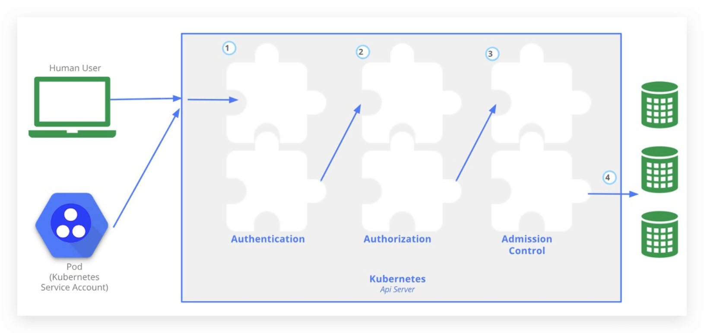
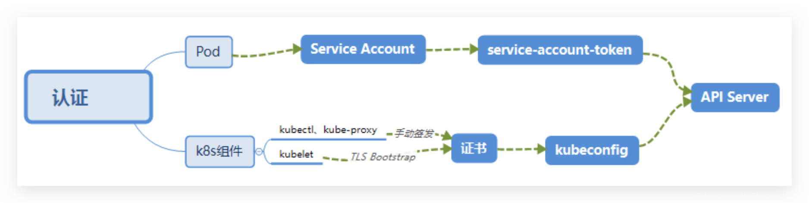
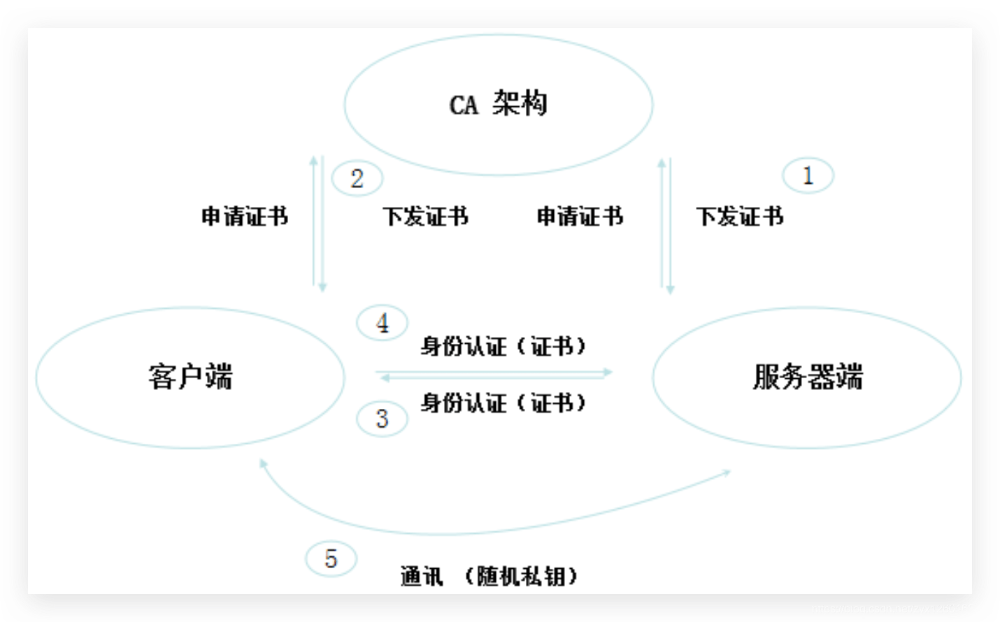
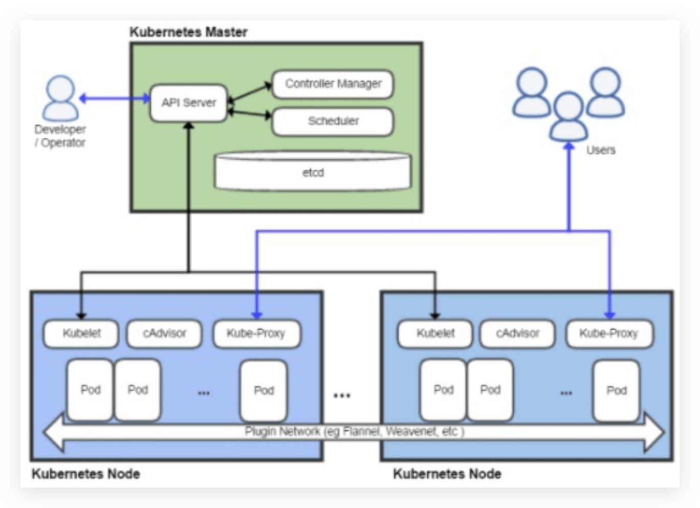
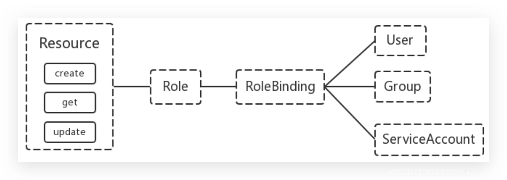
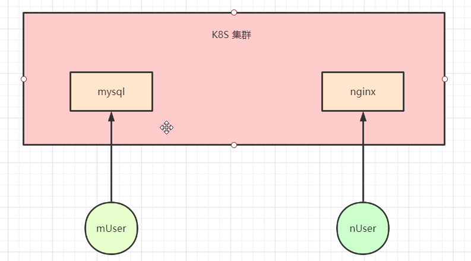

# Kubernetes集群安全

## 1. 机制简介

`Kubernetes` 作为一个分布式集群的管理工具，保证集群的安全性是其一个重要的任务。`API Server` 是集群内部各个组件通信的中介，也是外部控制的入口。所以 `Kubernetes` 的安全机制基本就是围绕保护 `API Server` 来设计的。

`Kubernetes` 使用了**认证**（Authentication）、**鉴权**（Authorization）、**准入控制**（Admission
Control）三步来保证 `API Server` 的安全



## 2. 认证（Authentication）



- HTTP Token 认证：通过一个 Token 来识别合法用户
  - HTTP Token 的认证是用一个很长的特殊编码方式的并且难以被模仿的字符串 Token 来表达客户的一种方式。Token 是一个很长的很复杂的字符串，每一个 Token 对应一个用户名存储在 API Server 能访问的**文件中**。当客户端发起 API 调用请求时，需要在 HTTP Header 里放入 Token
- HTTP Base 认证：通过 用户名+密码 的方式认证
  - `用户名+：+密码` 用 `BASE64` 算法进行编码后的字符串放在 HTTP Request 中的 Heather
    Authorization 域里发送给服务端，服务端收到后进行编码，获取用户名及密码

> 这两种，都知道，不太安全.

`K8S `是通过的 HTTPS 证书认证：基于 CA 根证书签名的客户端身份认证方式

> 双向认证

**1、 HTTPS 证书认证**



**2、需要认证的组件**



**3、认证的组件的两种类型：**

- `Kubenetes` 组件对 API Server 的访问：`kubectl`、`Controller Manager`、`Scheduler`、`kubelet`、`kubeproxy`
- `Kubernetes` 管理的 Pod 对容器的访问：Pod（`dashborad` 也是以 Pod 形式运行）

**4、端口访问说明：**

`Controller Manager`、`Scheduler` 与 `API Server` 在同一台机器（本机组件），所以直接使用 `API Server` 的非安全端口访问（非安全端口可以禁用）

- 默认为端口 `8080`，使用 `--insecure-port` 进行更改
- 默认 IP 为 `localhost`，使用 `--insecure-bind-address` 进行更改
- 请求 绕过 身份认证和鉴权模块
- 由准入控制模块处理的请求

`kubectl`、`kubelet`、`kube-proxy` （远程组件）访问 API Server 就都需要证书进行 HTTPS 双向认证

- 默认端口 `6443`，使用 `--secure-port` 更改
- 默认 IP 是第一个非本地网络接口，使用 --bind-address 更改
- 请求须经身份认证和鉴权组件处理
- 请求须经准入控制模块处理

**5、证书颁发有两种方式：**

- 手动签发：通过 k8s 集群的跟 ca 进行签发 HTTPS 证书
- **自动签发**：`kubelet` 首次访问 API Server 时，使用 `token` 做认证，通过后，`Controller Manager` 会为 kubelet 生成一个证书，以后的访问都是用证书做认证了

**6、kubeconfig**

`kubeconfig` 是一个文件类型，文件包含**集群参数**（CA 证书、API Server 地址），**客户端参数**（上面生成的证书和私钥），**集群 context 信息**（集群名称、用户名），可以理解为一个认证函，里面包含了怎么访问服务的信息以及认证信息。Kubenetes 组件通过启动时指定不同的 `kubeconfig` 文件可以切换到不同的集群

```shell
[root@k8s-master01 ~]# cd .kube/
[root@k8s-master01 .kube]# ls
cache  config  http-cache
```

**7、ServiceAccount（SA）（给 Pod 颁发证书）**

Pod 中的容器访问 API Server。因为 Pod 的创建、销毁是**动态的**，所以要为它手动生成证书就不可行了。

Kubenetes 使用了 `Service Account` 解决 Pod 访问 API Server 的认证问题

**8、Secret 与 SA 的关系**

Kubernetes 设计了一种资源对象叫做 `Secret`，分为两类，一种是用于 `ServiceAccount` 的 `service-accounttoken`， 另一种是用于保存用户自定义保密信息的 `Opaque`。`ServiceAccount` 中包含三个部分：

- `Token` 是使用 API Server 私钥签名的 JWT。用于访问 API Server 时，Server 端认证
- `ca.crt`：根证书。用于 Client 端验证 API Server 发送的证书
- `namespace`，标识这个 `service-account-token` 的作用域名空间

> Json web token (JWT), 是为了在网络应用环境间传递声明而执行的一种基于 JSON 的开放标准（(RFC 7519).该 token 被设计为紧凑且安全的，特别适用于分布式站点的单点登录（SSO）场景。JWT 的声明一般被用来在身份提供者和服务提供者间传递被认证的用户身份信息，以便于从资源服务器获取资源，也可以增加一些额外的其它业务逻辑所必须的声明信息，该 token 也可直接被用于认证，也可被加密。

默认情况下，每个 `namespace` 都会有一个 `ServiceAccount`，如果 Pod 在创建时没有指定 `ServiceAccount`，就会使用 Pod 所属的 `namespace` 的 `ServiceAccount`。

`Service Account` 用来访问 `Kubernetes API`，由 `Kubernetes` **自动创建**，并且会**自动挂载**到 Pod 的 `/run/secrets/kubernetes.io/serviceaccount` 目录中

```shell
 1. 随便找一个需要访问 Kubernetes API 的 Pod
$ kubectl get pod -n kube-system
NAME                                   READY   STATUS    RESTARTS   AGE
kube-proxy-2pqkk                       1/1     Running   6          40d

 2. 查看该 Pod 中 /run/secrets/kubernetes.io/serviceaccount 目录下的文件
$ kubectl exec kube-proxy-2pqkk -n kube-system -it -- ls /run/secrets/kubernetes.io/serviceaccount
ca.crt	namespace  token
```

## 3. 授权（Authorization）

上面认证过程，只是确认通信的双方都确认了对方是可信的，可以相互通信。而鉴权是确定请求方有哪些资源的权限。API Server 目前支持以下几种授权策略 （通过 API Server 的启动参数 “`--authorization-mode`” 设置）：

- `AlwaysDeny`：表示拒绝所有的请求，一般用于测试
- `AlwaysAllow`：允许接收所有请求，如果集群不需要授权流程，则可以采用该策略
- `ABAC`（Attribute-Based Access Control）：基于属性的访问控制，表示使用用户配置的授权规则对用户请求进行匹配和控制
- `Webbook`：通过调用外部 REST 服务对用户进行授权
- **`RBAC`**（Role-Based Access Control）（默认）：基于角色的访问控制，现行默认规则

> 生产环境中，通常使用 `RBAC `的 授权 方式

### 3.1. RBAC

`RBAC`（Role-Based Access Control）基于角色的访问控制，在 Kubernetes 1.5 中引入，现行版本成为**默认标准**。相对其它访问控制方式，拥有以下优势：

- 对集群中的资源和非资源均拥有**完整的覆盖**
- 整个 RBAC 完全由几个 API 对象完成，同其它 API 对象一样，可以用 kubectl 或 API 进行操作
- 可以在运行时进行调整，无需重启 API Server

RBAC 引入了 4 个新的顶级资源对象：`Role`、`ClusterRole`、`RoleBinding`、`ClusterRoleBinding`，4 种对象类型均可以通过 `kubectl` 与 API 操作

- `Role` 和 `RoleBinding` 是名称空间级别资源，`ClusterRole` 和 `ClusterRoleBinding` 是集群级别资源
- `Role` 与 `RoleBinding` 之间的关系如下图所示，Role 用来指定一些角色，每个角色对资源的权限不同，RoleBinding 将这些角色赋予给用户、组和 SA 。



需要注意的是 `Kubenetes` 并不会提供用户管理，那么 `User`、`Group`、`ServiceAccount` 指定的用户又是从哪里来的呢？ Kubenetes 组件（kubectl、kube-proxy）或是其他自定义的用户在向 CA 申请证书时，需要提供一个证书请求文件：

```json
{
  "CN": "admin",	# Common Name(CN)，公用名，一般是主机名+网站域名
  "hosts": [],
  "key": {
    "algo": "rsa",
    "size": 2048
  },
  "names": [
    {
      "C": "CN",		# Country Code(C)：国家，只能是两个字母的国家码
      "ST": "HangZhou",			# State or Province(S)，省名或者州名
      "L": "XS",				# Locality(L)，城市名
      "O": "system:masters",	# Organization Name(O)，单位名称
      "OU": "System"	# Organization Unit(OU)，部门
    }
  ]
}

```

- API Server 会把客户端证书的 `CN` 字段作为 `User`，把 `names.O` 字段作为 `Group`
- kubelet 使用 TLS Bootstaping 认证时，API Server 可以使用 Bootstrap Tokens 或者 Token authentication file 验证 =token，无论哪一种，Kubenetes 都会为 token 绑定一个默认的 User 和 Group
- Pod 使用 ServiceAccount 认证时，service-account-token 中的 JWT 会保存 User 信息

有了用户信息，再创建一对 角色/角色绑定（集群角色/集群角色绑定）资源对象，就可以完成权限绑定了

### 3.2. Role / ClusterRole

在 RBAC API 中，`Role` 表示一组规则权限，权限只会增加(累加权限)，不存在一个资源一开始就有很多权限而通过
RBAC 对其进行减少的操作；`Role` 可以定义在一个 `namespace` 中，如果想要跨 `namespace` 则可以创建 `ClusterRole`

```yaml
kind: Role
apiVersion: rbac.authorization.k8s.io/v1
metadata:
  namespace: default # 名称空间
  name: pod-reader
rules:
  - apiGroups: [""] # api组，"" 为空代表的是 core 核心组
    resources: ["pods"] # 资源对象
    verbs: ["get", "watch", "list"] # 操作动作
```

`ClusterRole` 具有与 `Role` 相同的权限角色控制能力，不同的是 `ClusterRole` 是集群级别的，`ClusterRole` 可以用
于:

- 集群级别的资源控制( 例如 `node` 访问权限 )
- 非资源型 `endpoints`( 例如 `/healthz` 访问 )
- 所有命名空间资源控制(例如 pods )

```yaml
kind: ClusterRole
apiVersion: rbac.authorization.k8s.io/v1
metadata:
  name: secret-reader
rules:
  - apiGroups: [""] # api 组
    resources: ["secrets"] # 资源对象
    verbs: ["get", "watch", "list"] # 操作动作
```

### 3.3. RoleBinding / ClusterRoleBinding

`RoloBinding` 可以将角色中定义的权限授予用户或用户组，`RoleBinding` 包含一组权限列表(`subjects`)，权限列表中包含有不同形式的待授予权限资源类型(`users`, `groups`, `SA`)；`RoloBinding` 同样包含对被 Bind 的 Role 引用；`RoleBinding` 适用于某个**命名空间内授权**，而 `ClusterRoleBinding` 适用于**集群范围内的授权**

将 `default` 命名空间的 pod-reader Role 授予 jane 用户，此后 jane 用户在 default 命名空间中将具有 pod-reader 的权限

```yaml
kind: RoleBinding
apiVersion: rbac.authorization.k8s.io/v1
metadata:
  name: read-pods
  namespace: default # 名称空间
subjects: # 权限列表
  - kind: User # User 类型
    name: jane # 用户名
    apiGroup: rbac.authorization.k8s.io # api 组
roleRef: # 角色
  kind: Role # 类型
  name: pod-reader # Role 名字
  apiGroup: rbac.authorization.k8s.io # api组
```

`RoleBinding` 同样可以引用 `ClusterRole` 来对当前 `namespace` 内用户、用户组或 `ServiceAccount` 进行授权，这种操作允许集群管理员在整个集群内定义一些通用的 `ClusterRole`，然后在不同的 `namespace` 中使用 `RoleBinding` 来引用

例如，以下 `RoleBinding` 引用了一个 `ClusterRole`，这个 `ClusterRole` 具有整个集群内对 `secrets` 的访问权限；但是其授权用户 dave 只能访问 `development` 空间中的 `secrets`(因为 `RoleBinding` 定义在 `development` 命名空间)

```yaml
kind: RoleBinding
apiVersion: rbac.authorization.k8s.io/v1
metadata:
  name: read-secrets
  namespace: development # 名称空间，只授予 development 名称空间内的权限
subjects:
  - kind: User
    name: dave
    apiGroup: rbac.authorization.k8s.io
roleRef:k8s_installation
  kind: ClusterRole
  name: secret-reader
  apiGroup: rbac.authorization.k8s.io
```

使用 `ClusterRoleBinding` 可以对整个集群中的所有命名空间资源权限进行授权；以下 `ClusterRoleBinding` 样例展示了授权 `manager` 组内所有用户在全部命名空间中对 `secrets` 进行访问

```yaml
kind: ClusterRoleBinding
apiVersion: rbac.authorization.k8s.io/v1
metadata:
  name: read-secrets-global
subjects:
  - kind: Group # 绑定给一个组
    name: manager # 组名
    apiGroup: rbac.authorization.k8s.io # api接口
roleRef:
  kind: ClusterRole # ClusterRole
  name: secret-reader # 名称
  apiGroup: rbac.authorization.k8s.io # api接口
```

### 3.4. Resources

`Kubernetes `集群内一些资源一般以其名称字符串来表示，这些字符串一般会在 `API `的 `URL `地址中出现；同时某些资源也会包含子资源，例如 `logs `资源就属于 `pods `的子资源，`API `中 `URL `样例如下

```shell
GET /api/v1/namespaces/{namespace}/pods/{name}/log
```

如果要在 RBAC 授权模型中控制这些子资源的访问权限，可以通过 `/` 分隔符来实现，以下是一个定义 `pods` 资源 `logs` 访问权限的 Role 定义样例

```shell
kind: Role
apiVersion: rbac.authorization.k8s.io/v1beta1
metadata:
  namespace: default
  name: pod-and-pod-logs-reader
rules:
  - apiGroups: [""]
    resources: ["pods/log"]
    verbs: ["get", "list"]
```

### 3.5. Subjects

`RoleBinding` 和 `ClusterRoleBinding` 可以将 `Role` 绑定到 `Subjects`；`Subjects` 可以是 `groups`、`users` 或者 `service accounts`

Subjects 中 Users 使用字符串表示，它可以是一个普通的名字字符串，如 “alice”；也可以是 email 格式的邮箱地址，如 “`xxx@163.com`”；甚至是一组字符串形式的数字 ID 。但是 Users 的前缀 `system:` 是系统保留的，集群管理员应该确保普通用户不会使用这个前缀格式

`Groups` 书写格式与 `Users` 相同，都为一个字符串，并且没有特定的格式要求；同样 `system:` 前缀为系统保留

### 3.6. 授权案例

比如，在 K8s 集群 中可能，Mysql 模块，Nginx 模块就需要进行资源分割管理。



```shell
  创建用户
useradd devuser
passwd devuser

[devuser@k8s-master01 ~]$ mkdir cert
[devuser@k8s-master01 ~]$ cd cert/
[devuser@k8s-master01 cert]$ vim devuser-csr.json
```

```json
{
  "CN": "devuser",
  "hosts": [],
  "key": {
    "algo": "rsa",
    "size": 2048
  },
  "names": [
    {
      "C": "CN",
      "ST": "BeiJing",
      "L": "BeiJing",
      "O": "k8s",
      "OU": "System"
    }
  ]
}
```

- `CN`：一般是域名，这里使用了用户名（`User`）
- `hosts`：可以使用的主机，不写的话代表所有
- `key`：生成证书的算法
- `names`：一些其它的属性
  - `C`: Country， 国家
  - `ST`: State，州或者是省份
  - `L`: Locality Name，地区，城市
  - `O`: Organization Name，组织名称，公司名称（`Group`）
  - `OU`: Organization Unit Name，组织单位名称，公司部门

**生成证书**

```shell
 1. 下载证书生成工具
wget https://pkg.cfssl.org/R1.2/cfssl_linux-amd64
mv cfssl_linux-amd64 /usr/local/bin/cfssl
wget https://pkg.cfssl.org/R1.2/cfssljson_linux-amd64
mv cfssljson_linux-amd64 /usr/local/bin/cfssljson
wget https://pkg.cfssl.org/R1.2/cfssl-certinfo_linux-amd64
mv cfssl-certinfo_linux-amd64 /usr/local/bin/cfssl-certinfo
chmod a+x /usr/local/bin/cfssl*

 2. 生成证书
$ cd /etc/kubernetes/pki
$ cfssl gencert -ca=ca.crt -ca-key=ca.key -profile=kubernetes /home/devuser/cert/devuser-csr.json | cfssljson -bare devuser

 查看生成的证书
$ ll dev*
-rw-r--r-- 1 root root  997 11月 17 19:53 devuser.csr
-rw------- 1 root root 1679 11月 17 19:53 devuser-key.pem
-rw-r--r-- 1 root root 1237 11月 17 19:53 devuser.pem
```

- `cfssl gencert`: 生成新的 key (密钥)和签名证书
  - `-ca`：指明 ca 的证书
  - `-ca-key`：指明 ca 的私钥文件
  - `-profile`：根据 config 中的 profile 段来生成证书的相关信息（暂时不太懂）
- `-bare`：指定文件名

**创建 kubeconfig**

1、在 devuser 家目录中创建 `.kube` 目录（`config` 文件一般是放在 `~/.kube` 目录中的）

```shell
mkdir /home/devuser/.kube
cd /home/devuser/.kube
```

2、设置集群参数

```shell
export KUBE_APISERVER="https://192.168.200.61:6443"

kubectl config set-cluster kubernetes \
--certificate-authority=/etc/kubernetes/pki/ca.crt \
--embed-certs=true \
--server=${KUBE_APISERVER} \
--kubeconfig=config
```

（1） `kubernetes`：集群名字
（2）`--certificate-authority`：指定 CA 证书
（3）`--embed-certs`：是否进行加密的认证
（4）`--server`：指定 APIserver 的信息
（5）`--kubeconfig`：指定 kubeconfig 的文件，没有会自动创建

3、设置客户端认证参数

```shell
kubectl config set-credentials devuser \
--client-certificate=/etc/kubernetes/pki/devuser.pem \
--client-key=/etc/kubernetes/pki/devuser-key.pem \
--embed-certs=true \
--kubeconfig=config
```

（1） `devuser`：证书的用户名
（2）`--client-certificate`：指定客户端证书
（3）`--client-key`：指定客户端私钥
（4）`--embed-certs`：是否开启证书认证
（5）`--kubeconfig`：写入的文件，与上面相同，写入同一个文件

4、设置上下文参数

```shell
 1. 创建 dev 的名称空间
kubectl create namespace dev

 2. 设置上下文参数
kubectl config set-context kubernetes \
--cluster=kubernetes \
--user=devuser \
--namespace=dev \
--kubeconfig=config
```

（1） `kubernetes`：Context 的名字
（2）`--cluster`：指定集群名称
（3）`--user`：指定用户名
（4）`--namespace`：绑定到某个名称空间
（5）`--kubeconfig`：写入的文件，与上面相同，写入同一个文件

5、更改 config 文件所属的用户和组

```shell
chown devuser:devuser /home/devuser/.kube/config
```

6、查看 config 文件

```yaml
apiVersion: v1
clusters: # 配置kubernetes集群
  - cluster:
      certificate-authority-data: ...
      server: https://192.168.66.10:6443
    name: kubernetes
contexts: # 配置访问kubernetes集群的具体上下文环境
  - context:
      cluster: kubernetes
      namespace: dev
      user: devuser
    name: kubernetes
current-context: "" # 配置当前使用的上下文环境
kind: Config
preferences: {}
users: # 配置访问的用户信息，用户名以及证书信息
  - name: devuser
    user:
      client-certificate-data: ...
      client-key-data: ...
```

**创建 RoleBinding**

创建 `RoleBinding` 给 `devuser` 赋予权限

```shell
kubectl create rolebinding devuser-admin-binding --clusterrole=admin --user=devuser --namespace=dev
```

- `devuser-admin-binding`：RoleBinding 的名字
- `--clusterrole=admin`：指定要绑定的 `Clusterrole` 名字，k8s 集群默认存在一个 `admin` 的 `Clusterrole`
- `--user=devuser`：指定要绑定的用户名为 devuser
- `--namespace=dev`：可以访问 dev 名称空间下的所有资源

**切换上下文/环境（kubeconfig）**

切换上下文也就是让 `kubectl` 读取到 `config` 中的配置信息，

```bash
$ kubectl config use-context kubernetes --kubeconfig=config
Switched to context "kubernetes".
```

- 这行命令设置了 config 文件中的 `current-context` 为 `kubernetes`
- kubernetes：上下文环境名
- `--kubeconfig`：指定 `kubeconfig` 文件

**测试**

```shell
 1. 用户 devuser 创建一个名叫 nginx 的 pod(默认创建到 dev 名称空间下)
$ kubectl run nginx --image=qianzai/k8s-myapp:v1

 2. root 用户查看该 pod
$ kubectl get pod -n dev
NAME                     READY   STATUS    RESTARTS   AGE
nginx-858f8869f8-xczt4   1/1     Running   0          66m

 3. 想查看default 名称空间没有权限
$ kubectl get pod -n default
Error from server (Forbidden): pods is forbidden: User "devuser" cannot list resource "pods" in API group "" in the namespace "default"
```

## 4. 准入控制

官方文档：https://kubernetes.io/zh/docs/reference/access-authn-authz/admission-controllers/

准入控制是 API Server 的插件集合，通过添加不同的插件，实现额外的准入控制规则。甚至于 API Server 的一些主要的功能都需要通过 `Admission Controllers` 实现，比如 `ServiceAccount`。

**列举几个插件的功能：**

- `NamespaceLifecycle`： 防止在不存在的 namespace 上创建对象，防止删除系统预置 namespace，删除 namespace 时，连带删除它的所有资源对象。
- `LimitRanger`：确保请求的资源不会超过资源所在 Namespace 的 LimitRange 的限制。
- `ServiceAccount`： 实现了自动化添加 ServiceAccount。
- `ResourceQuota`：确保请求的资源不会超过资源的 ResourceQuota 限制。

**准入控制的操作**

1. 启用 NamespaceLifecycle 和 LimitRanger 准入控制插件：

```bash
kube-apiserver --enable-admission-plugins=NamespaceLifecycle,LimitRanger
```

1. 禁用插件

```bash
kube-apiserver --disable-admission-plugins=PodNodeSelector,AlwaysDeny ...
```

1. 查看默认启用的插件

```bash
kube-apiserver -h | grep enable-admission-plugins
```
