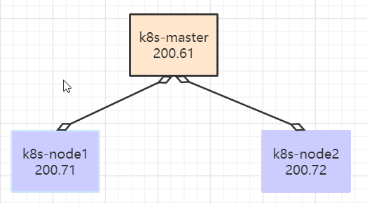
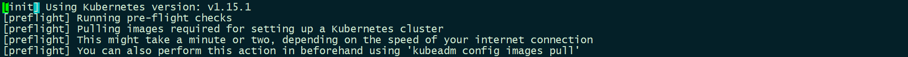
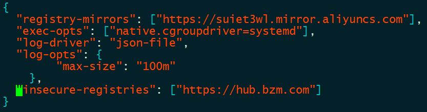
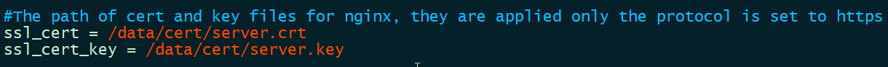
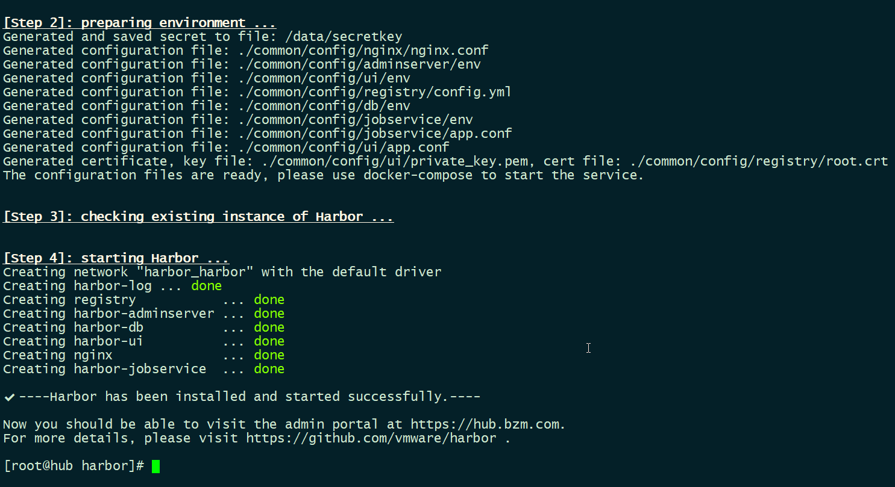
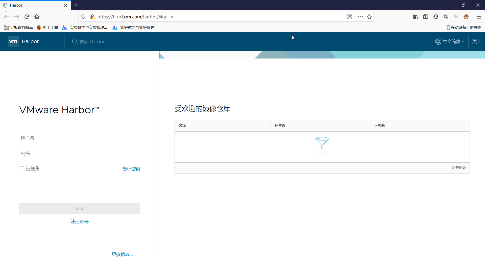

# Kubernetes集群安装

### 4.1. 集群规划

| 节点         | 处理器 | 内存 |
| ------------ | ------ | ---- |
| k8s-master01 | 1/2    | 2G   |
| k8s-node1    | 2/2    | 4G   |
| k8s-node2    | 2/2    | 4G   |



### 4.2. 搭建过程

#### 4.2.1. Kuberbetes 环境准备

>   `k8s-master01`，`k8s-node01`，`k8s-node02`所有节点安装

1、设置系统主机名以及 Host 文件的相互解析

```shell
vim /etc/hosts

192.168.200.61 k8s-master01 m1
192.168.200.71 k8s-node01 n1
192.168.200.72 k8s-node02 n2
```

2、关闭防火墙，SELinux

```shell
systemctl stop firewalld   
systemctl disable firewalld     

setenforce 0   
sed -i 's/\(SELINUX=\).*/\1disabled/' /etc/selinux/config
```

3、调整系统的时区

```shell
#设置系统时区为中国/上海
timedatectl set-timezone Asia/Shanghai
#将当前的UTC时间写入硬件时钟
timedatectl set-local-rtc 0
#重启依赖于系统时间的服务
systemctl restart rsyslog
systemctl restart crond
```

4、关闭系统不需要服务

```shell
systemctl stop postfix && systemctl disable postfix
```

5、关闭虚拟内存空间

```
swapoff -a && sed -i '/ swap / s/^\(.*\)$/#\1/g' /etc/fstab
```

>   因为开启虚拟内存空间，k8s就可能运行在虚拟内存空间中，大大影响k8s效率，建议关闭

6、配置yum源，可以用阿里云

[CentOS 7- 配置阿里镜像源](https://developer.aliyun.com/article/704987)

7、升级系统内核为 4.44

```shell
rpm -Uvh http://www.elrepo.org/elrepo-release-7.0-3.el7.elrepo.noarch.rpm

yum --enablerepo=elrepo-kernel install -y kernel-lt
grub2-set-default 'CentOS Linux (4.4.240-1.el7.elrepo.x86_64) 7 (Core)'
grub2-editenv list
cat /boot/grub2/grub.cfg |grep menuentry
```

>   不升级为4.4，并不会造成k8s安装失败，但是会造成一些不稳定因素。

8、调整内核参数，对于 K8S

```shell
cat > kubernetes.conf <<EOF
net.bridge.bridge-nf-call-iptables=1
net.bridge.bridge-nf-call-ip6tables=1
net.ipv4.ip_forward=1
net.ipv4.tcp_tw_recycle=0
vm.swappiness=0 # 禁止使用 swap 空间，只有当系统 OOM 时才允许使用它
vm.overcommit_memory=1 # 不检查物理内存是否够用
vm.panic_on_oom=0 # 开启 OOM
fs.inotify.max_user_instances=8192
fs.inotify.max_user_watches=1048576
fs.file-max=52706963
fs.nr_open=52706963
net.ipv6.conf.all.disable_ipv6=1
net.netfilter.nf_conntrack_max=2310720
EOF
cp kubernetes.conf  /etc/sysctl.d/kubernetes.conf
sysctl -p /etc/sysctl.d/kubernetes.conf
```

9、安装依赖包

```shell
yum install -y conntrack ntpdate ntp ipvsadm ipset jq iptables curl sysstat libseccomp wgetvimnet-tools git
```

10、设置 rsyslogd 和 systemd journald

```shell
mkdir /var/log/journal # 持久化保存日志的目录
mkdir /etc/systemd/journald.conf.d
cat > /etc/systemd/journald.conf.d/99-prophet.conf <<EOF 
[Journal]
# 持久化保存到磁盘
Storage=persistent

# 压缩历史日志
Compress=yes

SyncIntervalSec=5m RateLimitInterval=30s RateLimitBurst=1000

# 最大占用空间 10G 
SystemMaxUse=10G

# 单日志文件最大 200M 
SystemMaxFileSize=200M

# 日志保存时间 2 周
MaxRetentionSec=2week

# 不将日志转发到 syslog 
ForwardToSyslog=no 
EOF
systemctl restart systemd-journald
```

#### 4.2.2. Kuberbetes 部署安装

1、kube-proxy开启ipvs的前置条件

>   ipvs：解决svc(service)和pod之间的调度关系，极大增加效率。

```shell
modprobe br_netfilter

cat > /etc/sysconfig/modules/ipvs.modules <<EOF 
modprobe -- ip_vs 
modprobe -- ip_vs_rr 
modprobe -- ip_vs_wrr 
modprobe -- ip_vs_sh
modprobe -- nf_conntrack_ipv4 
EOF

chmod 755 /etc/sysconfig/modules/ipvs.modules && bash /etc/sysconfig/modules/ipvs.modules &&
lsmod | grep -e ip_vs -e nf_conntrack_ipv4
```

2、安装docker

```shell
# docker 需要的一些依赖
yum install -y yum-utils device-mapper-persistent-data lvm2

# 导入阿里源的docker远程仓库
yum-config-manager --add-repo http://mirrors.aliyun.com/docker-ce/linux/centos/docker-ce.repo

yum update -y && yum install -y docker-ce-18.06.3.ce-3.el7

# 创建 /etc/docker 目录

mkdir /etc/docker

# 配置 daemon.

cat >/etc/docker/daemon.json <<EOF
{
  "registry-mirrors": ["https://suiet3wl.mirror.aliyuncs.com"],
  "exec-opts": ["native.cgroupdriver=systemd"], 
  "log-driver": "json-file", 
  "log-opts": { 
        "max-size": "100m" 
    }
}
EOF

# 存放docker的配置文件
mkdir -p /etc/systemd/system/docker.service.d

# 重启docker服务
systemctl daemon-reload && systemctl restart docker && systemctl enable docker
```

 3、安装Kubeadm

```shell
cat <<EOF > /etc/yum.repos.d/kubernetes.repo 
[kubernetes] 
name=Kubernetes 
baseurl=http://mirrors.aliyun.com/kubernetes/yum/repos/kubernetes-el7-x86_64 
enabled=1 
gpgcheck=0 
repo_gpgcheck=0 
gpgkey=http://mirrors.aliyun.com/kubernetes/yum/doc/yum-key.gpg http://mirrors.aliyun.com/kubernetes/yum/doc/rpm-package-key.gpg
EOF

# 指定安装版本（这里统一使用1.15.1）
yum -y install kubeadm-1.15.1 kubectl-1.15.1 kubelet-1.15.1
systemctl enable kubelet.service
```

4、初始化Kubermetes 节点

直接`kubeadm init` ，会因为网络原因在这里卡很久。可以预先拉取配置。



> `kubeadm-basic.images.tar.gz`：公众号：<u>云计算小千</u>  回复：*k8s安装*

```shell
# 解压
tar -zxvf kubeadm-basic.images.tar.gz
```

写个简单shell脚本导入镜像`k8s-load.sh`

```shell
#!/bin/bash
ls /root/kubeadm-basic.images >/tmp/image-list.txt
cd /root/kubeadm-basic.images

for i in $(cat /tmp/image-list.txt)
do
	docker load -i $i
done

rm -fr /tmp/image-list.txt
```

```shell
# 生成kubeadm的默认配置文件
kubeadm config print init-defaults > kubeadm-config.yaml 
```

```shell
vim kubeadm-config.yaml

localAPIEndpoint:        
	advertiseAddress: 192.168.200.61 
kubernetesVersion: v1.15.1    
networking:      
	podSubnet: "10.244.0.0/16"      
	serviceSubnet: 10.96.0.0/12    
---    
apiVersion: kubeproxy.config.k8s.io/v1alpha1    
kind: KubeProxyConfiguration    
featureGates:      
	SupportIPVSProxyMode: true    
mode: ipvs
```

```shell
# 初始化
kubeadm init --config=kubeadm-config.yaml --experimental-upload-certs | tee kubeadm-init.log
```

> `kubeadm-init.log`文件保存好，**从节点不需要初始化**。

使用kubectl工具

```shell
mkdir -p $HOME/.kube
sudo cp -i /etc/kubernetes/admin.conf $HOME/.kube/config
sudo chown $(id -u):$(id -g) $HOME/.kube/config
```

5、部署网络

```shell
kubectl apply -f https://raw.githubusercontent.com/coreos/flannel/a70459be0084506e4ec919aa1c114638878db11b/Documentation/kube-flannel.yml
```

> 确保网络好，能够访问到quay.io这个registery。否则进行下面操作

```shell
# 可能存在网络原因，可以先wget下来
wget https://raw.githubusercontent.com/coreos/flannel/a70459be0084506e4ec919aa1c114638878db11b/Documentation/kube-flannel.yml

kubectl create -f kube-flannel.yml
```

6、node加入master节点

```shell
kubeadm join 192.168.200.61:6443 --token abcdef.0123456789abcdef \
    --discovery-token-ca-cert-hash sha256:3a6ea23cd5ea4571b768b65819b4a5df59d8d7286c21c67e4b65353e6ebd5cc9 
```

> 执行在kubeadm init输出的kubeadm join命令

所有节点加入完成

```shell
[root@k8s-master01 ~]# kubectl get node
NAME           STATUS   ROLES    AGE     VERSION
k8s-master01   Ready    master   25m     v1.15.1
k8s-node1      Ready    <none>   3m14s   v1.15.1
k8s-node2      Ready    <none>   3m22s   v1.15.1
```


### 4.3. 配置私有仓库

> 构建`Harbor`节点，作为私有仓库，并且已经安装了docker ，安装方式与之前一样。

`docker-compose`安装

> [Docker Compose 快速入门](https://mp.weixin.qq.com/s?__biz=MzkxNjEyNjM4OA==&mid=2247484289&idx=1&sn=0145c605df064205ef8f42b38aae132f&chksm=c155ec5af622654c1720c8c6eb4b088cc74344f65be56c02f341ae09a2bcba3a2292199b434b&token=1512659361&lang=zh_CN#rd)

指定镜像仓库地址，每个节点都要添加

```shell
vim /etc/docker/daemon.json

"insecure-registries": ["https://hub.bzm.com"] 
```



> 可以先做一个假的地址证书，在局域网内部

添加完毕后，重启docker

```shell
systemctl restart docker
```

**安装：Harbor** 

官方地址：https://github.com/vmware/harbor/releases 

下载地址：https://github.com/vmware/harbor/releases/download/v1.2.0/harbor-offline-installer-v1.2.0.tgz

> `harbor-offline-installer-v1.2.0.tgz`：公众号：<u>云计算小千</u>  回复：*k8s安装*

**解压Harbor**

```shell
tar -zxvf harbor-offline-installer-v1.2.0.tgz -C /usr/local/
```

```shell
vim /usr/local/harbor/harbor.cfg
hostname = hub.bzm.com

ui_url_protocol = https
```

**创建证书目录**

```shell
mkdir -p /data/cert/
```



**创建https 证书以及配置相关目录权限**

```shell
[root@hub cert]# openssl genrsa -des3 -out server.key 2048 
Generating RSA private key, 2048 bit long modulus
......................................................+++
......................+++
e is 65537 (0x10001)
Enter pass phrase for server.key:
Verifying - Enter pass phrase for server.key:
```

```shell
openssl req -new -key server.key -out server.csr 
[root@hub cert]# openssl req -new -key server.key -out server.csr 
Enter pass phrase for server.key:
You are about to be asked to enter information that will be incorporated
into your certificate request.
What you are about to enter is what is called a Distinguished Name or a DN.
There are quite a few fields but you can leave some blank
For some fields there will be a default value,
If you enter '.', the field will be left blank.
-----
Country Name (2 letter code) [XX]:CN
State or Province Name (full name) []:BJ
Locality Name (eg, city) [Default City]:BJ
Organization Name (eg, company) [Default Company Ltd]:bzm
Organizational Unit Name (eg, section) []:bzm
Common Name (eg, your name or your server's hostname) []:hub.bzm.com
Email Address []:2794127547@qq.com

Please enter the following 'extra' attributes
to be sent with your certificate request
A challenge password []:
An optional company name []:
```

```shell
# 私钥备份
$ cp server.key server.key.org 

# 退去私钥密码
$ openssl rsa -in server.key.org -out server.key 
Enter pass phrase for server.key.org:
writing RSA key

openssl x509 -req -days 365 -in server.csr -signkey server.key -out server.crt 

# 给所有证书都赋予 x 权限
chmod a+x *
```

**安装**

```shell
cd /usr/local/harbor/

./install.sh 
```



```shell
# 所有节点添加映射
echo "192.168.200.80 hub.bzm.com" >>/etc/hosts

# win的hosts映射
192.168.200.80 hub.bzm.com
```

访问：https://hub.bzm.com；用户名：admin，密码：Harbor12345



> 到这里Harbor基本安装完成

可以在一个节点登录测试下

```shell
[root@k8s-node1 ~]# docker login https://hub.bzm.com
Username: admin
Password: 
WARNING! Your password will be stored unencrypted in /root/.docker/config.json.
Configure a credential helper to remove this warning. See
https://docs.docker.com/engine/reference/commandline/login/#credentials-store

Login Succeeded
```


```
docker pull qianzai/k8s-myapp:v1

docker tag qianzai/k8s-myapp:v1 hub.bzm.com/library/myapp:v1

docker push hub.bzm.com/library/myapp:v1
```


测试k8s集群是否可用，是否与私有仓库连接了

```shell
kubectl run nginx-deployment --image=hub.bzm.com/library/myapp:v1 --port=80 --replicas=1
```

