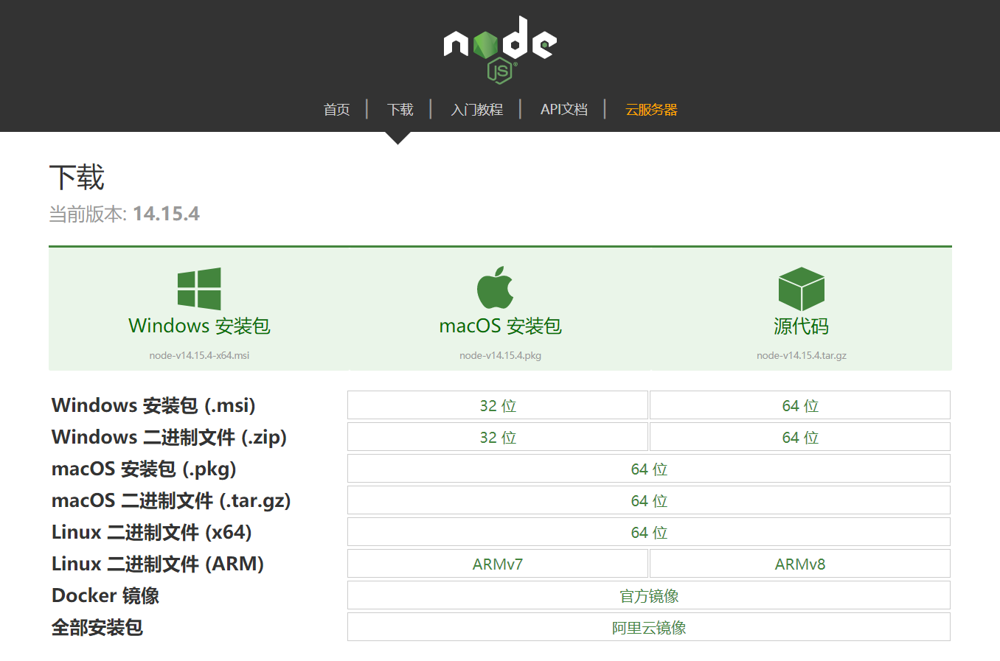

# NodeJS 安装

## 1. 下载 nodejs

[下载地址](http://nodejs.cn/download/)：http://nodejs.cn/download/

- **windows 系统**： .msi 安装包(exe)指定安装位置 .zip(压缩包)直接解压缩指定目录
- **mac os 系统**： .pkg 安装包格式自动配置环境变量 .tar.gz(压缩包)解压缩安装到指定名



## 2. 配置 nodejs 环境变量

`windows `系统：

1、计算上右键属性----> 高级属性 ---->环境变量 添加如下配置:
NODE_HOME= nodejs 安装目录
PATH = xxxx;%NODE_HOME%

## 3. 验证 nodejs 环境是否成功

```bash
node -v
```

## 4. 配置淘宝镜像

```bash
npm config set registry https://registry.npm.taobao.org
npm config get registry
```

## 5. 配置 npm 下载依赖位置

```bash
npm config set cache "D:\Java_bag\nodeJS\node_cache"
npm config set prefix "D:\Java_bag\nodeJS\node_global"
```

## 6. 验证 nodejs 环境配置

```bash
npm config ls
```
