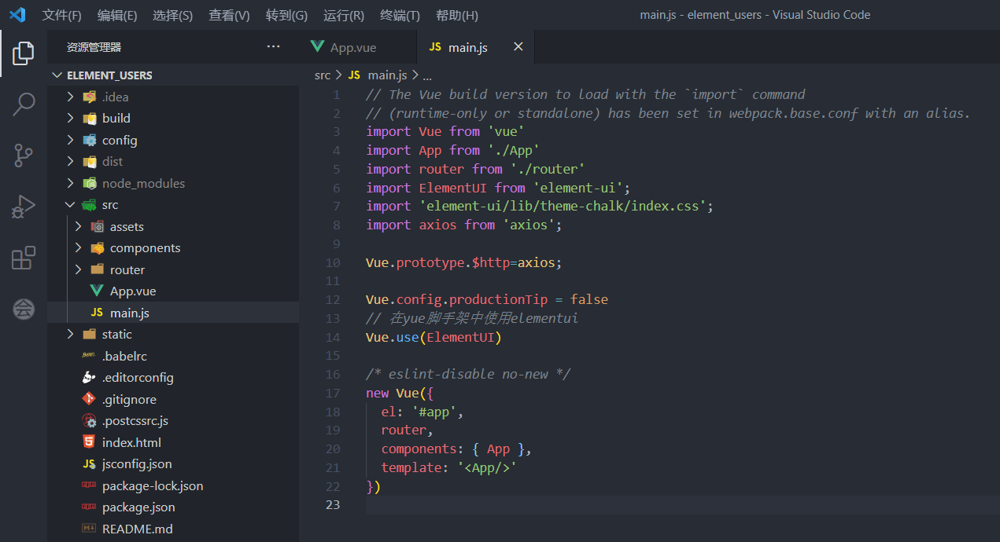

# Eelement_UI

## ElementUI引言

### 官方定义

[官网](https://element.eleme.cn/#/zh-CN)：https://element.eleme.cn/#/zh-CN

`Element`，==网站快速成型工具==一套为开发者、设计师和产品经理准备的基于 Vue 2.0 的`桌面端组件库`

>   `element ui`就是基于`vue`的一个`ui`框架,该框架提供了各种`vue`相关组件，方便我们快速开发页面

## 安装Element UI

[官网教程](https://element.eleme.cn/#/zh-CN/component/installation)：https://element.eleme.cn/#/zh-CN/component/installation

**下载elementui的依赖**

```bash
npm i element-ui -S
```

**在 `main.js `中写入以下内容：**

```js
// 指定当前项目中使用elementui
import ElementUI from 'element-ui';
import 'element-ui/lib/theme-chalk/index.css';

// 在vue脚手架中使用elementui
Vue.use(ElementUI);
```


## Element UI 小案例

### 案例效果

**主页一个轮播图**


**用户管理增删改查**


## 案例步骤

创建`Vue cli`，安装Axios，下载引入`element-ui`



**导航栏**

```vue
<template>
  <div id="app">
    <el-header>
      <!--导航菜单-->
      <el-menu :default-active="activeIndex"
               class="el-menu-demo"
               mode="horizontal"
               @select="handleSelect">
        <el-menu-item index="/index">Bzm主页</el-menu-item>
        <el-menu-item index="/users">用户管理</el-menu-item>
        <el-menu-item index="/msgs">消息中心</el-menu-item>
        <el-menu-item index="/orders">订单管理</el-menu-item>
      </el-menu>
    </el-header>
    <el-main>
      <router-link to="/index"></router-link>
    </el-main>
    <router-view />
  </div>
</template>

<script>
export default {
  name: 'App',
  data () {
    return {
      activeIndex: this.$route.path,  //激活索引为路由路径
    };
  },
  methods: {
    handleSelect (key, keyPath) {
      console.log(key, keyPath);
      this.$router.push(key)    //切换路由
    }
  }
}
</script>

<style>
</style>
```


创建数据库表`t_users.sql`

```sql
SET FOREIGN_KEY_CHECKS=0;

DROP TABLE IF EXISTS `t_users`;
CREATE TABLE `t_users` (
  `id` int(6) NOT NULL AUTO_INCREMENT,
  `name` varchar(80) COLLATE utf8mb4_unicode_ci DEFAULT NULL,
  `bir` timestamp NULL DEFAULT NULL ON UPDATE CURRENT_TIMESTAMP,
  `sex` varchar(4) COLLATE utf8mb4_unicode_ci DEFAULT NULL,
  `address` varchar(120) COLLATE utf8mb4_unicode_ci DEFAULT NULL,
  PRIMARY KEY (`id`)
) ENGINE=InnoDB AUTO_INCREMENT=38 DEFAULT CHARSET=utf8mb4 COLLATE=utf8mb4_unicode_ci;
```


```yaml
mybatis:
  mapper-locations: classpath:/mapper/*.xml
  type-aliases-package: ink.bzm.users.pojo
```


创建实体类`users.pojo.User`

```java
@Data
@AllArgsConstructor
@NoArgsConstructor
@ToString
@Accessors(chain = true)
public class User {
    private String id;
    private String name;
    @JsonFormat(pattern = "yyyy-MM-dd")     //日期格式化
    private Date bir;
    private String sex;
    private String address;
}
```

?>`lombok`


!>接着创建DAO接口，书写对应的mapper配置文件，创建service接口和对应的实现类等等增删改查那一套。


controller

```java
@RestController
@RequestMapping("/user")
@CrossOrigin(allowCredentials="true")   //解决跨域，5.0.2后，allowCredentials默认为false了
public class UserController {

    @Autowired
    private UserService userService;

    @GetMapping("/findAll")
    List<User> findAll() {
        return userService.findAll();
    }

... //等等，完整查看源码

}
```

http://localhost:8989/user/findAll


前端拿取数据

```vue
<script>
 export default {
  name: "List",
  data() {
    return {
        ...
    };
  },
  methods: {
,,,
    //刷新数据
    findAllTableData() {
      this.$http.get("http://localhost:8989/user/findAll").then((res) => {
        this.tableData = res.data;
      });
    },
  },
  created() {
    this.findAllTableData();
  },
};
</script>
```


---

