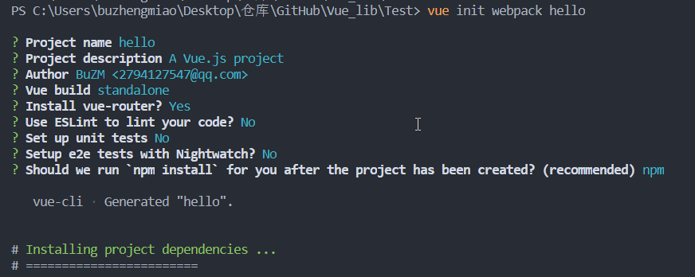
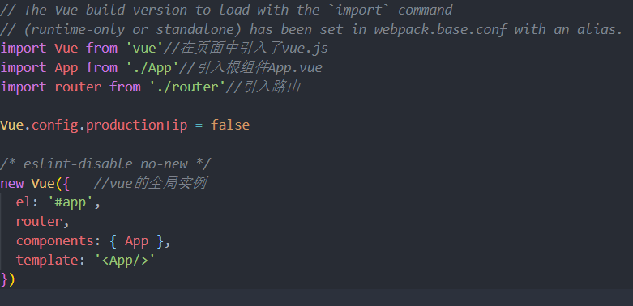
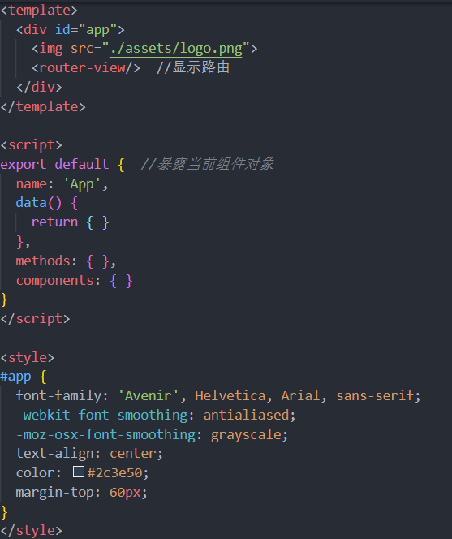

# Vue CLI 脚手架

## 1. 什么是 CLI

**命令行界面**（英语：`command-line interface`，缩写：_CLI_）是在图形用户界面得到普及之前使用最为广泛的用户界面，它通常不支持鼠标，用户通过键盘输入指令，计算机接收到指令后，予以执行。也有人称之为字符用户界面（CUI）

## 2. 什么是 Vue CLI

`Vue CLI` 是一个基于 `Vue.js` 进行快速开发的完整系统。使用**Vue 脚手架**之后我们开发的页面将是一个完整系统(项目)。

[Vue Cli 官方网站](https://cli.vuejs.org/zh/guide/)

## 3. Vue CLI 优势

- 通过 `vue-cli` 搭建交互式的项目脚手架。通过执行命令方式下载相关依赖
- 通过 `@vue/cli` + `@vue/cli-service-global` 快速开始零配置原型开发
- 一个运行时依赖 (`@vue/cli-service`)，该依赖：
  - 可升级； 一条命令
  - 基于 webpack 构建，并带有合理的默认配置； webpack 项目打包方式 编译好的项目源码===>部署到服务器上直接使用
  - 可以通过项目内的配置文件进行配置； 默认配置文件,通过修改默认配置文件达到自己想要的项目环境
  - 可以通过插件进行扩展。 vue v-charts elementui
- 一个丰富的官方插件集合，集成了前端生态中最好的工具。Nodejs(tomcat) Vue VueRouter webpack yarn
- 一套完全图形化的创建和管理 Vue.js 项目的用户界面

## 4. Vue CLI 安装

### 4.1. 环境准备

[NodeJS 安装](/document/前端/NodeJS安装)

### 4.2. 安装脚手架

```bash
npm install -g vue-cli	//安装2.x版本脚手架
npm install -g @vue/cli	//安装3.x版本脚手架
```

```bash
npm uninstall -g @vue/cli  //卸载3.x版本脚手架
npm uninstall -g vue-cli  //卸载2.x版本脚手架
```

### 4.3. 第一个 vue 脚手架项目


[使用 CLI 搭建 Vue.js 项目](https://blog.csdn.net/Neuf_Soleil/article/details/88926242)

#### 4.3.1. 创建项目

```bash
vue init webpack hello
```

?>`hello `项目名



#### 4.3.2. 项目结构

```markdown
hello ------------->项目名

# build ------------->用来使用 webpack 打包使用 build 依赖

# config ------------->用来做整个项目配置目录

# node_modules ------>用来管理项目中使用依赖

# src ------>用来书写 vue 的源代码[重点]

    - assets      ------>用来存放静态资源 [重点]
    - components   ------>用来书写Vue组件 [重点]
    - router			 ------>用来配置项目中路由[重点]
    - App.vue      ------>项目中根组件[重点]
    - main.js      ------>项目中主入口[重点]

# static ------>其它静态

# .babelrc ------> 将 es6 语法转为 es5 运行

# .editorconfig ------> 项目编辑配置

# .gitignore ------> git 版本控制忽略文件

# .postcssrc.js ------> 源码相关 js

# index.html ------> 项目主页

# package.json ------> 类似与 pom.xml 依赖管理 jquery 不建议手动修改

# package-lock.json ----> 对 package.json 加锁

# README.md ----> 项目说明文件
```


#### 4.3.3. 启动项目

```bash
cd hello
```

```bash
npm run dev
```


#### 4.3.4. 访问项目

http://localhost:8080

> 默认 8080 端口

## 5. Vue CLI 分析

1、`src`是我们主要书写`Vue`源码的目录，来看下初始化后的结构

```markdown
src
├── App.vue //项目中根组件
├── assets //存放静态资源
│ └── logo.png
├── components //存放 Vue 组件
│ └── HelloWorld.vue
├── main.js //项目中主入口
└── router //用来配置项目中路由
└── index.js
```

2、`npm run dev`运行项目后，就一个**HelloWorld 页面**


3、首先来看项目的主入口 `main.js`



> [!tip]
>
> 一般不怎么去修改它

`vue`的实例对象`app`，在根路径的`index.html`中使用的


?>`index.html`也不用去修改，是项目完成后，构建打包用的

4、`Vue`全局实例对象，就注册了一个**App 根组件**，项目一运行的时候，就加载了**App 根组件**



- `<router-view/>`就根据路径信息，展示对应的组件

- `export default {}`暴露当前组件对象，同时该对象也就有自己的`data`，`methods`，`components`

5、`router/index.js`文件就定义了对应的路由规则展示对应的组件


## Vue CLI 使用axios

### 安装axios

```bash
npm install axios --save-dev
```

### 配置main.js中引入axios

```js
import axios from 'axios';

Vue.prototype.$http=axios;
```

### 使用axios

在需要发送异步请求的位置

```js
this.$http.get("url").then((res)=>{})  

this.$http.post("url").then((res)=>{})
```


---

