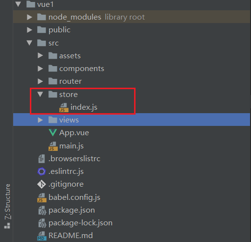
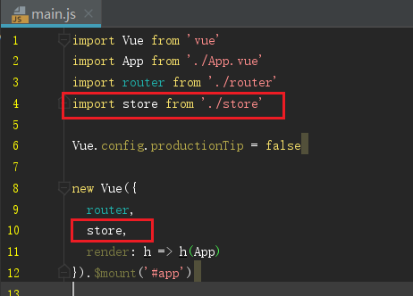
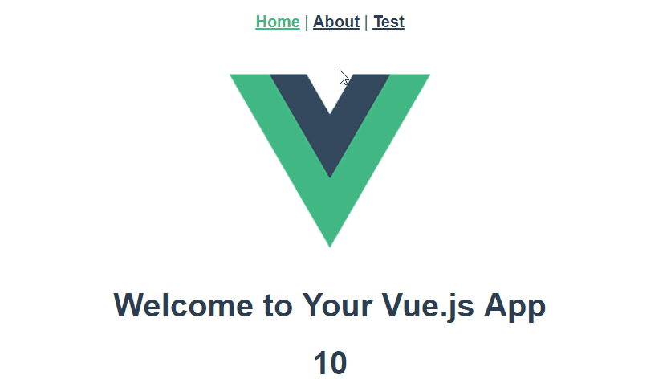
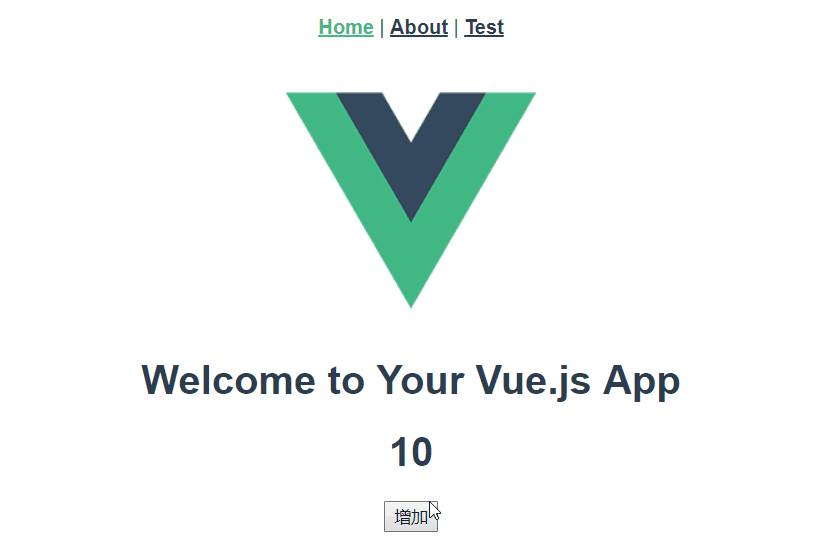
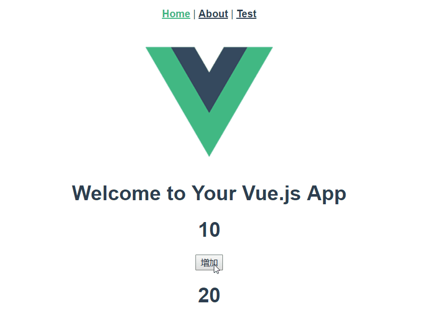

# VueX

## 1. VueX简介

!>`Vuex `是一个专为 `Vue.js` 应用程序开发的**状态管理模式**。它采用**集中式存储管理应用的所有组件的状态**，并以相应的规则保证状态以一种可预测的方式发生变化。

> [!tip]
>
> [VueX官方文档](https://vuex.vuejs.org/zh/guide/)

## 2. VueX安装

**NPM**

```bash
npm install vuex --save
```

创建`store`目录，编写`index.js`文件



`index.js`

```js
import Vue from 'vue' //引入Vue
import Vuex from 'vuex' //引入VueX

//使用VueX
Vue.use(Vuex)

//暴露VueX对象
export default new Vuex.Store({
  state: {
  },
  mutations: {
  },
  actions: {
  },
  modules: {
  }
})
```

在`main.js`中引入`stroe`并注册到`vue`实例



---

## 3. VueX使用

!>首先使用脚手架创建好一个`Vue`项目

### 3.1. State

定义唯一数据源，它能被所有组件共享

```js
export default new Vuex.Store({
  state: {
    count: 10
  }
})
```

使用就非常简单了，这里可以使用`{{this.$store.state.count}}`获取数据

```vue
<h1>{{this.$store.state.count}}</h1>
<!--因为就一个Vue实例，可省去this-->
<h1>{{$store.state.count}}</h1>
```



### 3.2. Mutation

对`store`数据修改的唯一方法

```vue
export default new Vuex.Store({
  mutations: {
    increment (state) {
      state.count++
    }
  },
})
```

这里简单的增加一个按钮，绑定`addCount`方法

```vue
<template>
  <div class="hello">
    <input type ="button" value ="增加" @click="addCount">
  </div>
</template>

<script>
export default { 
 methods:{
    /*增加count方法*/
    addCount(){
      this.$store.commit('increment')
    }
  }
}
</script>
```



### 3.3. Getters

`Vuex` 允许我们在 `store `中定义“`getter`”（可以认为是 `store` 的计算属性）。就像计算属性一样，`getter `的返回值会根据它的依赖被缓存起来，且**只有当它的依赖值发生了改变才会被重新计算**。

```js
export default new Vuex.Store({
  getters: {
    increment(){
      return state.count + 10;
    }
  }
})
```

直接去使用即可

```vue
<template>
  <div class="hello">
    <h1>{{this.$store.getters.increment}}</h1>
  </div>
</template>
```



---

