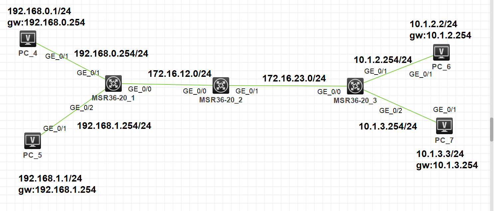

# RIP 实验

## 1. 实验拓扑



## 2. 实验需求

1. 按照图示配置 IP 地址
2. 利用 RIPv2 实现全网互通
3. 要求全网路由不允许出现 RIP 明细路由，直连路由除外，不影响网络正常访问
4. 业务网段不允许出现协议报文
5. R1 与 R2 之间需开启接口验证保证协议安全性，认证秘钥为大家的姓名全拼

## 3. 实验解法

1. 按照图示配置 IP 地址

   

   

   

   

   ```
   [R1]int G0/1
   [R1-GigabitEthernet0/1]ip address 192.168.0.254 24
   [R1-GigabitEthernet0/1]quit
   [R1]int g0/2
   [R1-GigabitEthernet0/2]ip address 192.168.1.254 24
   [R1-GigabitEthernet0/2]quit
   [R1]int g0/0
   [R1-GigabitEthernet0/0]ip address 172.16.12.1 24

   [R2]int g0/0
   [R2-GigabitEthernet0/0]ip address 172.16.12.2 24
   [R2-GigabitEthernet0/0]quit
   [R2]int g0/1
   [R2-GigabitEthernet0/1]ip address 172.16.23.2 24

   [R3]int g0/0
   [R3-GigabitEthernet0/0]ip address 172.16.23.3 24
   [R3-GigabitEthernet0/0]quit
   [R3]int g0/1
   [R3-GigabitEthernet0/1]ip address 10.1.2.254 24
   [R3-GigabitEthernet0/1]quit
   [R3]int g0/2
   [R3-GigabitEthernet0/2]ip address 10.1.3.254 24
   ```

2. 利用 RIPv2 实现全网互通

   **注意：RIP 路由协议默认版本是 RIPv1，所以需修改版本为 RIPv2，关闭自动汇总功能，宣告直连网 络时只能按主类网络宣告**

   ```
   [R1-rip-1]version 2
   [R1-rip-1]undo summary
   [R1-rip-1]network 192.168.0.0
   [R1-rip-1]network 192.168.1.0
   [R1-rip-1]network 172.16.0.0

   [R2-rip-1]version 2
   [R2-rip-1]undo summary
   [R2-rip-1]network 172.16.0.0

   [R3-rip-1]version 2
   [R3-rip-1]undo summary
   [R3-rip-1]network 172.16.0.0
   [R3-rip-1]network 10.0.0.0
   ```

3. 要求全网路由不允许出现 RIP 明细路由，直连路由除外，不影响网络正常访问

   ```
   [R2-GigabitEthernet0/0]rip summary-address 192.168.0.0 255.255.254.0
   [R4-GigabitEthernet0/0]rip summary-address 10.1.0.0 255.255.252.0
   ```

   

   

   

4. 业务网段不允许出现协议报文

   ```
   [R1-rip-1]silent-interface g0/1
   [R1-rip-1]silent-interface g0/2

   [R3-rip-1]silent-interface g0/1
   [R3-rip-1]silent-interface g0/2
   ```

5. R1 与 R2 之间需开启接口验证保证协议安全性，认证秘钥为大家的姓名全拼

   ```
   [R1-GigabitEthernet0/0]rip authentication-mode md5 rfc2453 cipher buzhengmiao

   [R2-GigabitEthernet0/0]rip authentication-mode md5 rfc2453 cipher buzhengmiao

   ```
