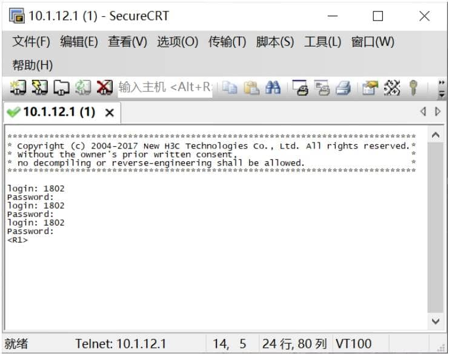

# Telnet 远程登录

## 实验拓扑


## 实验要求

1. 按照图示配置IP地址，Host设备地址配置在虚拟网卡上 
2. 在设备R1上开启远程登陆功能
3. 在本地使用Crt软件测试远程登陆功能

## 实验步骤

1、按照图示配置IP地址，Host设备地址配置在虚拟网卡上

```bash
[R1]interface GigabitEthernet 0/0
[R1-GigabitEthernet0/0]ip address 10.1.12.1 24
# 退出R1-GigabitEthernet0/0
[R1-GigabitEthernet0/0]quit
```

 2、在设备R1上开启远程登陆功能

```bash
# 全局开始远程登陆功能
[R1]telnet server enable
```

```bash
# 创建用户名及密码，用户名为 1802 密码为 password ,指定用户给Telnet协议使用，登
录级别为15

[R1]local-user 1802 class manage
New local user added.
[R1-luser-manage-1802]password simple password
[R1-luser-manage-1802]service-type telnet
[R1-luser-manage-1802]authorization-attribute user-role level-15
```

3、启动本地认证调用创建用户名及密码

```bash
[R1]user-interface vty 0 4
[R1-line-vty0-4]authentication-mode scheme
[R1-line-vty0-4]user-role level-15
```

4、验证Telnet服务

  

  


