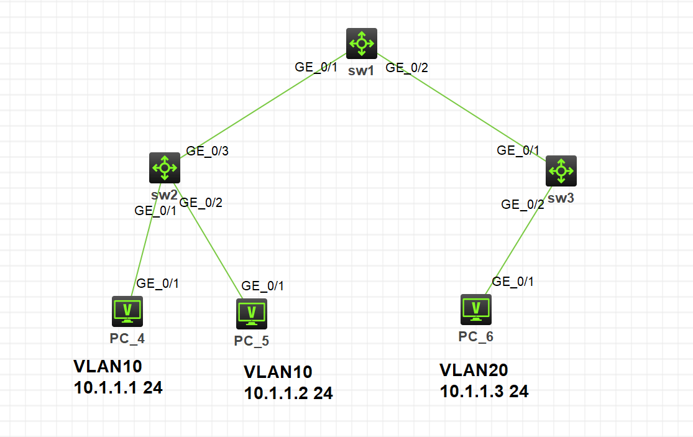
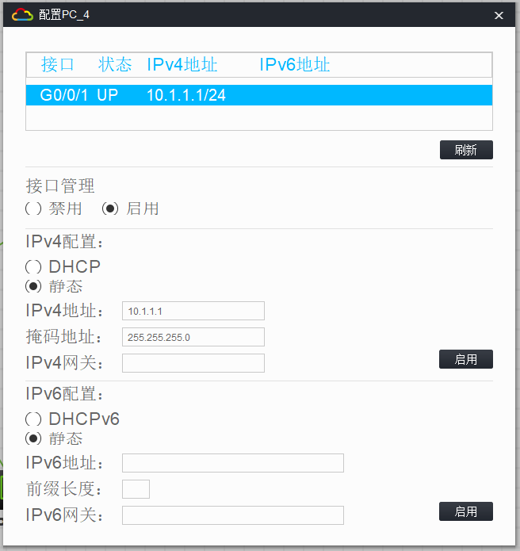
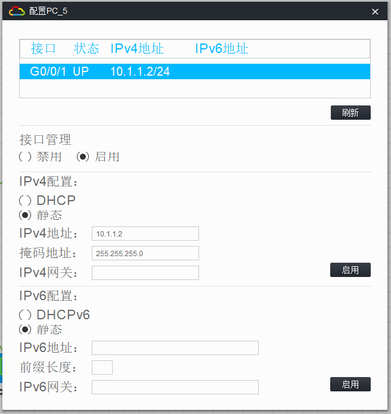
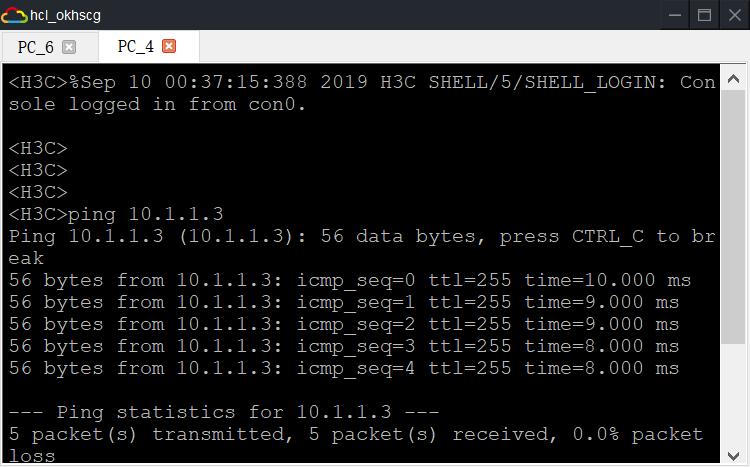
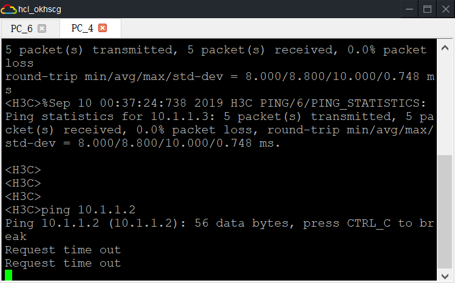

# VLAN 实验

## 1. 实验拓扑



## 2. 实验需求

1. 在拓扑图中配置各 PC 设备的 IP 和掩码，IP 处于同一网段
2. 在各交换机中创建 VLAN
3. 在交换机中配置各 PC 设备的接入链路，接口类型设为 Access，并添加 VLAN
4. 在交换机中配置连接各交换机设备的干道链路，接口类型设为 Trunk，并规定能通过的 VLAN
5. 检测同 VLAN 的 PC 设备是否互通

## 3. 实验解法

### 3.1. 在拓扑图中配置各 PC 设备的 IP 和掩码，IP 处于同一网段






### 3.2. 在各交换机中创建 VLAN

**sw1**

```
[sw1]vlan 10
[sw1]vlan 20
```

**sw2**

```
[sw2]vlan 10
[sw2]vlan 20
```

**sw3**

```
[sw3]vlan 10
[sw3]vlan 20
```

### 3.3. 在交换机中配置各 PC 设备的接入链路，接口类型设为 Access，并添加 VLAN

**在交换机设备 sw2 中进行配置 PC_4 ，PC_5 的接入链路并添加 VLAN**

```
[sw2]int G1/0/2
[sw2-GigabitEthernet1/0/2]port access vlan 10
[sw2-GigabitEthernet1/0/2]quit
[sw2]int G1/0/3
[sw2-GigabitEthernet1/0/3]port access vlan 20
```

**在交换机设备 sw3 中进行配置 PC_6 的接入链路并添加 VLAN**

```
[sw3]int G1/0/2
[sw3-GigabitEthernet1/0/2]port access vlan 10
```

### 3.4. 在交换机中配置连接各交换机设备的干道链路，接口类型设为 Trunk，并规定能通过的 VLAN

**配置交换机设备 sw2 的干道链路**

```
[sw2]int G1/0/1
[sw2-GigabitEthernet1/0/1]port link-type trunk
[sw2-GigabitEthernet1/0/1]port trunk permit vlan 10 20
```

**配置交换机设备 sw3 的干道链路**

```
[sw3]int G1/0/1
[sw3-GigabitEthernet1/0/1]port link-type trunk
[sw3-GigabitEthernet1/0/1]port trunk permit vlan 10 20
```

**配置交换机设备 sw1 的干道链路**

```
[sw1]int G1/0/1
[sw1-GigabitEthernet1/0/1]port link-type trunk
[sw1-GigabitEthernet1/0/1]port trunk permit vlan 10 20

[sw1]int G1/0/2
[sw1-GigabitEthernet1/0/2]port link-type trunk
[sw1-GigabitEthernet1/0/2]port trunk permit vlan 10 20
```

### 3.5. 检验

**10.1.1.1** `ping `**10.1.1.3**



**10.1.1.1** `ping `**10.1.1.2**


