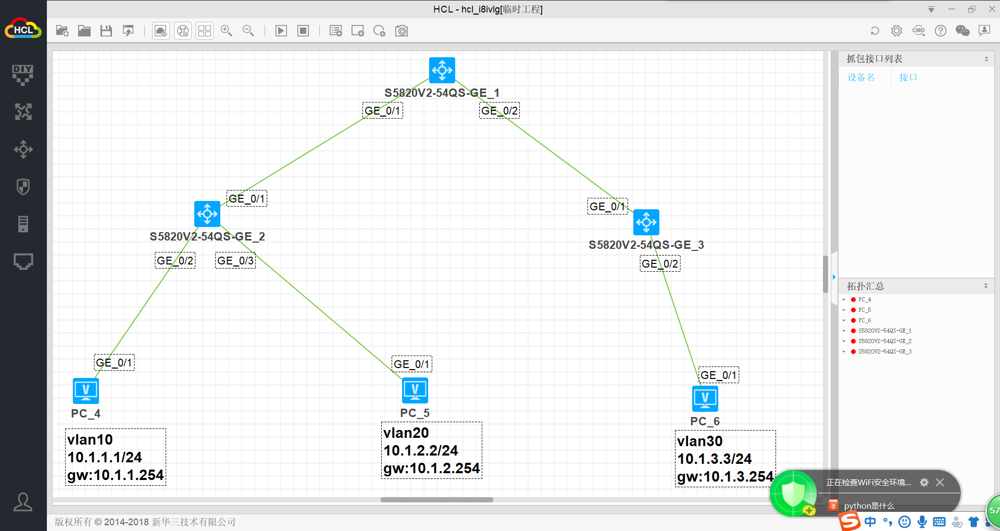
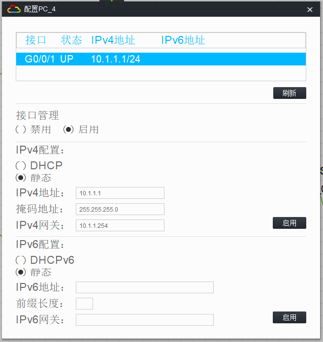
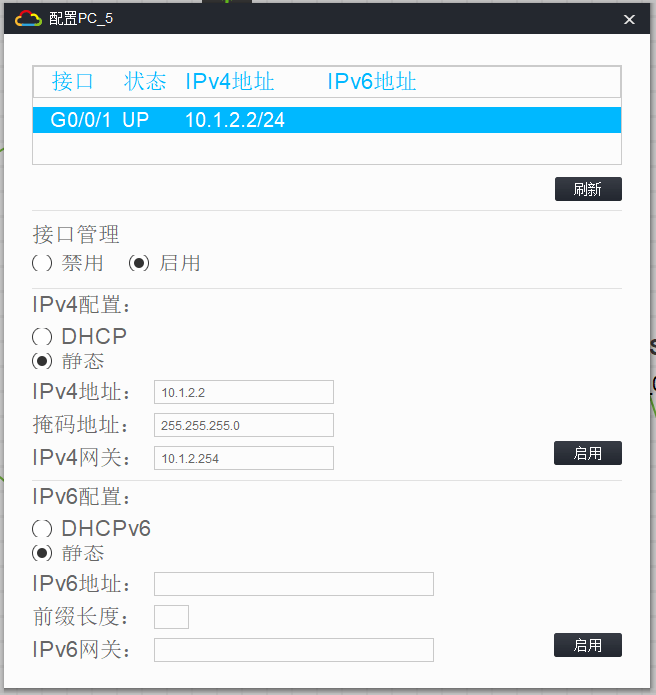

# 三层交换实验

## 1. 实验拓扑



## 2. 实验需求

1. 按照图示配置各设备`ip`地址
2. **pc4**属于`vlan10`，**pc5**属于`vlan20`，**pc6**属于`vlan30`
3. 利用三层交换实现各设备之间互通

## 3. 实验解法

1.按照图示配置各设备 ip 地址

 

 

 

2. pc4 属于 vlan10，pc5 属于 vlan20，pc6 属于 vlan30

   ```
   [sw2]vlan 10
   [sw2-vlan10]vlan 20
   [sw2]interface G1/0/1
   [sw2-GigabitEthernet1/0/1]port access vlan 10
   [sw2]interface G1/0/2
   [sw2-GigabitEthernet1/0/2]port access vlan 20
   [sw3]interface G1/0/2
   [sw3-GigabitEthernet1/0/2]port access vlan 30
   ```

3. 利用三层交换实现各设备之间互通

   ```
   [sw2]interface Vlan-interface 10
   [sw2-Vlan-interface10]ip address 10.1.1.254 24
   [sw2]interface Vlan-interface 20
   [sw2-Vlan-interface20]ip address 10.1.2.254 24

   [sw3]interface Vlan-interface 30
   [sw3-Vlan-interface30]ip address 10.1.3.254 24

   [sw2]interface G1/0/1
   [sw2-GigabitEthernet1/0/1]port link-type trunk
   [sw2-GigabitEthernet1/0/1]port trunk permit vlan 10 20

   [sw3]interface G1/0/1
   [sw3-GigabitEthernet1/0/1]port link-type trunk
   [sw3-GigabitEthernet1/0/1]port trunk permit vlan 30

   [sw1]interface G1/0/1
   [sw1-GigabitEthernet1/0/1]port link-type trunk
   [sw1-GigabitEthernet1/0/1]port trunk permit vlan 10 20 30
   [sw1]interface G1/0/2
   [sw1-GigabitEthernet1/0/2]port link-type trunk
   [sw1-GigabitEthernet1/0/2]port trunk permit vlan 10 20 30
   ```
