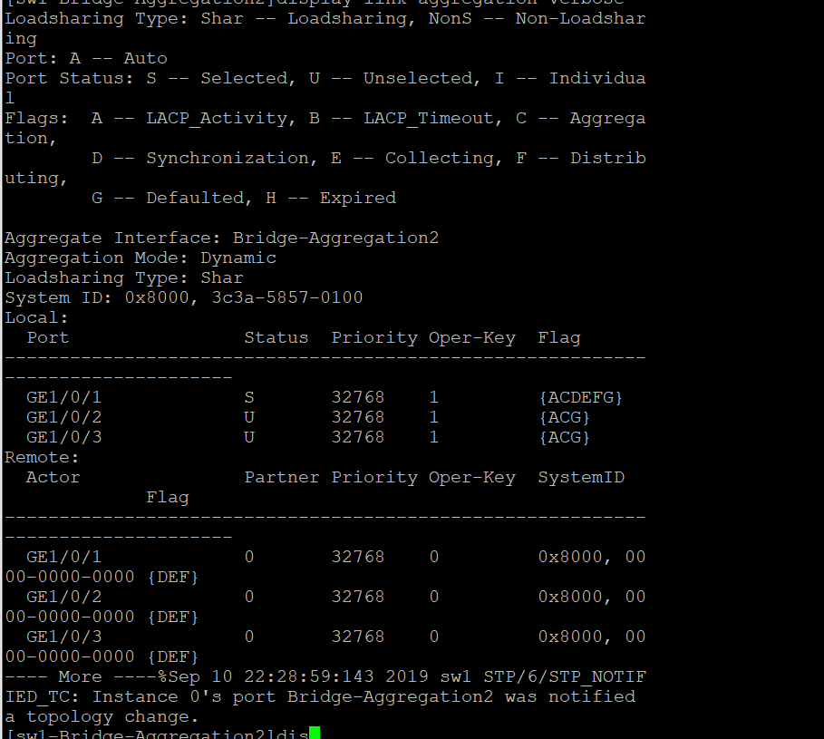

# 链路聚合实验

### 1. 链路聚合实验

#### 1.1. 实验拓扑


#### 1.2. 实验需求

1. 给交换机命名
2. 将 sw1sw2 之间链路逻辑为静态聚合
3. 静态聚合改为动态聚合，同时将 GE_0/3 设置为备份链路

#### 1.3. 实验解法

1. 给交换机命名

```
<H3C>system-view
System View: return to User View with Ctrl+Z.
[H3C]sysname sw1
```

​ 2.将 sw1sw2 之间链路逻辑为静态聚合

```
[SW1]interface Bridge-Aggregation 2
[SW1-Bridge-Aggregation2]quit
[SW1]interface GigabitEthernet 1/0/1
[SW1-GigabitEthernet1/0/1]port link-aggregation group 2

[SW1]interface GigabitEthernet 1/0/2
[SW1-GigabitEthernet1/0/2]port link-aggregation group 2

[SW1]interface GigabitEthernet 1/0/3
[SW1-GigabitEthernet1/0/3]port link-aggregation group 2
```


​ 3.把静态聚合变为动态聚合实现 GE_0/3 为备份链路

```
[SW1-Bridge-Aggregation1]link-aggregation mode dynamic
[sw1-Bridge-Aggregation2]link-aggregation selected-port maximum2
```


