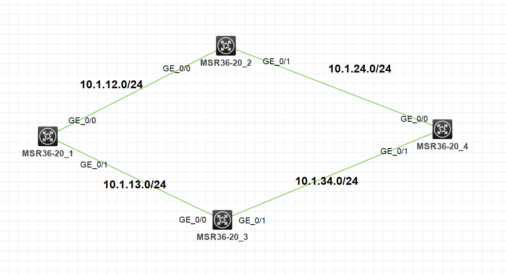

# 静态路由实验

## 1. 实验拓扑



## 2. 实验需求

1. 按照图示配置各设备 ip 地址
2. 要求 R1 访问 4.4.4.1/32 网络形成等价路由
3. 要求 R1 访问 4.4.4.2/32 网络形成备份路由，备份路径为 R1-R3-R4
4. 要求 R1 访问 4.4.4.3/32 网络走默认路由
5. 要求 R4 能访问网络中所有节点路由

## 3. 实验解法

1. 按照图示配置各设备 ip 地址

   ```
   [R1]interface G0/0
   [R1-GigabitEthernet0/0]ip address 10.1.12.1 24
   [R1]interface G0/1
   [R1-GigabitEthernet0/1]ip address 10.1.13.1 24

   [R2]interface G0/0
   [R2-GigabitEthernet0/0]ip address 10.1.12.2
   [R2]interface G0/1
   [R2-GigabitEthernet0/1]ip address 10.1.24.2 24

   [R3]interface G0/0
   [R3-GigabitEthernet0/0]ip address 10.1.13.3 24
   [R3]interface G0/1
   [R3-GigabitEthernet0/1]ip address 10.1.34.3 24

   [R4]interface G0/0
   [R4-GigabitEthernet0/0]ip address 10.1.24.4 24
   [R4]interface G0/1
   [R4-GigabitEthernet0/1]ip address 10.1.34.4 24
   ```

2. 要求 R1 访问 4.4.4.1/32 网络形成等价路由

   ```
   [R4]int Lo0    //进环回口
   [R4-LoopBack0]ip address 4.4.4.1 32
   [R1]ip route-static 4.4.4.1 32 10.1.12.2
   [R1]ip route-static 4.4.4.1 32 10.1.13.3
   [R2]ip route-static 4.4.4.1 32 10.1.24.4

   ```
