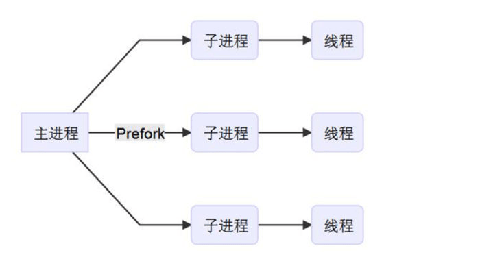
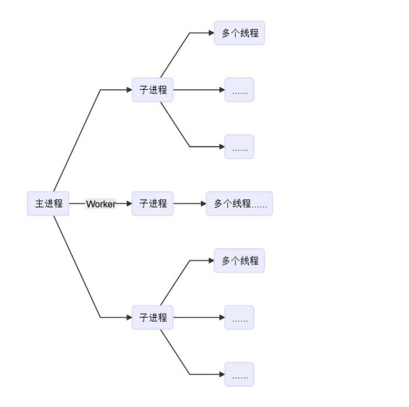
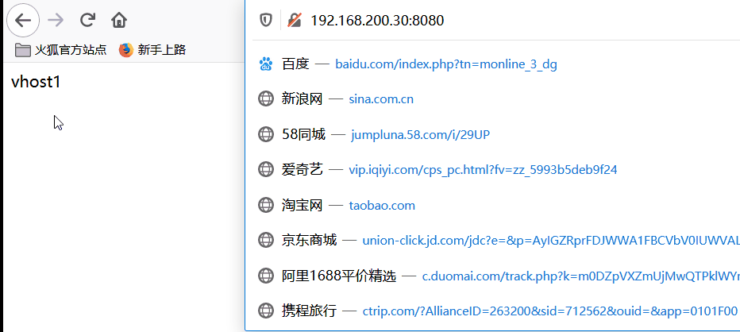

# Httpd

[http简介](https://www.jianshu.com/p/21337586a219)

## httpd简介

Apache HTTP Server（简称Apache或httpd）是Apache软件基金会的一个开放源代码的网页服务器 软件，旨在为unix，windows等操作系统中提供开源httpd服务。由于其安全性、高效性及可扩展 性，被广泛使用，自1996年4月以来，Apache一直是Internet上最流行的HTTP服务器。它快速、可 靠并且可通过简单的API扩充，将Perl、Python等解释器等编译到httpd的相关模块中。


## httpd服务特点

>   httpd是一个高度模块化软件，由核心（core）和模块（module）组成。这些模块大都是动态模块，因此可以随时加载。

[Apache 工作的三种模式：Prefork、Worker、Event](https://www.mopsky.com/2019/01/06/12cb3b73cd/)

| 名称       | 特点                                                   |
| ---------- | ------------------------------------------------------ |
| 高度模块化 | core + modules，核心加模块，想要什么功能添加什么模块； |
| DSO        | Dynamic Shared Object，动态共享库；                    |
| MPM        | Multipath processing Modules 多路处理模块。            |

并行处理模式`MPM`(多路处理模块)包含了三种运行模式。分别为`prefork`、`worker`和`event`。

1.  prefork模式

    ```markdown
    多进程模型，每个进程响应一个请求、一个主进程：负责生成子进程及回收子进 程；负责创建套接字；负责接收
    请求，并将其派发给某子进程进行处理，每个子 进程处理一个请求；即使没有用户请求，也会预先生成多个空闲
    进程，随时等待 请求到达；最大不会超过1024个子进程。
    ```

    

2.  worker模式

    ```markdown
    多进程多线程模型，每线程处理一个用户请求、一个主进程：负责生成子进程、 负责创建套接字、负责接收请
    求、并将其派发给某子进程进行处理，每个子进程 负责生成多个线程，每个线程负责响应用户请求；并发响应数
    量为：子进程数量 *子进程创建的最大线程数量。
    ```

    >   并发响应数量：m*n
    >   m：子进程数量
    >   n：每个子进程所能创建的最大线程数量；

    

3.  event模式

    ```markdown
    事件驱动模型，多进程模型，每个进程响应多个请求、一个主进程 ：负责生成 子进程、负责创建套接字、负责接
    收请求，并将其派发给某子进程进行处理，子 进程基于事件驱动机制直接响应多个请求。
    ```

    

>   配置文件` /etc/httpd/conf.modules.d/00‐mpm.conf `中可以切换工作模型；`httpd‐2.2`不支持切 换MPM工作模型。 

## httpd功能

-   CGI：通用网关接口（Common Gateway Interface）是一种根据请求信息动态产生回应内容的技 术。
-   虚拟主机：基于IP，PORT， FQDN（域名）实现多站点共存。 
-   路径别名：设置访问的网址（url）的别名。 
-   丰富的用户认证机制：basic基本用户认证，digest摘要认证。 
-   支持第三方模块：不同的模块实现不同的功能。 
-   正向代理，反向代理，负载均衡。 

## httpd配置文件

### 基本配置

-   服务安装

    ```shell
    yum install -y httpd
    ```

-   服务配置

    *防火墙放行http协议数据*  

    ```shell
    firewall-cmd --add-service=http --permanent 
    firewall-cmd --reload
    ```

-   查看网站默认存放目录, 和网页名

    ```shell
    vim /etc/httpd/conf/httpd.conf
    ```

    

    

-   设置网站主页  测试

    ```shell
    vim /var/www/html/index.html
    hello
    ```

-   重启服务，加载配置 

    ```shell
    systemctl restart httpd.service 
    ```

-   打开网页测试
    

### 进阶配置

#### 修改服务监听端口号

-   修改配置文件，监听8080端口

    ```
    vim /etc/httpd/conf/httpd.conf
    ```

    

-   防火墙放行8080端口  

    ```shell
    firewall-cmd --add-port=8080/tcp --permanent
    firewall-cmd --reload 
    ```

-   重启服务，加载配置  

    ```shell
    systemctl restart httpd
    ```

-   打开网页测试

    

## 虚拟主机配置

​		httpd服务在实际应用中有这样一种场景；我们有一台服务器，但是想挂多个网站，按照上面的配 置方式就无法实现。那么我们就可以通过配置虚拟主机的方式实现一个服务器上运行多个网站，每 个网站都是一个虚拟主机；虚拟主机其实就是通过httpd服务访问同一个服务器上的不同目录。

**虚拟主机有三类**

-   相同IP不同端口 
-   不同IP相同端口 
-   相同IP相同端口不同域名

### Require访问控制法则

| 名称                      | 功能                         |
| ------------------------- | ---------------------------- |
| Require all granted       | 允许所有主机访问             |
| Require all deny          | 拒绝所有主机访问             |
| Require ip IPADDR         | 授权指定来源地址的主机访问   |
| Require not ip IPADDR     | 拒绝指定来源地址的主机访问   |
| Require host HOSTNAME     | 授权指定来源主机名的主机访问 |
| Require not host HOSTNAME | 拒绝指定来源主机名的主机访问 |


### 相同IP不同端口

-   创建扩展配置文件，配置虚拟主机为相同IP不同端口

    ```shell
    vim /etc/httpd/conf.d/httpd-vhosts.conf
    ```

    ```shell
    #虚拟主机1
    Listen 8080
    <VirtualHost 192.168.200.30:8080>
        ServerAdmin root@localhost
        ServerName www.bzm.com
        ServerAlias www.bzm1.com
        DocumentRoot "/var/www/vhost1"
        ErrorLog "/var/log/httpd/error_log"
        CustomLog "/var/log/httpd/access_log" combined
        <Directory "/var/www/vhost1">
    		<RequireAll>
                Require all granted
                Require not ip 192.168.1.1
    		</RequireAll> 
        </Directory> 
    </VirtualHost>
    
    #虚拟主机2
    Listen 8081
    <VirtualHost 192.168.200.30:8081>
        ServerAdmin root@localhost
        ServerName www.bzm.com
        ServerAlias www.bzm1.com
        DocumentRoot "/var/www/vhost2"
        ErrorLog "/var/log/httpd/error_log"
        CustomLog "/var/log/httpd/access_log" combined
        <Directory "/var/www/vhost2">
    		<RequireAll>
                Require all granted
                Require not ip 192.168.1.1
    		</RequireAll> 
        </Directory> 
    </VirtualHost>
    ```

-   创建两个网站目录,写入内容

    ```shell
    mkdir /var/www/vhost1
    mkdir /var/www/vhost2
    ```

vim index.html
    vhost1
    vim index.html
    vhost2

```
-   放行相应的端口

    ```shell
    firewall-cmd --add-port=8081/tcp --permanent 
    success
    firewall-cmd --reload 
    success
```

-   重启服务

    ```shell
    systemctl restart httpd.service
    ```

    

-   测试



### 不同IP相同端口

-   给网卡添加IP地址

    ```shell
    ip a add 192.168.200.31 dev ens33
    ```

-   编辑虚拟主机配置文件，配置虚拟主机为不同IP相同端口  

    ```shell
    vim /etc/httpd/conf.d/httpd-vhosts.conf
    ```

    ```shell
    <VirtualHost 192.168.200.30:80>
        ServerAdmin root@localhost
        ServerName www.bzm.com
        ServerAlias www.bzm1.com
        DocumentRoot "/var/www/vhost1"
        ErrorLog "/var/log/httpd/error_log"
        CustomLog "/var/log/httpd/access_log" combined
        <Directory "/var/www/vhost1">
            <RequireAll>
                Require all granted
                Require not ip 192.168.1.1
            </RequireAll> 
        </Directory> 
    </VirtualHost>
    
    <VirtualHost 192.168.200.31:80>
        ServerAdmin root@localhost
        ServerName www.bzm.com
        ServerAlias www.bzm1.com
        DocumentRoot "/var/www/vhost2"
        ErrorLog "/var/log/httpd/error_log"
        CustomLog "/var/log/httpd/access_log" combined
        <Directory "/var/www/vhost2">
            <RequireAll>
                Require all granted
                Require not ip 192.168.1.1
            </RequireAll> 
        </Directory> 
    </VirtualHost>
    
    ```

-   重启服务

    ```shell
    systemctl restart httpd.service
    ```

-   测试

    

    

### 相同IP相同端口不同域名

-   编辑虚拟主机配置文件，配置虚拟主机为相同IP相同端口不同域名  

    ```shell
    vim /etc/httpd/conf.d/httpd-vhosts.conf
    ```

    ```shell
    <VirtualHost 192.168.200.30:80>
        ServerAdmin root@localhost
        ServerName www.bzm.com
        ServerAlias www.bzm1.com
        DocumentRoot "/var/www/vhost1"
        ErrorLog "/var/log/httpd/error_log"
        CustomLog "/var/log/httpd/access_log" combined
        <Directory "/var/www/vhost1">
            <RequireAll>
                Require all granted
                Require not ip 192.168.1.1
            </RequireAll> 
        </Directory> 
    </VirtualHost>
    
    #Listen 8081
    <VirtualHost 192.168.200.30:80>
        ServerAdmin root@localhost
        ServerName www.mzb.com
        ServerAlias www.mzb1.com
        DocumentRoot "/var/www/vhost2"
        ErrorLog "/var/log/httpd/error_log"
        CustomLog "/var/log/httpd/access_log" combined
        <Directory "/var/www/vhost2">
            <RequireAll>
                Require all granted
                Require not ip 192.168.1.1
            </RequireAll> 
        </Directory> 
    </VirtualHost>
    ```

    

-   重启服务

    ```shell
    systemctl restart httpd.service
    ```

-   测试

    

    

## https配置

>   https（全称：Hyper Text Transfer Protocol over SecureSocket Layer），是以安全为目标的 http 通 道，在 http 的基础上通过传输加密和身份认证保证了传输过程的安全性。 

### mod_ssl模块

-   mode_ssl 模块可以实现https加密认证。

    ```shell
    yum install -y mod_ssl
    ```

-   启用模块：编辑/etc/httpd/conf.modules.d/00‐base.conf文件，添加下面这行，如果已经有了但是 注释了，则取消注释即可。

    ```shell
    vim /etc/httpd/conf.modules.d/00-base.conf
    
    LoadModule ssl_module modules/mod_ssl.so
    ```

### 证书类型

https的证书：

-   SSLCertificateFile：服务器证书文件；
-   SSLCertificateKeyFile：服务器证书私钥文件； 
-   SSLCertificateChainFile：服务器证书链文件。 
-   SSLCACertificateFile：CA机构证书公钥文件； 

>   证书类型可以在 /etc/httpd/conf.d/ssl.conf 配置文件中设置；也可在虚拟主机中配置。 

### ssl配置

```shell
生成密钥（私钥）  
openssl genrsa -out server.key 2048

生成证书请求文件  
openssl req -new -key server.key -out server.csr

生成证书crt
openssl x509 -req -days 365 -in server.csr -signkey server.key -out server.crt

复制证书到指定位置
cp server.crt /etc/pki/tls/certs/
cp server.key /etc/pki/tls/private/
cp server.csr /etc/pki/tls/private/

编辑虚拟主机配置文件，配置虚拟主机为https使用443端口  
<VirtualHost *:443>
    ServerAdmin root@localhost
    ServerName www.bzm.com
    ServerAlias www.bzm1.com
    SSLEngine on
    SsLCertificateFile "/etc/pki/tls/certs/server.crt"
    SSLCertificateKeyFile "/etc/pki/tls/private/server.key"
    DocumentRoot "/var/www/vhost1"
    ErrorLog "/var/log/httpd/error_log"
    CustomLog "/var/log/httpd/access_log" combined
    <Directory "/var/www/vhost1">
        <RequireAll>
            Require all granted
            Require not ip 192.168.1.1
        </RequireAll> 
    </Directory> 
</VirtualHost>
```

-   测试

    

>   因为是自己给自己颁发证书，所以使用https访问时会出现警告说证书不安全。 

