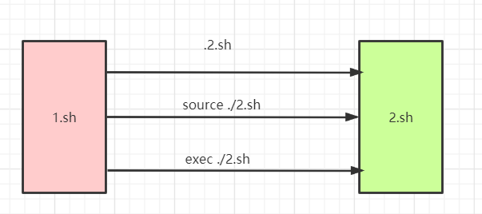

# Shell 脚本调用方式

> 在`Linux `运维开发中，无论是在`console`(控制台)，还是`shell`脚本中，使用的方法经常有这三种：`./my.sh `或 `source my.sh` 或 **. my.sh**

**主要以下有几种方式：**

| Command    | Explanation                                                  |
| ---------- | ------------------------------------------------------------ |
| **fork**   | 新开一个子 Shell 执行，子 Shell 可以从父 Shell 继承环境变量，但是子 Shell 中的环境变量不会带回给父 Shell。 |
| **exec**   | 在同一个 Shell 内执行，但是父脚本中 `exec` 行之后的内容就不会再执行了 |
| **source** | 在同一个 Shell 中执行，在被调用的脚本中声明的变量和环境变量, 都可以在主脚本中进行获取和使用，相当于合并两个脚本在执行。 |



## 测试脚本

`1.sh`

```shell
#!/usr/bin/env bash

# 设置变量 A 
A=1

# 输出脚本开始运行时候的 PID
echo "before exec/source/fork: PID for 1.sh = $$"

export A
echo "In 1.sh: variable A=$A"

case $1 in
        --exec)
                echo -e "==> using exec…\n"
                exec ./2.sh ;;
        --source)
                echo -e "==> using source…\n"
                source ./2.sh ;;
        *)
                echo -e "==> using fork by default…\n"
                ./2.sh ;;
esac

# 输出脚本开始运行时候的 PID 和变量 A
echo "after exec/source/fork: PID for 1.sh = $$"
echo -e "In 1.sh: variable A=$A\n"
```

`2.sh`

```shell
#!/usr/bin/env bash

# 输出PID
echo "PID for 2.sh = $$"

# 输出来着 1.sh 的 A 变量
echo "In 2.sh get variable A=$A from 1.sh"

# 将变量 A 的值改为 2
A=2
export A

echo -e "In 2.sh: variable A=$A\n"
```

## fork

```shell
[root@localhost test]# ./1.sh 
before exec/source/fork: PID for 1.sh = 3121
In 1.sh: variable A=1
==> using fork by default…

PID for 2.sh = 3122
In 2.sh get variable A=1 from 1.sh
In 2.sh: variable A=2

after exec/source/fork: PID for 1.sh = 3121
In 1.sh: variable A=1
```

> - 开始时，**PID**为`3121`，执行`2.sh`时，**PID**为`3122`，由此可见，是分两个进程运行的
> - 变量 A ：1>2>1

## exec

```shell
[root@localhost test]# ./1.sh --exec
before exec/source/fork: PID for 1.sh = 3125
In 1.sh: variable A=1
==> using exec…

PID for 2.sh = 3125
In 2.sh get variable A=1 from 1.sh
In 2.sh: variable A=2

```

> - 根据 PID 可以发现`2.sh `执行完成后，不再回到 `1.sh`
> - 变量 A ：1>2

## source

```shell
[root@localhost test]# ./1.sh --source
before exec/source/fork: PID for 1.sh = 3127
In 1.sh: variable A=1
==> using source…

PID for 2.sh = 3127
In 2.sh get variable A=1 from 1.sh
In 2.sh: variable A=2

after exec/source/fork: PID for 1.sh = 3127
In 1.sh: variable A=2
```

> - 根据 PID 可以发现两者在同一进程里运行
> - 变量 A ：1>2>2 

