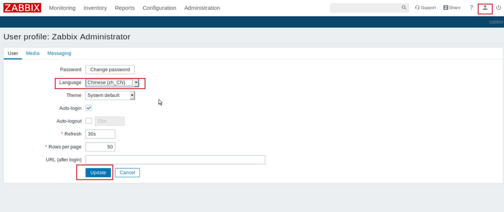

# 企业监控 Zabbix4.0 搭建

## 1. 关闭防火墙和 SELinux

```shell
$ systemctl stop firewalld   &>/dev/null
$ systemctl disable firewalld     &>/dev/null

$ setenforce 0   &>/dev/null
$ sed -i 's/\(SELINUX=\).*/\1disabled/' /etc/selinux/config
```

## 2. 配置软件包源

配置`zabbix`的`yum`源为阿里

```shell
cat <<EOF > /etc/yum.repos.d/zabbix.repo
[zabbix]
name=Zabbix Official Repository - \$basearch
baseurl=https://mirrors.aliyun.com/zabbix/zabbix/4.0/rhel/7/\$basearch/
enabled=1
gpgcheck=1
gpgkey=file:///etc/pki/rpm-gpg/RPM-GPG-KEY-ZABBIX-A14FE591

[zabbix-non-supported]
name=Zabbix Official Repository non-supported - \$basearch
baseurl=https://mirrors.aliyun.com/zabbix/non-supported/rhel/7/\$basearch/
enabled=1
gpgkey=file:///etc/pki/rpm-gpg/RPM-GPG-KEY-ZABBIX
gpgcheck=1
EOF
```

```shell
# 阿里源的zabbix
$ rpm -ivh https://mirrors.aliyun.com/zabbix/zabbix/4.0/rhel/7/x86_64/zabbix-release-4.0-1.el7.noarch.rpm

# 阿里云的epel源
$ yum install -y wget
$ wget -O /etc/yum.repos.d/epel.repo http://mirrors.aliyun.com/repo/epel-7.repo
```

## 3. 安装 zabbix 和相关服务组件

```shell
# 这两个包先拿下来,因为安装的时候网络问题可能现安装超时
$ wget  https://mirrors.tuna.tsinghua.edu.cn/zabbix/zabbix/4.0/rhel/7/x86_64/{zabbix-server-mysql-4.0.20-1.el7.x86_64.rpm,zabbix-web-4.0.22-1.el7.noarch.rpm}

# 安装zabbix的服务程序和web程序
$ yum install -y httpd php zabbix-server-mysql-4.0.20-1.el7.x86_64.rpm  zabbix-web-mysql

# 装数据库服务
$ yum install -y mariadb-server
```

## 4. 修改 zabbix 配置文件

```shell
#修改zabbix数据库密码为zabbix
$ sed -ri.bak '/# DBPassword=/cDBPassword=zabbix' /etc/zabbix/zabbix_server.conf

#修改时区为国内
$ sed -ri.bak 's/ #(.*)date.timezone.*/\1date.timezone Asia\/Shanghai/' /etc/httpd/conf.d/zabbix.conf
```

## 5. 配置数据库服务

```shell
# 启动数据库
$ systemctl start mariadb

# 初始化数据库
$ mysql_secure_installation
```

```mysql
NOTE: RUNNING ALL PARTS OF THIS SCRIPT IS RECOMMENDED FOR ALL MariaDB
      SERVERS IN PRODUCTION USE!  PLEASE READ EACH STEP CAREFULLY!

In order to log into MariaDB to secure it, we'll need the current
password for the root user.  If you've just installed MariaDB, and
you haven't set the root password yet, the password will be blank,
so you should just press enter here.

Enter current password for root (enter for none):
OK, successfully used password, moving on...

Setting the root password ensures that nobody can log into the MariaDB
root user without the proper authorisation.

Set root password? [Y/n] y
New password:
Re-enter new password:
Password updated successfully!
Reloading privilege tables..
 ... Success!


By default, a MariaDB installation has an anonymous user, allowing anyone
to log into MariaDB without having to have a user account created for
them.  This is intended only for testing, and to make the installation
go a bit smoother.  You should remove them before moving into a
production environment.

Remove anonymous users? [Y/n] y
 ... Success!

Normally, root should only be allowed to connect from 'localhost'.  This
ensures that someone cannot guess at the root password from the network.

Disallow root login remotely? [Y/n] y
 ... Success!

By default, MariaDB comes with a database named 'test' that anyone can
access.  This is also intended only for testing, and should be removed
before moving into a production environment.

Remove test database and access to it? [Y/n] n
 ... skipping.

Reloading the privilege tables will ensure that all changes made so far
will take effect immediately.

Reload privilege tables now? [Y/n] y
 ... Success!

Cleaning up...

All done!  If you've completed all of the above steps, your MariaDB
installation should now be secure.

Thanks for using MariaDB!
```

```mysql
$ mysql -uroot -p ##登录数据库
Enter password:
Welcome to the MariaDB monitor.  Commands end with ; or \g.
Your MariaDB connection id is 8
Server version: 5.5.65-MariaDB MariaDB Server

Copyright (c) 2000, 2018, Oracle, MariaDB Corporation Ab and others.

Type 'help;' or '\h' for help. Type '\c' to clear the current input statement.

MariaDB [(none)]> create database zabbix character set utf8 collate utf8_bin; #创建zabbix数据库
Query OK, 1 row affected (0.00 sec)

MariaDB [(none)]> grant all privileges on zabbix.* to zabbix@localhost identified by 'zabbix'; #创建数据库管理用户
Query OK, 0 rows affected (0.00 sec)

MariaDB [(none)]> quit
Bye
$ zcat /usr/share/doc/zabbix-server-mysql-4.0.20/create.sql.gz  | mysql -uzabbix -pzabbix zabbix  #将数据表写入到zabbix库中
```

## 6. 启动 zabbix 和相关服务

```shell
$ systemctl start zabbix-server.service httpd mariadb.service
$ systemctl enable zabbix-server.service httpd mariadb.service
Created symlink from /etc/systemd/system/multi-user.target.wants/zabbix-server.service to /usr/lib/systemd/system/zabbix-server.service.
Created symlink from /etc/systemd/system/multi-user.target.wants/httpd.service to /usr/lib/systemd/system/httpd.service.
Created symlink from /etc/systemd/system/multi-user.target.wants/mariadb.service to /usr/lib/systemd/system/mariadb.service.
```

## 7. 登录 zabbix 的 web 界面,进行初始化

初始化地址`http://ip/zabbix/setup.php`

帐号`Admin `密码`zabbix `,再点`Sign in`

## 8. 修改 zabbix 界面语言为中文

点击右上角的小人



