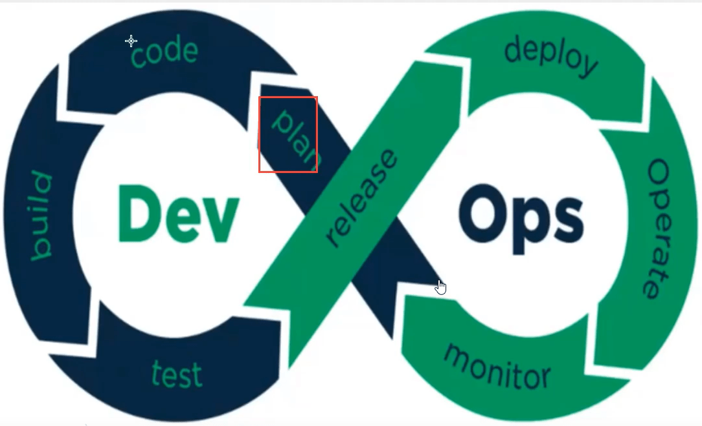
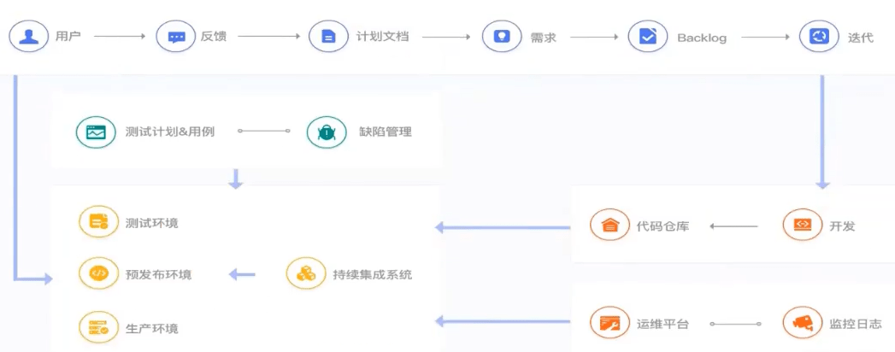

# 何为DevOps

## DevOps简介

>   DevOps这个词，大多都不陌生，毕竟这个概念已经出现好多年了。

`DevOps `是 `Development `和 `Operations `的组合，也就是开发和运维的简写。`DevOps `是针对企业中的研发人员、运维人员和测试人员的工作理念，是他们在应用开发、代码部署和质量测试等整条生命周期中协作和沟通的最佳实践。

`DevOps`是一组过程、方法与系统的统称，用于促进**开发**、**技术运营**和**质量保障（QA）**部门之间的沟通、协作与整合。																																										——**DevOps的维基百科定义**



>   DevOps 强调整个组织的合作以及交付和基础设施变更的自动化、从而实现持续集成、持续部署和持续交付。

## 那个什么是持续集成、持续部署和持续交付？

### 持续集成(CI)

是指多名开发者在开发不同功能代码的过程当中，可以频繁的将代码行合并到一起并切相互不影响工作。

### 持续部署（CD）

持续部署(CD-continuous deployment)是基于某种工具或平台实现代码自动化的构建、测试和部署到线上环境以实现交付高质量的产品,持续部署在某种程度上代表了一个开发团队的更新迭代速率。

### 持续交付

持续交付是在(Continuous Delivery)持续部署的基础之上，将产品交付到线上环境，因此持续交付是产品价值的一种交付，是产品价值的一种盈利的实现。



>   这大概就是公司一个项目整个的流程~

## 如何实现DevOps思想呢？

当然是通过各种工具，互联网发展这么多年，`DevOps `相关的工具很多，逐个去学习也现实，掌握核心的思想，能应对企业的需求即可。同时近年云计算，容器的发展。云原生概念的的出现， `CI/CD`的效率越来越高，正是容器的出现，为 `PaaS`、`DevOps `工具层面的落地提供非常好的承载平台。


>   这密密麻麻的技术，工具~

## 案例说明

1、使用Spring Boot 编写一个简单的`hello`程序

```java
@Controller
public class HelloController {

    @ResponseBody
    @RequestMapping("/hello")
    public String hello() {
        return "hello Bzm!";
    }
}
```


>   开始的项目是这样的~

2、如果此时开发修改了代码


>   然后开发将代码`push`到了远程仓库（`gitee`，`github`或是公司自己的代码库）

3、比如我们使用`Jenkins`，当它检测的新的代码提交过来的时候，就开始自动运行了


>   当它运行完毕后，项目就已经自动完成部署在服务器了。

4、效果


>   通过这个小案例，大概有一点CI/CD的味道了吧，适应当前的快节奏~

